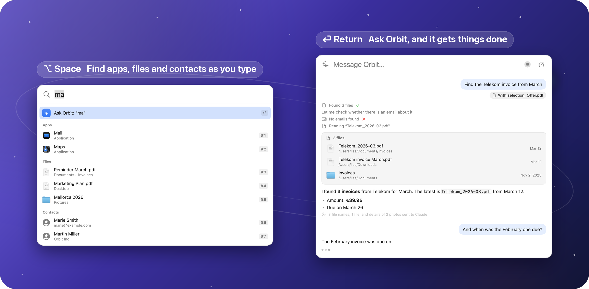
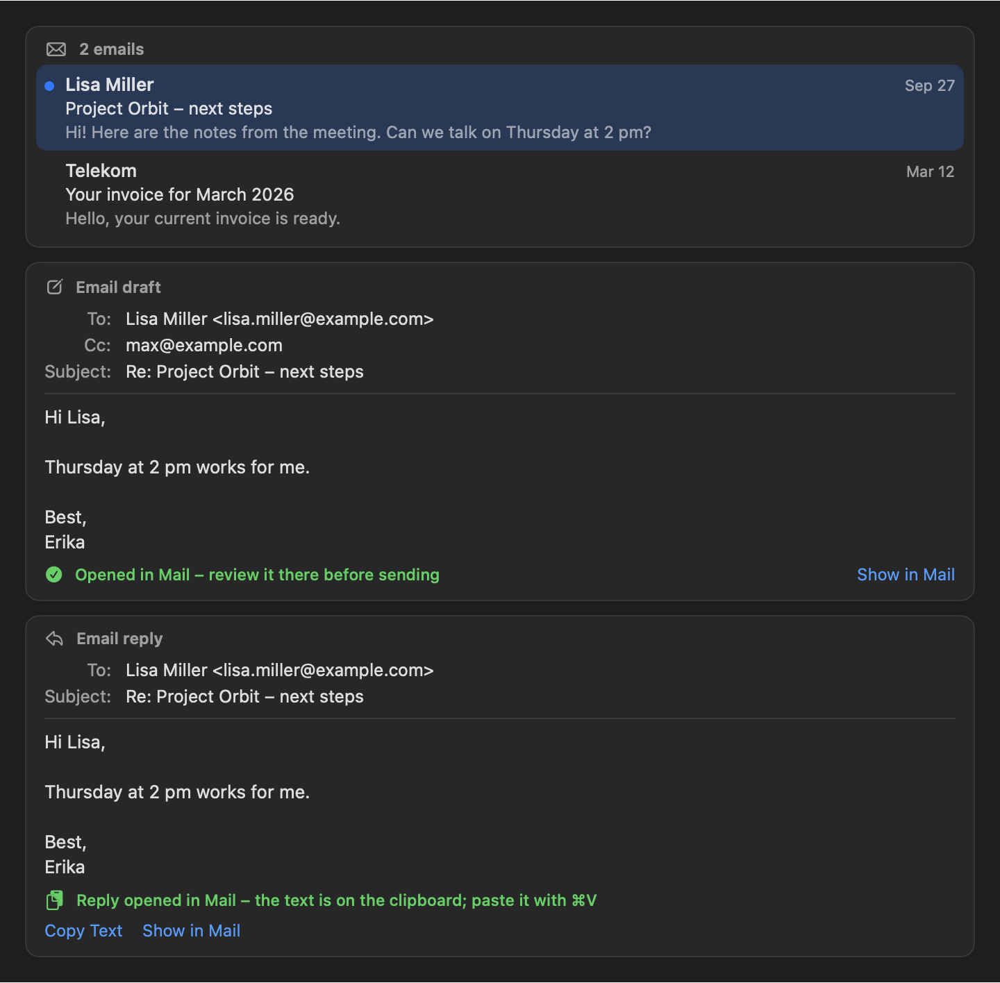
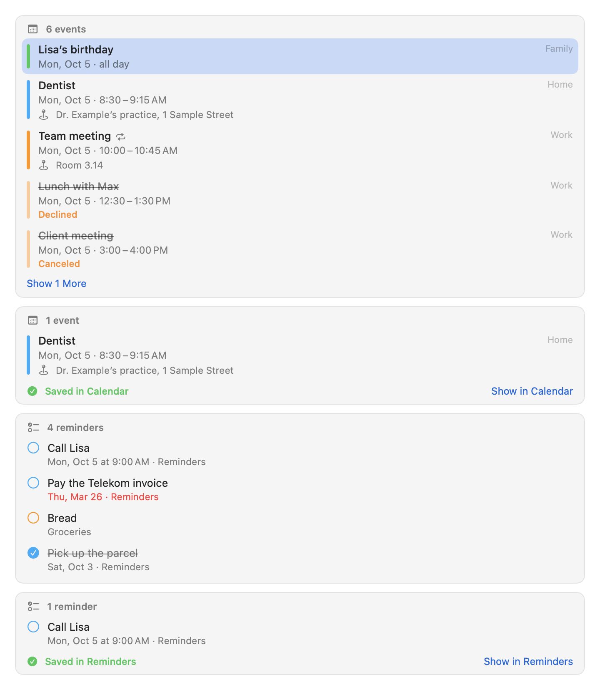
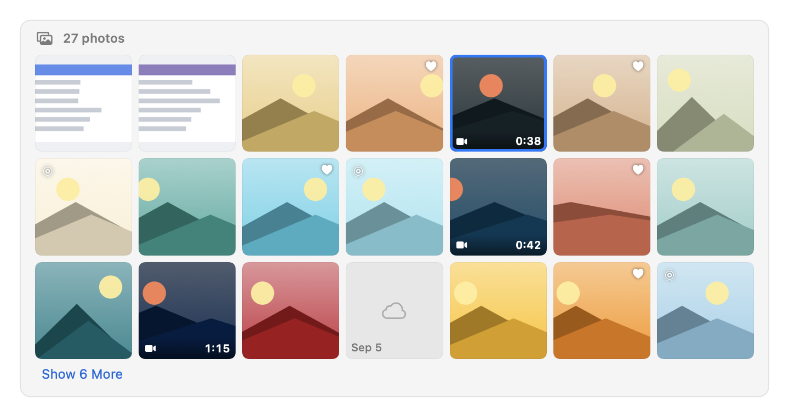
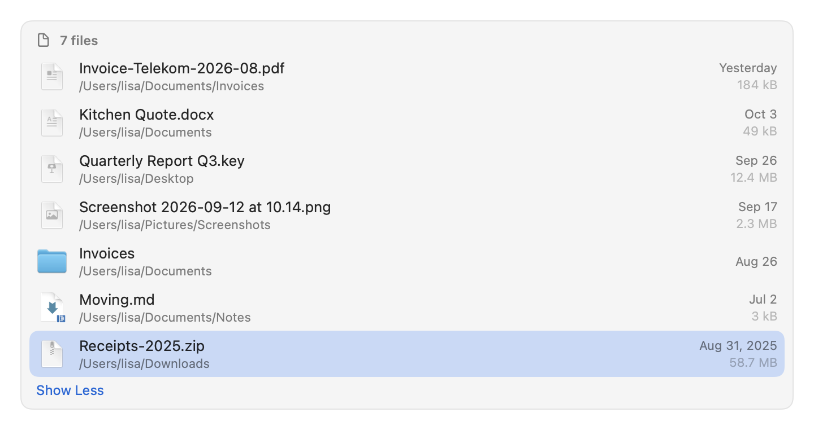

<div align="center">


# Orbit

**Search everything. Ask anything. Stay in control.**

A native macOS launcher with a built-in AI assistant that works with your files, Mail, Notes, Calendar,
Reminders, Photos and Shortcuts, using the language model you choose, and asks before it acts.


[](https://eric-volz.github.io/Orbit/)

[Get started](#get-started) · [Features](#what-you-can-ask) · [How it works](#how-it-works) ·
[Privacy](#privacy-and-safety-by-design) · [Documentation](docs/README.md) · [Contributing](#contributing)

</div>

<picture>
  <source media="(prefers-color-scheme: dark)" srcset="docs/assets/hero-dark.png">
  <source media="(prefers-color-scheme: light)" srcset="docs/assets/hero-light.png">
  
</picture>

## Why Orbit?

Press <kbd>⌥ Space</kbd> and Orbit appears: one fast panel for everything on your Mac. Type a few letters and your
apps, files and contacts are there before you finish typing. Ask a question instead, and Orbit's assistant gets to
work: it searches your mail, reads the PDF, checks your calendar and drafts the reply. Anything that would change
something waits for your OK on a card you can still edit.

<table>
  <tr>
    <td width="33%" valign="top">⚡ <b>Instant</b><br>Apps appear about 85 ms after your last keystroke, files and contacts right after. Instant search never asks a model.</td>
    <td width="33%" valign="top">🧠 <b>Capable</b><br>25 tools across Files, Mail, Notes, Contacts, Calendar, Reminders, Photos, Shortcuts, links and system settings.</td>
    <td width="33%" valign="top">✋ <b>In control</b><br>Actions with consequences wait on a confirmation card. Mail is never sent for you, and no tool deletes anything.</td>
  </tr>
  <tr>
    <td valign="top">🔒 <b>Private</b><br>No Orbit server, no account, no telemetry. Content goes to the model only when a question needs it, and the chat shows what was sent.</td>
    <td valign="top">🔌 <b>Your model</b><br>Your Claude subscription through Claude Code, the Anthropic API, or a fully local model with Ollama or LM Studio.</td>
    <td valign="top">♿ <b>For everyone</b><br>Complete keyboard control, VoiceOver support, the macOS display settings, and both English and German.</td>
  </tr>
</table>

## What you can ask

| | Ask Orbit… | …and it |
|---|---|---|
| 📄 | “Find the Telekom invoice from March. How much was it?” | searches your files with Spotlight, reads the PDF and answers with a file card |
| ✉️ | “What did Lisa write me last?” then “Tell her Thursday works.” | finds the message and opens Mail's own reply window, with the text on your clipboard |
| 📅 | “What do I have tomorrow?” | lists every event of the day, including recurring, declined and canceled ones |
| ➕ | “Add the dentist on Tuesday at 2 pm.” | shows a confirmation card with title, time and calendar, then creates the event |
| ✅ | “Remind me tomorrow at 9 to call Lisa.” | creates the reminder with an alert, after you confirm |
| 📝 | “What's in my recipe note?” | searches Notes and reads the note, including lists and tables |
| 🖼️ | “Show me my photos from July 2025.” | shows a grid of thumbnails; a click opens the photo in Photos |
| 👤 | “What's Max's phone number?” | finds the contact and shows a contact card |
| 🧩 | “Turn on Do Not Disturb.” | finds the matching shortcut in your Shortcuts and runs it after you confirm |
| 🌗 | “Switch to dark mode.” · “A bit quieter, please.” | changes the appearance or the volume after you confirm |
| 🖱️ | Select a paragraph or a few files, press <kbd>⌥ Space</kbd>: “Summarize this.” | takes your selection as context, shown as chips above the input |

Orbit answers in the language you write in. See the [tools reference](docs/tools.md) for everything it can do.

## A closer look

**Results you can act on.** Answers come with cards: messages that open in Mail, drafts and replies ready for your
review, files you can preview with <kbd>Space</kbd>, drag into another app or show in Finder. Everything works from
the keyboard.

<p align="center"></p>

**You stay in control.** Before Orbit creates, runs or changes anything, it shows a card with exactly what will
happen. Edit the values, then press <kbd>⌘ Return</kbd> or click the button; <kbd>⌘ .</kbd> cancels. Links from
mails, notes or web pages never open by themselves, and look-alike domains show their real, punycode form.

<p align="center"></p>

**Your day at a glance.** Events from every calendar, with recurring, declined and canceled events marked; reminders
with due dates, lists and overdue ones in red. New events and reminders are created only after you confirm.

<p align="center"></p>

<details>
<summary><b>More screenshots</b></summary>
<br>

| | |
|---|---|
|  |  |
| Photos by date, album, favorites and kind | File cards with Quick Look, drag and drop and Show in Finder |
|  |  |
| Confirmation cards and notices | Clear notices with the button that fixes the problem |
|  |  |
| Your Claude subscription, with usage at a glance | Every permission, its status and why Orbit needs it |
|  |  |
| A one-minute setup assistant | Your selection as context, removable with one key |

</details>

## How it works

<p align="center"></p>

Orbit is a single native app (Swift 6, SwiftUI and AppKit) that lives in your menu bar. Instant search runs entirely
on your Mac. When you ask a question, Orbit's agent streams the answer from your language model and calls tools as
needed: Spotlight for files, AppleScript for Mail and Notes, EventKit for Calendar and Reminders, PhotoKit for Photos,
and `/usr/bin/shortcuts` for your shortcuts. With the Claude subscription, Orbit runs your own Claude Code as the
engine and serves its tools to it through a private, token-protected connection on `127.0.0.1`. The
[architecture overview](docs/architecture.md) has the details.

## Choose your model

| | What you need | Good to know |
|---|---|---|
| **Claude subscription** (via Claude Code) | Claude Pro or Max, and the Claude desktop app or Claude Code, signed in | No API key. Usage counts toward your plan, and Orbit shows it and warns at 80% and 95%. |
| **Anthropic API** | An API key from the Anthropic Console | Pay per use. The key is stored in your login keychain only. |
| **OpenAI-compatible** | Ollama, LM Studio, OpenAI or any Chat Completions server with tool support | With Ollama or LM Studio, nothing leaves your Mac at all. |

You can switch at any time, even in the middle of a chat. See [Choosing a language model](docs/providers.md).

> [!NOTE]
> In Claude subscription mode, Orbit doesn't talk to Anthropic itself. It starts the Claude Code you installed,
> unmodified, and you sign in through Anthropic's own browser flow; Orbit never reads, stores or forwards your Claude
> credentials. Anthropic's terms decide how a subscription may be used (see
> [Claude Code: legal and compliance](https://code.claude.com/docs/en/legal-and-compliance)). If you're unsure
> whether your use fits, choose the Anthropic API or a local model instead.

## Privacy and safety by design

- **Nothing in between.** Orbit has no server, no account, no analytics and no update checks. Its only network
  connection is the language model you configured (with the Claude subscription, Claude Code's connection).
- **Only what a question needs.** Instant search never leaves your Mac. The assistant reads a mail, a note or a file
  only when it needs it, and every answer lists what was sent, such as “3 emails sent to Claude”.
- **Content is data, not instructions.** Text from mails, notes, files and web pages reaches the model clearly marked
  as data, so a message can't take over the assistant.
- **Secrets stay secret.** Keychains, SSH keys, `.env` files, password-manager data, password fields and Orbit's
  own data are never read or listed.
- **Nothing happens behind your back.** Actions with consequences wait for your confirmation, mail is never sent
  for you, links from content need your OK, and links into your local network are refused unless you typed them.
- **Local storage.** Chats live in a local database (the last 100), API keys in the keychain, and the logs never
  contain prompts, answers or file names. Every permission is optional.

Read more: [Privacy](docs/privacy.md) · [Permissions](docs/permissions.md) · [Security model](docs/security-model.md)

## Get started

**Requirements:** macOS 14 Sonoma or later on Apple silicon or Intel, and one of the language models above.

**Build from source.** There is no prebuilt download yet: you build Orbit yourself, which takes a few minutes and
needs no Apple developer account. The [Releases page](https://github.com/eric-volz/Orbit/releases) lists every
version with its changes. You only need the Command Line Tools (`xcode-select --install`) or Xcode 16 or later:

```sh
git clone https://github.com/eric-volz/Orbit.git
cd Orbit
Scripts/build-app.sh release          # builds and signs build/release/Orbit.app
mv build/release/Orbit.app /Applications/
open /Applications/Orbit.app
```

Orbit appears in the menu bar (it has no Dock icon), and a short setup assistant helps you choose a language model,
check the shortcut and allow the permissions you want. Every step can be skipped. A self-built app is signed ad hoc,
so macOS asks for permissions again after each rebuild; [Releasing](docs/releasing.md) shows how a development
certificate avoids that.

➡️ [Getting started](docs/getting-started.md) walks through every step, with screenshots.

## Keyboard at a glance

| Keys | What they do |
|---|---|
| <kbd>⌥ Space</kbd> | Open or close Orbit from any app (change it in Settings) |
| Type, then <kbd>↑</kbd> <kbd>↓</kbd> <kbd>Return</kbd> or <kbd>⌘ 1</kbd> to <kbd>⌘ 9</kbd> | Open an app, file or contact from instant search |
| <kbd>Return</kbd> on “Ask Orbit”, or <kbd>⌘ Return</kbd> | Ask the assistant |
| <kbd>Escape</kbd> | Stop the answer, or close the panel |
| <kbd>⌘ N</kbd> | Start a new chat |
| <kbd>Tab</kbd>, then <kbd>Space</kbd> | Move to the latest card, then Quick Look the selected file |
| <kbd>⌘ Return</kbd> · <kbd>⌘ .</kbd> | Run or cancel the waiting confirmation card |
| <kbd>⌘ R</kbd> | Try again after an error |

All shortcuts: [Keyboard shortcuts](docs/keyboard-shortcuts.md)

## FAQ

<details>
<summary><b>Do I need an API key?</b></summary>
<br>
No. You can use your Claude Pro or Max subscription through Claude Code, or a local model with Ollama or LM Studio.
An Anthropic API key or any OpenAI-compatible server works too.
</details>

<details>
<summary><b>Can Orbit run completely offline?</b></summary>
<br>
Yes. With a local model in Ollama or LM Studio, Orbit makes no connection outside your Mac. Pick a model that
supports tools, such as gpt-oss or qwen3.
</details>

<details>
<summary><b>Will it send emails or delete things on its own?</b></summary>
<br>
No. Drafts and replies open in Mail for you to review and send, no tool deletes anything, and every action with
consequences waits for your confirmation.
</details>

<details>
<summary><b>Why does it ask for so many permissions?</b></summary>
<br>
It doesn't have to: every permission is optional and only unlocks its own tools, such as Calendars for the calendar
tools. Without one, those tools are switched off and everything else keeps working. Orbit reads permission states
without triggering a prompt; macOS asks only when you click Allow… or a tool needs access for the first time.
</details>

<details>
<summary><b>Which languages does Orbit speak?</b></summary>
<br>
The interface is available in English and German and follows your macOS language settings. The assistant answers in
the language of your message.
</details>

More answers: [Troubleshooting](docs/troubleshooting.md) · [Known limitations](docs/known-limitations.md)

## Documentation

Read it online at **[eric-volz.github.io/Orbit](https://eric-volz.github.io/Orbit/)**, with search and dark mode, or browse
the same pages right here in [docs/](docs/README.md).

| Using Orbit | Contributing |
|---|---|
| [Getting started](docs/getting-started.md) | [Architecture](docs/architecture.md) |
| [User guide](docs/user-guide.md) | [The agent and adding a tool](docs/agent.md) |
| [Choosing a language model](docs/providers.md) | [LLM providers and Claude Code](docs/llm-providers.md) |
| [Tools reference](docs/tools.md) | [Security model](docs/security-model.md) |
| [Permissions](docs/permissions.md) and [Privacy](docs/privacy.md) | [Development](docs/development.md) and [Testing](docs/testing.md) |
| [Keyboard shortcuts](docs/keyboard-shortcuts.md) and [Accessibility](docs/accessibility.md) | [Localization](docs/localization.md) and [Releasing](docs/releasing.md) |
| [Troubleshooting](docs/troubleshooting.md) and [Known limitations](docs/known-limitations.md) | [Manual acceptance checks](docs/manual-qa.md) and [Performance](docs/performance.md) |

The [documentation index](docs/README.md) lists every page.

## Contributing

Contributions are welcome: bug reports, ideas, translations, documentation and code. Orbit is a plain Swift package
with a few scripts, so the Command Line Tools are enough to build and test it:

```sh
Scripts/swiftpm.sh build                               # compile everything
Scripts/swiftpm.sh test                                # unit tests, on mocks and invented data only
Scripts/build-app.sh debug && open build/debug/Orbit.app
```

Want to try the assistant without any account? Start the scripted `FakeLLMServer` and run a debug build on the
invented test data; [Development](docs/development.md) shows how. Please read [CONTRIBUTING.md](CONTRIBUTING.md)
before you open a pull request, and report security issues privately as described in [SECURITY.md](SECURITY.md).

## Built with

[Swift 6](https://www.swift.org), SwiftUI and AppKit, [GRDB.swift](https://github.com/groue/GRDB.swift) for the chat
database and [KeyboardShortcuts](https://github.com/sindresorhus/KeyboardShortcuts) for the global shortcut. Thanks to
their authors.

## License

Orbit is released under the [MIT License](LICENSE). Copyright © 2026 The Orbit Authors.

<sub>Orbit is an independent project and is not affiliated with, endorsed by or sponsored by Anthropic, OpenAI or
Apple. Claude and Claude Code are trademarks of Anthropic. Apple, Mac, macOS, Spotlight and the names of Apple's apps
are trademarks of Apple Inc.</sub>
