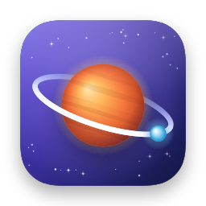
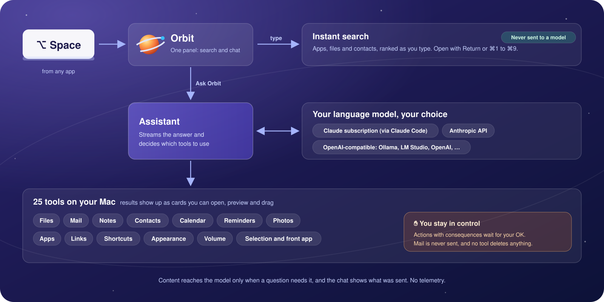

  

# Orbit documentation

Everything about using, configuring and contributing to Orbit, the macOS launcher with a built-in assistant. New
here? Start with [Getting started](getting-started.md). Looking for the overview? Head back to the
[project README](../README.md).

  

## Where to start

| I want to… | Read |
|---|---|
| try Orbit on my Mac | [Getting started](getting-started.md), then the [User guide](user-guide.md) |
| use my Claude subscription, an API key or a local model | [Choosing a language model](providers.md) |
| know what Orbit can do with my mail, files and calendar | [Tools reference](tools.md) |
| know what leaves my Mac and what Orbit may access | [Privacy](privacy.md) and [Permissions](permissions.md) |
| fix something that doesn't work | [Troubleshooting](troubleshooting.md) and [Known limitations](known-limitations.md) |
| work without a mouse or with VoiceOver | [Keyboard shortcuts](keyboard-shortcuts.md) and [Accessibility](accessibility.md) |
| build Orbit, fix a bug or add a tool | [Development](development.md), [Architecture](architecture.md) and [The agent](agent.md#adding-a-new-tool) |
| review Orbit's security | [Security model](security-model.md) and [SECURITY.md](../SECURITY.md) |

## Using Orbit

| Page | What you'll find |
|---|---|
| [Getting started](getting-started.md) | Requirements, installing or building Orbit, the setup assistant, your first questions, updating and uninstalling |
| [User guide](user-guide.md) | The panel, instant search, chatting with the assistant, result cards, confirmation cards, context chips, chat history, Settings |
| [Keyboard shortcuts](keyboard-shortcuts.md) | Every key for the panel, cards, confirmations, notices, Settings and the setup assistant |
| [Choosing a language model](providers.md) | The Claude subscription (via Claude Code), the Anthropic API and OpenAI-compatible servers such as Ollama and LM Studio |
| [Tools reference](tools.md) | All 25 tools: parameters, limits, what needs your confirmation and what the model receives |
| [Permissions](permissions.md) | Each macOS permission Orbit can use, why, and how Orbit asks for it |
| [Privacy](privacy.md) | What is sent to the model and when, what is stored where, logs, deleting your data |
| [Accessibility](accessibility.md) | VoiceOver, keyboard-only use and the display settings Orbit follows |
| [Troubleshooting](troubleshooting.md) | What each notice means and what helps, common problems, logs, FAQ |
| [Known limitations](known-limitations.md) | What Orbit doesn't do (yet), area by area |

## Contributing to Orbit

| Page | What you'll find |
|---|---|
| [Architecture](architecture.md) | Components and data flow, module map, app lifecycle, UI, instant search, storage, permissions, concurrency |
| [The agent](agent.md) | The agent loop, the tool protocol and registry, risk levels and confirmations, the system prompt, adding a new tool |
| [LLM providers](llm-providers.md) | The provider abstraction, the Anthropic and OpenAI wire formats, streaming, retries, errors, the Claude Code runtime and its MCP bridge |
| [Security model](security-model.md) | Trust boundaries, threats and the defenses against them, mapped to the code |
| [Development](development.md) | Toolchain and build scripts, project layout, debug builds, FakeLLMServer, orbitctl, invented test data |
| [Testing](testing.md) | Unit tests, mocks and fixtures, the opt-in suites and the rules every test follows |
| [Manual acceptance checks](manual-qa.md) | What to check by hand on a real Mac before a release |
| [Localization](localization.md) | How Orbit picks its language, String Catalogs, the OrbitStrings tool and the rules for user-visible text |
| [Releasing](releasing.md) | Versioning, universal builds, code signing, notarization and the release checklist |
| [Performance](performance.md) | Targets, measurements and how to measure |

Project files: [CONTRIBUTING.md](../CONTRIBUTING.md) · [SECURITY.md](../SECURITY.md) · [CHANGELOG.md](../CHANGELOG.md) ·
[LICENSE](../LICENSE) (MIT)
