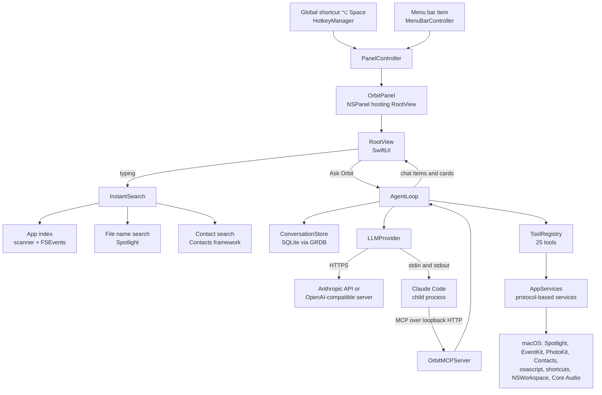

# Architecture

This page explains how Orbit is put together: which processes run, how the code is organized, how the app starts
and stops, and how the panel, instant search, storage, permissions and concurrency work. It is written for Swift and
macOS developers who want to change Orbit; the agent loop and the language model providers have pages of their own.

**On this page**

- [Overview](#overview)
- [Module map](#module-map)
- [Application lifecycle](#application-lifecycle)
- [UI architecture](#ui-architecture)
- [Instant search pipeline](#instant-search-pipeline)
- [Storage](#storage)
- [Permissions subsystem](#permissions-subsystem)
- [Concurrency model](#concurrency-model)
- [Dependency injection and testability](#dependency-injection-and-testability)
- [Resources and bundle layout](#resources-and-bundle-layout)
- [Further reading](#further-reading)

## Overview

Orbit is a single native app: Swift 6, SwiftUI and AppKit, built as a Swift package without an Xcode project. It has
no server of its own. Its only network connection is the language model provider you configure (with the Claude
subscription, Claude Code makes that connection), plus a loopback listener on `127.0.0.1` that exists only while
Claude Code runs.

### What runs where

| Process | Started by | Lifetime | Purpose |
|---|---|---|---|
| **Orbit** (`Orbit.app/Contents/MacOS/Orbit`) | launchd (Finder, login item, `open`) | Until you quit it | Everything: panel, menu bar item, instant search, agent loop, tools, storage. An agent app (`LSUIElement`, activation policy `.accessory`): no Dock icon, no visible main menu. |
| **Claude Code** (`claude`) | Orbit, for the "Claude subscription (via Claude Code)" provider | At most one at a time: the process of the current chat, reused for follow-ups and replaced when another chat sends a request or when the model, effort, system prompt or tools change, and after a failed turn; it ends after 15 minutes without a request or when Orbit quits | Runs the model turn and the tool loop on your subscription; calls Orbit's tools through a loopback MCP server inside Orbit. Short `claude` commands (sign-in, status) run as children too. |
| **osascript** (`/usr/bin/osascript`) | The Mail, Notes, Photos, Finder and System Events services | One short process per script run | Runs one of Orbit's bundled AppleScripts with its arguments in `argv` and prints JSON. |
| **shortcuts** (`/usr/bin/shortcuts`) | The Shortcuts service | One short process per `list` or `run` | Lists and runs the user's shortcuts. |

All child processes are started through [`ChildProcess`](../Orbit/Support/ChildProcess.swift) (see
[Concurrency model](#child-processes)). The API providers (Anthropic, OpenAI-compatible) connect from inside the Orbit process over HTTPS (plain HTTP
only to this Mac, an IP address, a `.local` name or a single-label name); see [llm-providers.md](llm-providers.md).

### Components and data flow



In words:

1. The global shortcut (or the menu bar item) asks `PanelController` to show the floating panel. The panel never
   activates Orbit; the app you came from stays frontmost.
2. While you type, [`InstantSearch`](../Orbit/Search/InstantSearch.swift) ranks apps from an in-memory index and merges
   in files (Spotlight) and contacts. Nothing of it reaches a model.
3. Return on the "Ask Orbit" row (or ⌘Return) hands the text to [`AgentLoop`](../Orbit/Agent/AgentLoop.swift), which
   streams a model turn from the selected `LLMProvider`, runs the tool calls the model makes (after a confirmation
   card where the risk level requires one) and repeats until the model answers without tools.
4. Tools reach macOS only through the protocols bundled in [`AppServices`](../Orbit/App/AppServices.swift).
5. The UI observes `AgentLoop.items` (messages, tool status rows, result cards, confirmation cards, notices) and
   renders them; `AgentLoop` saves the conversation to SQLite in the background.

The UI talks only to `AgentLoop` and `InstantSearch`, never to tools or providers directly.

## Module map

| Folder | Responsibility | Key types |
|---|---|---|
| [`Orbit/App/`](../Orbit/App) | Entry point, app lifecycle, composition root, the floating panel and its controller, the global shortcut, menu bar item and main menu, Settings and onboarding windows, Quick Look, context capture, chat parking. DEBUG only: remote control and fake personal data. | [`OrbitApp`](../Orbit/App/OrbitApp.swift), [`AppDelegate`](../Orbit/App/AppDelegate.swift), [`AppEnvironment`](../Orbit/App/AppEnvironment.swift), [`AppServices`](../Orbit/App/AppServices.swift), [`PanelController`](../Orbit/App/PanelController.swift), [`OrbitPanel`](../Orbit/App/OrbitPanel.swift), [`PanelState`](../Orbit/App/PanelState.swift), [`MenuBarController`](../Orbit/App/MenuBarController.swift), [`MainMenu`](../Orbit/App/MainMenu.swift), [`HotkeyManager`](../Orbit/App/HotkeyManager.swift), [`ContextCapture`](../Orbit/App/ContextCapture.swift), [`KeyboardHandoff`](../Orbit/App/KeyboardHandoff.swift), [`ChatParking`](../Orbit/App/ChatParking.swift), [`QuickLookController`](../Orbit/App/QuickLookController.swift), [`SettingsWindowController`](../Orbit/App/SettingsWindowController.swift), [`OnboardingWindowController`](../Orbit/App/OnboardingWindowController.swift), [`CommandNumberKey`](../Orbit/App/CommandNumberKey.swift), [`DebugAutomation`](../Orbit/App/DebugAutomation.swift), [`FakePersonalData`](../Orbit/App/FakePersonalData.swift) |
| [`Orbit/Agent/`](../Orbit/Agent) | The agent loop, the tool protocol and registry, risk levels, the confirmation broker, the system prompt, truncation, chat items, result cards, the conversation model. | [`AgentLoop`](../Orbit/Agent/AgentLoop.swift), [`Tool`](../Orbit/Agent/Tool.swift), [`ToolRegistry`](../Orbit/Agent/ToolRegistry.swift), [`ConfirmationBroker`](../Orbit/Agent/ConfirmationBroker.swift), [`SystemPrompt`](../Orbit/Agent/SystemPrompt.swift), [`ChatItem`](../Orbit/Agent/ChatItem.swift), [`ResultCard`](../Orbit/Agent/ResultCard.swift), [`Conversation`](../Orbit/Agent/Conversation.swift) |
| [`Orbit/LLM/`](../Orbit/LLM) | The provider abstraction, the Anthropic and OpenAI-compatible providers and wire formats, SSE parsing, HTTP and retries, errors. | [`LLMProvider`](../Orbit/LLM/LLMProvider.swift), [`LiveProviderFactory`](../Orbit/LLM/LiveProviderFactory.swift), [`AnthropicProvider`](../Orbit/LLM/AnthropicProvider.swift), [`OpenAICompatibleProvider`](../Orbit/LLM/OpenAICompatibleProvider.swift), [`StreamingParser`](../Orbit/LLM/StreamingParser.swift), [`ProviderHTTP`](../Orbit/LLM/ProviderHTTP.swift), [`Models`](../Orbit/LLM/Models.swift) |
| [`Orbit/LLM/ClaudeCode/`](../Orbit/LLM/ClaudeCode) | The Claude subscription provider: locating and running Claude Code, its stream decoder, sign-in and account status, and `MCPBridge/` (the loopback MCP server that exposes Orbit's tools). | [`ClaudeCodeRuntime`](../Orbit/LLM/ClaudeCode/ClaudeCodeRuntime.swift), [`ClaudeCodeSession`](../Orbit/LLM/ClaudeCode/ClaudeCodeSession.swift), [`ClaudeCodeProcess`](../Orbit/LLM/ClaudeCode/ClaudeCodeProcess.swift), [`ClaudeCodeAccountService`](../Orbit/LLM/ClaudeCode/ClaudeCodeAccountService.swift), [`OrbitMCPServer`](../Orbit/LLM/ClaudeCode/MCPBridge/OrbitMCPServer.swift), [`LoopbackHTTPServer`](../Orbit/LLM/ClaudeCode/MCPBridge/LoopbackHTTPServer.swift) |
| [`Orbit/Tools/`](../Orbit/Tools) | The 25 tools, one folder per domain: `Files`, `Mail`, `Notes`, `Contacts`, `Calendar`, `Reminders`, `Photos`, `Apps`, `System`. Each domain has a protocol-based service with a live implementation and a `<Domain>Tools.all(context:)` factory. `Shared/` holds the AppleScript runner, Spotlight queries, content wrapping, file paths, the process runner and the pasteboard. | [`FileTools`](../Orbit/Tools/Files/FileTools.swift), [`MailTools`](../Orbit/Tools/Mail/MailTools.swift), [`NotesTools`](../Orbit/Tools/Notes/NotesTools.swift), [`CalendarTools`](../Orbit/Tools/Calendar/CalendarTools.swift), [`PhotoTools`](../Orbit/Tools/Photos/PhotoTools.swift), [`AppTools`](../Orbit/Tools/Apps/AppTools.swift), [`SystemTools`](../Orbit/Tools/System/SystemTools.swift), [`AppleScriptRunner`](../Orbit/Tools/Shared/AppleScriptRunner.swift), [`LiveSpotlight`](../Orbit/Tools/Shared/LiveSpotlight.swift), [`FileSearchScope`](../Orbit/Tools/Shared/FileSearchScope.swift) |
| [`Orbit/Search/`](../Orbit/Search) | Instant search: app index, folder watcher, file name search, contact search, fuzzy matcher, launch counts, opening results. | [`InstantSearch`](../Orbit/Search/InstantSearch.swift), [`AppIndex`](../Orbit/Search/AppIndex.swift), [`AppBundleScanner`](../Orbit/Search/AppBundleScanner.swift), [`FolderWatcher`](../Orbit/Search/FolderWatcher.swift), [`FileNameSearch`](../Orbit/Search/FileNameSearch.swift), [`ContactSearch`](../Orbit/Search/ContactSearch.swift), [`FuzzyMatcher`](../Orbit/Search/FuzzyMatcher.swift), [`LaunchCounts`](../Orbit/Search/LaunchCounts.swift), [`SearchResultOpener`](../Orbit/Search/SearchResultOpener.swift) |
| [`Orbit/Storage/`](../Orbit/Storage) | The GRDB database and conversation store, settings in UserDefaults, the keychain store, app paths, the interface language. | [`AppDatabase`](../Orbit/Storage/Database.swift), [`ConversationStore`](../Orbit/Storage/ConversationStore.swift), [`SettingsStore`](../Orbit/Storage/SettingsStore.swift), [`KeychainStore`](../Orbit/Storage/KeychainStore.swift), [`AppPaths`](../Orbit/Storage/AppPaths.swift), [`AppLanguage`](../Orbit/Storage/AppLanguage.swift) |
| [`Orbit/Permissions/`](../Orbit/Permissions) | The permissions Orbit uses, their states, reading and requesting them. | [`PermissionKind`](../Orbit/Permissions/PermissionKind.swift), [`PermissionManager`](../Orbit/Permissions/PermissionManager.swift), [`LivePermissionAccess`](../Orbit/Permissions/LivePermissionAccess.swift) |
| [`Orbit/UI/`](../Orbit/UI) | SwiftUI views: root view, search, chat, input bar, context chips, result cards and their coordinators, confirmation cards, Markdown rendering, onboarding, Settings, VoiceOver announcements, theme. | [`RootView`](../Orbit/UI/RootView.swift), [`SearchView`](../Orbit/UI/SearchView.swift), [`ChatView`](../Orbit/UI/ChatView.swift), [`InputBar`](../Orbit/UI/InputBar.swift), [`ResultCardView`](../Orbit/UI/ResultCards/ResultCardView.swift), [`ConfirmationCard`](../Orbit/UI/ConfirmationCard.swift), [`MarkdownParser`](../Orbit/UI/Markdown/MarkdownParser.swift), [`MarkdownView`](../Orbit/UI/Markdown/MarkdownView.swift), [`Theme`](../Orbit/UI/Theme.swift), [`Announcements`](../Orbit/UI/Announcements.swift) |
| [`Orbit/Support/`](../Orbit/Support) | Small shared helpers: logging, child processes, private files, flexible dates. | [`Log`](../Orbit/Support/Log.swift), [`ChildProcess`](../Orbit/Support/ChildProcess.swift), [`PrivateFile`](../Orbit/Support/PrivateFile.swift), [`FlexibleDate`](../Orbit/Support/FlexibleDate.swift) |
| [`Orbit/Resources/`](../Orbit/Resources) | String Catalogs, the app icon and the AppleScripts. Not SwiftPM resources: `build-app.sh` copies them into the app. | [`Localizable.xcstrings`](../Orbit/Resources/Localizable.xcstrings), [`InfoPlist.xcstrings`](../Orbit/Resources/InfoPlist.xcstrings), [`AppIcon.icns`](../Orbit/Resources/AppIcon.icns), [`AppleScripts/`](../Orbit/Resources/AppleScripts) |
| [`OrbitTests/`](../OrbitTests) | Unit tests (Swift Testing), one folder per area mirroring `Orbit/`; mocks in `Support/`, invented data in `Fixtures/`. | See [testing.md](testing.md) |
| [`DevTools/`](../DevTools) | Developer tools, separate executable targets that never ship inside `Orbit.app`: `FakeLLMServer` (a scripted stand-in for the Anthropic and OpenAI APIs), `orbitctl` (drives a running DEBUG build), `OrbitStrings` (String Catalog tooling). | [`FakeLLMServer`](../DevTools/FakeLLMServer/main.swift), [`orbitctl`](../DevTools/orbitctl/main.swift), [`OrbitStrings`](../DevTools/OrbitStrings/main.swift) |
| [`Scripts/`](../Scripts) | Build tooling: `swiftpm.sh` (SwiftPM with Command Line Tools workarounds), `build-app.sh` (assemble, localize, sign), `make-icon.swift`, `create-dev-cert.sh`, `notarize.sh`, and `toolchain/` (the PreviewsMacros stand-in). | [`swiftpm.sh`](../Scripts/swiftpm.sh), [`build-app.sh`](../Scripts/build-app.sh), [`make-icon.swift`](../Scripts/make-icon.swift), [`create-dev-cert.sh`](../Scripts/create-dev-cert.sh), [`notarize.sh`](../Scripts/notarize.sh) |
| [`Config/`](../Config) | `Info.plist` with `$(ORBIT_…)` placeholders and the entitlements for release and debug builds. | [`Info.plist`](../Config/Info.plist), [`Orbit.entitlements`](../Config/Orbit.entitlements), [`Orbit-Debug.entitlements`](../Config/Orbit-Debug.entitlements) |

The package itself is described in [`Package.swift`](../Package.swift): `swift-tools-version: 6.0`, platform macOS 14,
one executable product `Orbit`, the dependencies [KeyboardShortcuts](https://github.com/sindresorhus/KeyboardShortcuts)
(from 2.4.0) and [GRDB.swift](https://github.com/groue/GRDB.swift) (from 7.11.0), the test target `OrbitTests`
(excluding `Fixtures`) and the three developer tools, all in Swift 6 language mode. For the folder-by-folder view
including build output, see [development.md](development.md#project-layout).

## Application lifecycle

### Launch sequence

1. **Entry point.** [`OrbitApp.main()`](../Orbit/App/OrbitApp.swift) is the `@main` entry. Before anything loads
   localized resources it calls `AppLanguage.removeLegacyGermanDefault()`, which removes the German language that
   older versions set for Orbit on their first launch (only the exact value Orbit wrote; a language chosen later in
   System Settings is kept). It then creates `NSApplication`, installs an `AppDelegate`, sets the activation policy
   to `.accessory` and runs the app.
2. **One instance per bundle ID.** `applicationDidFinishLaunching` looks for another running Orbit with the same
   bundle identifier (a second copy would register the same shortcut and share the database):
    - A previous instance that is still quitting (saving chats) gets 3 seconds to finish.
    - The **same copy** still running: this launch posts the distributed notification `<bundle id>.showPanel` (it
      carries no data), the running instance shows its panel, and this one quits.
    - **Another copy** (for example a newer download): an alert "Orbit Is Already Running" asks whether to quit the
      other copy, naming both versions ("Use This Copy" / "Cancel"). With "Use This Copy" the other instance is
      terminated and gets 5 seconds; if it does not quit, this one quits. An update therefore never quits silently.
3. **Composition root.** `finishLaunching()` creates `AppEnvironment(services: .live())`:
    - [`AppServices.live()`](../Orbit/App/AppServices.swift) builds the system access (Spotlight, workspace, app
      index, contacts, AppleScript runner, EventKit, PhotoKit, Shortcuts, audio volume, frontmost context, permission
      access, …). Nothing is scanned or queried until it is used. In DEBUG builds it reads
      `ORBIT_DEBUG_FILE_SCOPE` and `ORBIT_DEBUG_FAKE_PERSONAL_DATA` once (see
      [Dependency injection](#debug-modes-of-the-live-services)).
    - [`AppEnvironment`](../Orbit/App/AppEnvironment.swift) creates the `SettingsStore` (and on the very first launch
      picks the default provider: the Claude subscription when Claude Code is installed in one of its standard
      locations, otherwise the Anthropic API), the secret store (`KeychainStore`, or an in-memory store with
      `ORBIT_DEBUG_API_KEY` in DEBUG builds), the `ConversationStore` (opened lazily), the `ClaudeCodeRuntime`, the
      `PanelState`, the `ToolRegistry` with all tools, the `PermissionManager`, `InstantSearch`,
      `QuickLookController`, `ClaudeCodeAccountService`, `AgentLoop`, `ChatParking`, `ContextCapture` and
      `ContextPermissionSync`.
4. **Shell objects.** The delegate creates the `SettingsWindowController`, `PanelController`, `HotkeyManager` and
   `OnboardingWindowController`, installs `MainMenu` as `NSApp.mainMenu`, creates the `MenuBarController`, starts
   the hotkey, listens for the show-panel notification and calls `permissions.start()` (reads all permission states
   in the background).
5. **Restoring the last chat.** A task calls `chatParking.restoreMostRecentChat()`: the most recent conversation is
   restored when it was updated in the last 12 hours and was not left with "New Chat", and it starts **parked**: the
   panel opens in search mode with the chat one step away.
6. **DEBUG automation.** With `ORBIT_DEBUG_AUTOMATION=1` in a DEBUG build, [`DebugAutomation`](../Orbit/App/DebugAutomation.swift)
   starts (the remote control behind [orbitctl](development.md#orbitctl)).
7. **Onboarding decision.** `AppDelegate.onboardingAtLaunch(…)` returns an `OnboardingPlan`:
    - `.full` until the onboarding was seen once (finished, skipped or closed; `hasCompletedOnboarding`);
    - `.newPermissions([…])` when an update brought permissions that no earlier onboarding had a step for
      (`presentedOnboardingPermissions`): only those steps and the summary;
    - `.none` otherwise, and always in DEBUG runs configured through any `ORBIT_DEBUG_*` variable (they open it with
      `orbitctl open-onboarding`).

    Users who completed an onboarding before Orbit remembered its permission steps count as having seen Automation:
    Mail, Automation: Notes and Contacts.

Launching Orbit again from Finder, Spotlight or `open` while it runs (`applicationShouldHandleReopen`) shows the
panel, without context chips, since the frontmost app is then the launcher, not your context.

### Showing and hiding the panel

[`PanelController`](../Orbit/App/PanelController.swift) owns the panel. `toggle()` (the global shortcut) hides the
panel when it, or its Quick Look preview, is up and has the keyboard, and otherwise shows it. Before showing or
toggling, `AppDelegate` calls `permissions.refreshIfStale()`, since a request may follow.

`show(capturingContext:)`:

1. Picks the screen with the mouse pointer (else the main screen) and computes a `PanelLayout`.
2. When the panel was hidden: starts the context capture if the user opened it (hotkey or menu, not when Orbit shows
   the panel itself), lets `ChatParking` decide whether to park the chat, and lays the SwiftUI content out
   synchronously so the panel appears at its final height without an animation.
3. Calls `orderFrontRegardless()` and `makeKey()`: the panel becomes key **without activating Orbit**, so the
   frontmost app stays frontmost.
4. Sets `PanelState.isVisible`, increments `showCount` (RootView focuses the input and selects the previous query),
   and installs a global mouse-down monitor (no Accessibility permission needed).
5. Logs how long the panel took to appear, measured on the next turn of the run loop (target about 50 ms from the
   hotkey).

`hide(yieldFocus:)` removes the monitor, resets any keyboard hand-off, finishes a running resize, orders the panel
out (the SwiftUI content stays alive and is never rebuilt, so the chat is still there next time), tells
`ChatParking` and `ContextCapture`, and closes a Quick Look preview. If Orbit itself had become active (for example
after a second launch) and no other Orbit window is visible, it hides the app so the previous app gets the keyboard
back.

The panel hides on:

| Trigger | Handled in |
|---|---|
| Escape (after closing a Quick Look preview, and when no answer is running; otherwise Escape stops the answer) | `AppEnvironment.handleEscape()` |
| The global shortcut while the panel has the keyboard | `PanelController.toggle()` |
| A click in another app, the Dock or the menu bar, except on the system's text input windows (input methods, character palette, AutoFill, Writing Tools) | Global mouse monitor, `mouseDownOutsideOrbit(at:)` |
| The panel losing the keyboard to another app or another Orbit window (Settings, the About panel) | `windowDidResignKey`, `anyWindowDidBecomeKey` |
| Orbit resigning active, ⌘H ("Hide Orbit"), ⌘W | `applicationDidResignActive`, `applicationDidHide`, `closeKeyWindow()` |

Windows that belong to the panel (sheets, popovers, child windows and Quick Look previews opened from it) do not
close it. The pure decision is `PanelController.staysUp(afterKeyboardMovedTo:isPreviewVisible:isAppActive:isHandingOffKeyboard:)`.

### Settings and onboarding windows

Both are ordinary titled windows that **activate** Orbit, so their text fields get normal keyboard focus:

- [`SettingsWindowController`](../Orbit/App/SettingsWindowController.swift) hosts `SettingsView` in one reusable
  window ("Orbit Settings"), created on first use and kept with its SwiftUI state. Opening it hides the panel. It can
  open on a specific tab (the chat's "Open Settings" goes straight to the right one); ⌘1 to ⌘5 select General, Model,
  Tools, Permissions and Privacy, also without Full Keyboard Access and on layouts whose number row types other
  characters. Its frame is saved under `OrbitSettingsWindow`, and it opens on the current Space.
- [`OnboardingWindowController`](../Orbit/App/OnboardingWindowController.swift) hosts `OnboardingView` ("Set Up
  Orbit"). Closing it in any way ("Done", "Later", the close button, ⌘W) counts as seen: it saves an API key that
  was typed but not saved yet, records its permission steps in `presentedOnboardingPermissions`, and sets
  `hasCompletedOnboarding`. The next opening starts at the first step. "Setup…" in the menu bar menu reopens the
  whole onboarding.

When either window closes and no panel or other titled window is visible, Orbit hides itself so the app you came
from gets the keyboard back.

### Menus

- The **menu bar item** ([`MenuBarController`](../Orbit/App/MenuBarController.swift)) is a square status item
  (autosave name `OrbitStatusItem`) with a template icon drawn in code (a planet with a tilted orbit and a
  satellite, 18 × 18 pt). Its menu: "Open Orbit" (shows the current global shortcut and follows changes), "New
  Chat", "Settings…" (⌘,), "Setup…", "Quit Orbit" (⌘Q).
- The **main menu** ([`MainMenu`](../Orbit/App/MainMenu.swift)) is never visible (agent app), but AppKit still
  resolves key equivalents through it, also while the panel is key and Orbit is inactive. Without its Edit menu,
  ⌘C, ⌘V, ⌘X, ⌘A and ⌘Z would do nothing in the panel's text field. Menus: Orbit ("About Orbit", "Settings…",
  "Hide Orbit" ⌘H, "Quit Orbit" ⌘Q), Edit (Undo, Redo ⇧⌘Z, Cut, Copy, Paste, Select All), Chat ("New Chat" ⌘N,
  "Close Window" ⌘W).
- Both route their commands through the `AppActions` protocol, which `AppDelegate` implements and DEBUG automation
  also uses.
- The **global shortcut** ([`HotkeyManager`](../Orbit/App/HotkeyManager.swift)) is the KeyboardShortcuts name
  `togglePanel`, default ⌥ Space, registered as a Carbon hot key (no Accessibility permission needed). The user
  changes or removes it in Settings → General.

### Termination

- `applicationShouldTerminate` stops a running request as Escape would (so its partial answer is saved). If chat
  saves are still queued it returns `.terminateLater` and replies once the saves finished, **at most 2 seconds**
  later, so quitting never hangs. The reply is scheduled on the main run loop in its common modes
  (`TerminationReplyLatch`), because `terminate:` may itself run inside a main-actor job.
- `applicationWillTerminate` calls `claudeCodeAccount.shutdown()` (ends a Claude Code sign-in that still runs) and
  `claudeCodeRuntime.shutdown()` (ends the Claude Code process, stops the MCP bridge and removes its temporary
  files, synchronously).
- `Info.plist` disables sudden and automatic termination, so macOS never kills Orbit without this sequence.

## UI architecture

### The panel window

[`OrbitPanel`](../Orbit/App/OrbitPanel.swift) is an `NSPanel` subclass:

- **Borderless** plus `.nonactivatingPanel`, instead of a titled window with a transparent title bar (whose invisible
  title strip would overlap the 56 pt input row and whose corners depend on the OS version). `canBecomeKey` is
  overridden to `true` (borderless windows refuse key status by default), `canBecomeMain` is `false`.
- Floating at level `.statusBar` with `.canJoinAllSpaces`, `.fullScreenAuxiliary`, `.transient` and
  `.ignoresCycle`, so it appears above other apps' floating windows and over full-screen apps; menus and pop-ups
  still appear above it. `hidesOnDeactivate` is off and the panel cannot be moved.
- The content view is an `NSVisualEffectView` (`.popover` material, kept `.active`) with a stretchable rounded-rect
  `maskImage` (9-slice), from which AppKit derives the window shadow. Corner radius 20 pt on macOS 26 and later, 14 pt
  before. Inside it a layer-clipped view holds an opaque background (shown only with Reduce Transparency), the
  `NSHostingView` with [`RootView`](../Orbit/UI/RootView.swift), and a hairline border view (a clear one-point edge
  with Increase Contrast). The panel follows changes of the accessibility display options live.
- The hosting view has `sizingOptions = []`: the controller owns the window size, SwiftUI adds no constraints.
- Escape that no view handled arrives in `cancelOperation(_:)` and goes to `AppEnvironment.handleEscape()`.
- `performKeyEquivalent` and `sendEvent` rewrite ⌘ + number-row keys to digits through
  [`CommandNumberKey`](../Orbit/App/CommandNumberKey.swift), so ⌘1 to ⌘9 work on layouts whose number row types other
  characters (French and Belgian AZERTY, Czech, Slovak, Lithuanian, …).

**Geometry** is the pure, unit-tested `PanelLayout`: at most 720 pt wide with 32 pt margins to the screen edges,
at least 56 pt tall, top edge 22 % of the visible height below the top of the screen, at most 70 % of the visible
height tall. The top edge stays fixed while the panel is visible: it grows and shrinks downward.

**Resizing:** RootView measures its natural height and writes it to `PanelState.preferredContentHeight`.
`PanelController` observes it with `withObservationTracking` (re-armed after each change) and animates the frame with
`PanelFrameAnimator`: a 60 Hz timer on the main run loop, 0.16 s, cubic ease-out, whole points, anchored at the top
edge. A run-loop timer is used instead of the display link behind `NSAnimationContext`, which stalls while the display
sleeps (for example during a long streamed answer) and could resume towards an outdated height. A new target
retargets the running animation; with Reduce Motion the panel takes its new height at once.

### PanelState

[`PanelState`](../Orbit/App/PanelState.swift) is the `@Observable`, main-actor state shared by the AppKit
controller and the SwiftUI content: the preferred and maximum content height, `isVisible`, `showCount`, the input
text, the context chips (`attachments`), the `KeyboardHandoff`, and callbacks the controller wires in
(`closePanel`, `closePanelIfNotKey`, `openSettings`, `keyboardDidReturn`). `hasKeyboard()` is true while the panel is
visible and the keyboard is not handed to another app; keys such as ⌘↩ only reach the panel then.

### RootView and panel modes

[`RootView`](../Orbit/UI/RootView.swift) stacks the context chips, the [`InputBar`](../Orbit/UI/InputBar.swift) and
an input hint, and below them one of three `PanelMode`s:

| Mode | When | Shows |
|---|---|---|
| `compact` | No chat (or a parked one) and an empty input | Only the input, plus "Continue chat" while a chat is parked |
| `search` | Text typed and no active chat | [`SearchView`](../Orbit/UI/SearchView.swift): the "Ask Orbit: “…”" row (position 0, highlighted by default), then the instant results grouped as Apps, Files, Contacts with ⌘1 to ⌘9 hints |
| `chat` | A conversation exists and is not parked | [`ChatView`](../Orbit/UI/ChatView.swift): a scroll view as tall as its content (up to the maximum), following new content while you are at the bottom |

`PanelMode.resolve(hasConversation:isChatParked:inputText:)` decides. RootView also:

- sets `openURL` so that links anywhere in model output open only when `MarkdownLinkPolicy` allows them;
- sets the SwiftUI locale to `AppLanguage.locale` (date pickers and formatters in the interface language);
- on every `showCount` change focuses the input, selects the previous query, and (outside chat mode) searches
  again, since files may have changed while the panel was hidden.

[`ChatParking`](../Orbit/App/ChatParking.swift) implements "search first after a pause": when the panel was hidden
for 5 minutes or longer, an idle chat is parked and the panel opens in search mode. A chat that needs you (an
answer running, a confirmation card waiting, an unsent message in its input) is never parked. ↑ in the empty input or
"Continue chat" brings it back. Parking changes only what the panel shows; `AgentLoop` keeps the conversation.

[`ContextCapture`](../Orbit/App/ContextCapture.swift) captures the context chips when you open the panel and "Use the
selection when opening" is on: the panel appears at once, the chips follow when the capture is done. A capture that
takes longer than 300 ms is dropped, and so is one that finishes after you sent the message or closed the panel
(a generation counter). An open replaces earlier chips unless the input still holds unsent text together with chips
you kept. [`ContextPermissionSync`](../Orbit/App/ContextCapture.swift) keeps Accessibility and Automation: Finder in
the permission list exactly while the chips or `get_frontmost_context` are on.

### Keyboard handling

The input field (a plain SwiftUI `TextField`) keeps the keyboard almost all the time. `InputBar` handles keys with
`onKeyPress` and forwards them as `InputCommands` that RootView implements:

| Key | Search mode | Chat mode |
|---|---|---|
| Return | Opens the highlighted result, or asks Orbit | Sends the message (ignored while an answer runs) |
| ⌘Return | Sends the typed text to Orbit | Sends typed text; with an empty input runs the waiting confirmation card, or brings it into view first ([`ConfirmationKeyboard`](../Orbit/UI/ConfirmationKeyboard.swift)) |
| ↑ / ↓ | Moves the highlight (wraps around, [`SearchSelection`](../Orbit/UI/SearchSelection.swift)); ↑ in the empty input continues a parked chat | None |
| ⌘1 to ⌘9 | Opens result 1 to 9 | None |
| Page Up/Down, Home/End, ⌘↑/⌘↓ | None | Scroll the chat |
| Tab / Shift-Tab | None | Moves the keyboard to the latest card ([`CardKeyboard`](../Orbit/UI/ResultCards/CardKeyboard.swift)) |
| ⌫ in the empty input | Removes the last context chip | Removes the last context chip |
| Escape | Closes the panel | Stops a running answer, else closes the panel |

Because the keyboard stays in the input, VoiceOver would not notice highlight changes; RootView announces them
through the `Announcing` service ([`VoiceOverAnnouncer`](../Orbit/UI/Announcements.swift) posts
`NSAccessibility` announcement requests). See [accessibility.md](accessibility.md) and
[keyboard-shortcuts.md](keyboard-shortcuts.md).

#### The keyboard hand-off

When `create_mail_draft` opens Mail's reply window, the user is supposed to paste the reply text Orbit put on the
clipboard. Normally the panel would close the moment Mail takes the keyboard. [`KeyboardHandoff`](../Orbit/App/KeyboardHandoff.swift)
is a pure state machine (`idle` → `opening` → `opened` → `keptVisible`) that lets the panel stay visible without the
keyboard so the reply card stays in view:

- The tool announces the hand-off through `KeyboardHandoffAnnouncing` (live: `PanelState`; without a panel:
  `NoKeyboardHandoff`). Only a visible panel takes part; a closed panel is never brought back.
- While Orbit opens the window (at most 90 seconds, the tool deadline) and for 5 seconds after it opened, losing the
  keyboard to another app keeps the panel visible, once per hand-off.
- Afterwards the panel closes as always: a click outside, the shortcut or Escape once it has the keyboard again, or
  another app coming to the front. A click into the panel ends the hand-off. If the window did not open after all
  while the panel stayed visible for it, the panel closes.
- When the panel takes the keyboard back, `keyboardDidReturn` makes VoiceOver read a waiting confirmation card again
  with the keys that decide it.

### Quick Look

[`QuickLookController`](../Orbit/App/QuickLookController.swift) drives the system `QLPreviewPanel` (behind the
`QuickLookPanel` protocol; tests use a fake that never shows a window) as its data source and delegate:

- Space on a file card previews its files from the selected row, or closes the preview of that card.
- Card and preview stay in step: moving the card's selection shows another file, moving in the preview moves the
  card's selection.
- The preview appears on the panel's screen and belongs to the panel: it keeps the panel up while it has the
  keyboard, closes when the panel hides, and Escape closes it before anything else. When it closes after having had
  the keyboard, the panel becomes key again and the previewed card refocuses itself.
- The preview finds its controller through the responder chain: `OrbitPanel` first, and `AppDelegate` as the end of
  every responder chain for when the preview itself is the key window.

### Chat rows and result cards

`AgentLoop.items` is an array of [`ChatItem`](../Orbit/Agent/ChatItem.swift)s: user messages (with their chips),
assistant text (streaming or complete), progress notes, tool status rows, result cards, confirmation cards, notices
and the disclosure footnote ("3 file names … sent to Claude"). [`ChatView`](../Orbit/UI/ChatView.swift) renders each
with an `Equatable` row view, so streaming a long answer does not re-render the rest. Streamed text reaches `items` at
most every 33 ms.

A [`ResultCard`](../Orbit/Agent/ResultCard.swift) is structured data a tool hands to the UI: `files`, `mails`,
`mailDraft`, `notes`, `events`, `reminders`, `contacts`, `photos` or `info`.
[`ResultCardView`](../Orbit/UI/ResultCards/ResultCardView.swift) renders them. What a card does on a click or Return
is the user's own action and lives in coordinators that RootView creates and passes down through the SwiftUI
environment:

| Coordinator | Does |
|---|---|
| [`FileCardCoordinator`](../Orbit/UI/ResultCards/FileCardCoordinator.swift) | Opens and reveals files, copies paths, starts Quick Look, moves the keyboard between the input and cards (Tab, Shift-Tab), announces the selected row, scrolls the chat to it |
| [`MailCardActions`](../Orbit/UI/ResultCards/MailCardActions.swift) | Opens messages through `message://` links, brings a draft or reply window to the front ("Show in Mail"), copies a reply's text again ("Copy Text") |
| [`NoteCardActions`](../Orbit/UI/ResultCards/NoteCardActions.swift) | Opens notes in Notes through the same script as `open_note` |
| [`CalendarCardActions`](../Orbit/UI/ResultCards/CalendarCardActions.swift) | Shows events in Calendar and reminders in Reminders |
| [`PhotoCardActions`](../Orbit/UI/ResultCards/PhotoCardActions.swift) | Loads thumbnails (PhotoKit, never from iCloud, kept in memory) and shows a photo in Photos, opening Photos when it cannot |

Each coordinator turns a failure into a value (`openFailure`, `failure`) that RootView shows as an `InputHint`
under the input and announces. Cards rendered without a coordinator (snapshots of single views) are simply not
clickable. Keyboard navigation inside cards is the `CardKeyboard` view modifier; the selection logic is the pure
[`FileCardSelection`](../Orbit/UI/ResultCards/FileCardSelection.swift) (no wrap-around, like Finder; selecting a
hidden row expands the card; ↑/↓ move by a row of tiles in a photo grid). Confirmation cards are
[`ConfirmationCard`](../Orbit/UI/ConfirmationCard.swift); their protocol is in [agent.md](agent.md#risk-levels-and-confirmation-cards).

### Markdown rendering

Model answers are rendered natively, without a web view:

- [`MarkdownParser`](../Orbit/UI/Markdown/MarkdownParser.swift) splits text into `MarkdownBlock`s: paragraphs, ATX
  headings, bullet and ordered lists (nested by indentation, task items), fenced code blocks, block quotes, thematic
  breaks and GFM tables. It is tuned for streamed output: it never fails, an unclosed fence turns the rest into code
  (`isClosed: false`), and indentation is read leniently. Quotes and lists deeper than 24 levels render as plain
  paragraphs. Indented code blocks, setext headings, HTML blocks and link reference definitions are not supported;
  such lines render as text.
- [`MarkdownView`](../Orbit/UI/Markdown/MarkdownView.swift) renders the blocks as SwiftUI views with selectable text.
  `MarkdownInline` turns inline Markdown into an `AttributedString` (inline-only parsing), styles code spans, turns
  bare URLs into links, and treats only `~~` as strikethrough (single tildes appear in paths and ranges).
- `MarkdownLinkPolicy` allows only `http`, `https` and `mailto` links: model output can contain text from mail,
  notes or web pages, so `file://`, Shortcuts, System Settings and other app URL schemes stay plain text.

**AnswerParts.** `AssistantMessageView` renders an answer as two `Equatable` `MarkdownView`s, split by
[`AnswerParts`](../Orbit/UI/MessageView.swift):

- While streaming, `main` is the part that no longer changes (up to the last blank line outside a code fence) and
  `tail` the growing rest, with open inline markers closed. Only the tail is parsed again for each delta, so long
  answers stay fast. As long as nothing is stable, the rest goes into the first view.
- When the answer is complete, the whole text goes into `main`, the same view that showed the beginning, so SwiftUI
  keeps it and rebuilds only the blocks that changed, instead of building the whole answer again at once (measured:
  350 ms for 33,000 characters).

### Theme and other views

[`Theme`](../Orbit/UI/Theme.swift) holds the shared metrics, fonts and semantic colors (panel width 720 pt, content
inset 18 pt, input font 22 pt, chat text 14 pt, code 12.5 pt monospaced; corner radii 8, 10 and 14 pt for rows,
cards and bubbles), the colors per tool risk level, and helpers for Increase Contrast and Differentiate Without Color.
`UI/Settings/` contains one view per Settings tab; `UI/Onboarding/` the onboarding model and view (`OnboardingPlan`
is defined there). [`Phrases`](../Orbit/UI/Phrases.swift) builds count phrases and the disclosure footnote;
[`PermissionCopy`](../Orbit/UI/PermissionCopy.swift) holds what Settings and the onboarding say about each
permission.

## Instant search pipeline

Instant search runs entirely on the Mac and never involves a model. Its entry point is
[`InstantSearch`](../Orbit/Search/InstantSearch.swift) (`@MainActor`, `@Observable`), built on
`InstantSearchDependencies` (apps, files, contacts, opener, launch counts, home folder, debounce and an injectable
sleep).

### One keystroke, step by step

1. `search(_:)` trims the text, bumps a generation counter and cancels the previous pipeline task (which stops its
   Spotlight queries).
2. It narrows the results shown so far to those that still match the new text, so nothing flashes empty.
3. After the **debounce of 80 ms** (a newer keystroke cancels the wait), apps are ranked synchronously from the
   in-memory index; the first results appear about 80 ms after the last keystroke.
4. From **2 letters or digits**, files and contacts are searched in parallel (`async let`) and merge in when ready.
   Progressive file results keep earlier results that still match until the search is final.
5. Late results of an older generation are dropped. When the search finishes, VoiceOver hears the result count.

### Result grouping

`SearchLayout` groups and limits what is shown: **at most 8 results**, in the fixed order Apps, Files, Contacts: up
to 4 apps, up to 2 contacts, and files fill the rest (at least 2). Apps keep their rows when files arrive later, and
the list fits the panel without scrolling. An app shows "Application" under its name, or its folder when another
shown app has the same name; a file shows its folder as Finder names it ("Documents ▸ Invoices"), else its path.

### App index

[`LiveAppIndex`](../Orbit/Search/AppIndex.swift) keeps the apps in memory (icons are not part of the index; the UI
loads them):

- **Folders:** `/Applications`, `/System/Applications` and `~/Applications`, each with one level of subfolders
  (such as Utilities), plus Finder (`/System/Library/CoreServices/Finder.app`). Folders that do not exist yet are
  watched anyway.
- **Scanner:** [`AppBundleScanner`](../Orbit/Search/AppBundleScanner.swift) runs off the main actor (a detached
  utility task). It never descends into bundles, hidden folders or symlinked folders, but counts symlinks to apps
  (listed once, by their own path when found); it skips background-only apps (`LSBackgroundOnly`). It reads only
  bundle folders, their `Info.plist` and name localizations.
- **Names:** every app is found by the name Finder shows (shown in results), its file name, `CFBundleDisplayName` /
  `CFBundleName`, and the localized bundle names, from `InfoPlist.loctable` (Apple's apps) or
  `<language>.lproj/InfoPlist.strings`, looking only at the few folder names a language can have ("de-DE", "de_DE",
  "de", "German"). The languages are Orbit's own language, the first three of the user's preferred languages, and English (so "Rechner"
  finds Calculator on an English Mac that also lists German). A match on
  another name than the shown one (for example "Maps" for an app shown under its localized name) scores slightly lower
  (× 0.98).
- **Watcher:** [`FolderWatcher`](../Orbit/Search/FolderWatcher.swift) uses FSEvents (latency 0.5 s, on its own
  utility queue). An app or subfolder appearing, disappearing or changing at those levels (including a bundle's
  `Contents` folder, for an edited `Info.plist`) or dropped events trigger a rescan after 1 second of quiet; changes
  further inside bundles are ignored. If the stream cannot start, the index updates at the next launch.
- After a rescan, the current query is ranked again unless its debounce is still running.

### File name search

[`SpotlightFileNameSearch`](../Orbit/Search/FileNameSearch.swift) uses the shared Spotlight layer and the **same
scope, visibility and access rules as the file tools** (`FileToolContext`):

- **Scope** ([`FileSearchScope`](../Orbit/Tools/Shared/FileSearchScope.swift)): the visible folders directly in the
  home folder (Desktop, Documents, Downloads, … and folders you created), iCloud Drive (`~/Library/Mobile Documents`)
  and cloud storage (`~/Library/CloudStorage`), not the home scope as a whole, which would make Spotlight gather
  everything in `~/Library`. Files lying directly in the home folder are therefore not found. Hidden items,
  `~/Library`, package contents and secrets are never listed; apps are excluded (`com.apple.application`), since the
  app index shows them.
- **Matching:** every typed word must be a word prefix of the name (case- and diacritic-insensitive). Text with more
  than 6 words counts as a sentence for the agent and finds no files.
- **Two queries** run side by side, each reading at most 100 results, newest first, with a 2-second timeout: one on
  the name on disk, which Spotlight answers within milliseconds, and one on the name Finder shows (localized folder
  names), which takes about 180 ms. The first results arrive early and the rest merge in.
- A private actor (`Merger`) combines both, ranks them with `FileRanking`, verifies only the best candidates on disk
  (twice the limit), and adds the folder names as Finder shows them (cached per folder).
- **Ranking:** score = name bonus + recency. The bonus is 2 for an exact match (of the shown name, the name on disk
  or that name without its extension), 0.3 for a prefix and 0.15 for a word-prefix match; recency is
  1 / (1 + age / 14 days) of the later of last use and modification. A file used today (≈ 1) comes before one from
  last month (≈ 0.3) whichever word matched.

In DEBUG builds with `ORBIT_DEBUG_FILE_SCOPE`, only that folder is searched (see
[development.md](development.md#debug-environment-overrides)).

### Contact search

[`LiveContactSearch`](../Orbit/Search/ContactSearch.swift) uses the Contacts framework **only when access was already
granted**; it never asks. It runs on its own serial queue (`io.github.eric-volz.Orbit.contact-search`), never on the main
thread, matches by name (`predicateForContacts(matchingName:)`), reads at most 50 matches and ranks them with the
fuzzy matcher (contacts the framework found through another field last). Each hit shows the first e-mail address or
the organization; opening it uses an `addressbook://` URL. macOS has no limited Contacts authorization, so only
`.authorized` counts.

### Fuzzy matcher

[`FuzzyMatcher`](../Orbit/Search/FuzzyMatcher.swift) is pure. Both sides are folded (case, diacritics, width:
"ß" = "ss", "Ü" = "u") and split into words at spaces and punctuation, at lower-to-upper case changes ("FaceTime") and
between letters and digits ("Office365"). Separators are ignored when comparing, so "face time" matches "FaceTime".
Tiers, best first:

| Tier | Weight | Example |
|---|---|---|
| Exact: the whole name | 6 | "safari" → Safari |
| Prefix: the start of the name | 4 | "saf" → Safari |
| Word prefix: the text splits into prefixes of words in their order: a later word, initials, or both; several typed words also match in any order | 3 | "code", "vsc", "vscode", "visual co" → Visual Studio Code |
| Substring: anywhere inside, from 2 characters | 2 | "code" → Xcode |
| Subsequence: the characters in order, from 3 characters | 1 | "xcd" → Xcode |

Within a tier a score between 0 and 1 rewards closer matches: more of the name covered, earlier and fewer skipped
words, tighter subsequences. Equal matches are ordered by name as Finder sorts them, then by identifier
(`SearchOrder`), for a stable result.

### Launch counts

[`LaunchCounts`](../Orbit/Search/LaunchCounts.swift) records how often you opened each app **from instant search**
(UserDefaults key `instantSearchLaunchCounts`; app paths and counts only, never files, contacts or what was typed).
It keeps at most 100 apps (the least launched are dropped, never the one just launched) and at most 1,000 launches per
app. `AppRanking` adds a boost of `min(0.99, log2(launches + 1) / 6)`: 1 launch ≈ 0.17, 7 ≈ 0.5, 63 or more 0.99.
Because the boost stays below 1, it reorders apps within a tier and lifts an app past at most one tier, never past an
exact name match (exact sits two weights above prefix).

Results are opened by [`LiveSearchResultOpener`](../Orbit/Search/SearchResultOpener.swift) through `NSWorkspace`
(apps are launched or brought to the front). A file result is checked first: if it was moved or deleted since the
search, the panel stays open, says so, and searches again.

## Storage

Everything Orbit stores lives in three places: the data folder, UserDefaults and the login keychain. See
[privacy.md](privacy.md) for the user-facing view.

### App paths and the data folder

[`AppPaths`](../Orbit/Storage/AppPaths.swift):

| Path | Contents |
|---|---|
| `~/Library/Application Support/Orbit/` | The data folder (created with mode 0700 when the database creates it) |
| `…/Orbit.sqlite` (+ `-wal`, `-shm`) | The chat history |
| `…/Orbit.sqlite.damaged` (+ `-wal.damaged`, `-shm.damaged`) | An unreadable database moved aside (see below) |
| `…/ClaudeCode/` | Claude Code's empty working folder (0700) with Orbit's per-process files (0600): the system prompt and the MCP configuration |
| `…/ShortcutInput/` | Input files for `run_shortcut`, readable only by you and deleted after each run |
| `…/Automation/` | DEBUG builds with `ORBIT_DEBUG_AUTOMATION=1` only: the per-launch token and replies of the remote control |

The bundle identifier comes from `Bundle.main` (default `io.github.eric-volz.Orbit`).

**Data-folder override:** DEBUG builds honor `ORBIT_DATA_DIR=<folder>`, which replaces the whole data folder (the
database, the Claude Code folder, shortcut input and the automation channel), so tests and debug runs never touch real
data. Release builds ignore it.

### Database

[`AppDatabase`](../Orbit/Storage/Database.swift) wraps GRDB:

- On disk a `DatabasePool` in **WAL mode**; in memory (tests, previews) a `DatabaseQueue`.
- Every connection runs `PRAGMA secure_delete = ON`, so SQLite overwrites deleted content with zeros instead of
  leaving it in free pages. Foreign keys are on; the busy timeout is 5 seconds (another Orbit process, such as a debug
  build, may hold the write lock briefly).
- A file that is not a readable SQLite database (`SQLITE_CORRUPT`, `SQLITE_NOTADB`) is moved aside to
  `<name>.damaged` (replacing an older one) and a new, empty database is created, so a damaged file never disables
  chat history for good.

**Schema.** Migrations are registered in `AppDatabase.migrator`; never edit a registered migration, add a new one.
There is currently one migration, named `"v1"`:

```sql
CREATE TABLE conversation (
    id        TEXT PRIMARY KEY,      -- UUID string
    title     TEXT,                  -- first 60 characters of the first user message
    createdAt DATETIME NOT NULL,     -- ISO 8601, UTC, milliseconds
    updatedAt DATETIME NOT NULL,
    payload   BLOB NOT NULL          -- the whole Conversation as JSON
);
CREATE INDEX conversation_on_updatedAt ON conversation (updatedAt);
```

- Timestamps are fixed-width UTC strings like `2026-09-28T19:03:12.123Z` (`ISO8601Milliseconds`), so `updatedAt`
  sorts correctly as text.
- `payload` is the JSON-encoded [`Conversation`](../Orbit/Agent/Conversation.swift) (sorted keys, slashes not
  escaped, dates in the same ISO 8601 form): the provider-neutral message history, the frozen system prompt and tool
  definitions, the recipients the history went to, the content disclosures, and the chat items the UI shows. A payload
  that cannot be decoded (for example from an incompatible version) is reported as `undecodablePayload`; saving a new
  chat makes it obsolete.

### ConversationStore and retention

[`ConversationStore`](../Orbit/Storage/ConversationStore.swift) implements `ConversationStoring`:

- **Opened lazily** on first use by a private actor (`DatabaseSource`), never on the main thread; a failed open is
  retried on the next call. All work, including JSON encoding and decoding, runs on GRDB's dispatch queues.
- `save(_:)` upserts the row, then **prunes to the 100 most recent chats** (by `updatedAt`).
- `mostRecent()` returns the chat with the latest `updatedAt`. At launch `AgentLoop` restores it only when it was
  updated within the last 12 hours and is not the chat you left with "New Chat" (`dismissedConversationID`).
- `deleteAll()` ("Delete Chat History…" in Settings → Privacy) deletes all rows, runs `VACUUM`, truncates the WAL with a
  checkpoint (a busy checkpoint is logged and left to a later one) and removes damaged copies; this is best effort, since
  SSDs and APFS may keep old blocks.
- `AgentLoop` serializes store operations so they land in order and tracks pending saves for termination.

### Settings

[`SettingsStore`](../Orbit/Storage/SettingsStore.swift) is a main-actor `@Observable` class persisting non-secret
settings in `UserDefaults` (domain `io.github.eric-volz.Orbit`); each property writes through on change.

| Key | Type | Default | Meaning |
|---|---|---|---|
| `providerKind` | `anthropic` / `openAICompatible` / `claudeCode` | First launch: `claudeCode` when Claude Code is installed in a standard location, else `anthropic` | The selected provider |
| `anthropicModel` | String | `claude-sonnet-5-5` | Model for the Anthropic API |
| `anthropicBaseURL` | String | empty (= `https://api.anthropic.com`) | Proxy or Anthropic-compatible server |
| `openAIModel` | String | empty | Model for the OpenAI-compatible provider |
| `openAIBaseURL` | String | `http://localhost:11434/v1` | Chat Completions base URL |
| `claudeCodeModel` | String | `sonnet` | Claude Code model alias (`sonnet`, `opus`, `haiku`) or full model ID |
| `claudeCodePath` | String | empty (= auto-detect) | Explicit path of the `claude` executable |
| `reasoningEffort` | `low` / `medium` / `high` / empty | `low` | Empty = send no effort setting |
| `disabledToolNames` | [String] | empty | Tools switched off in Settings → Tools |
| `hasCompletedOnboarding` | Bool | `false` | The onboarding was seen |
| `presentedOnboardingPermissions` | [String] | empty | Permissions an onboarding showed a step for |
| `dismissedConversationID` | UUID string | empty | The chat left with "New Chat"; not restored at launch |
| `capturesSelectionOnOpen` | Bool | `true` | "Use the selection when opening" (context chips) |

Other keys in the same domain: `instantSearchLaunchCounts` ([LaunchCounts](#launch-counts)),
`KeyboardShortcuts_togglePanel` (the global shortcut, stored by KeyboardShortcuts), the status item's and Settings
window's autosaved positions, and `AppleLanguages` only when you choose a language for Orbit in System Settings.

In DEBUG builds, `ORBIT_DEBUG_PROVIDER`, `ORBIT_DEBUG_MODEL`, `ORBIT_DEBUG_BASE_URL` and `ORBIT_DEBUG_EFFORT` override
the settings in memory; once any of them is present, changes are no longer persisted, so debug runs never modify your
real settings. Tests pass their own `UserDefaults` suite.

### Keychain

[`KeychainStore`](../Orbit/Storage/KeychainStore.swift) implements `SecretStoring` with generic-password items in the
login keychain:

- Service `<bundle id>.credentials` (`io.github.eric-volz.Orbit.credentials`), accounts `anthropic-api-key` and
  `openai-compatible-api-key`. The Claude subscription uses no key; its sign-in stays with Claude Code.
- Items are added with `kSecAttrAccessibleAfterFirstUnlock` and the label `Orbit: <account>`. Saving an empty value
  deletes the item. Values are trimmed.
- API keys exist only here, never in UserDefaults, files or logs. The agent loop reads them off the main actor
  (keychain access can block).
- `InMemorySecretStore` serves tests and the DEBUG override `ORBIT_DEBUG_API_KEY`, so debug runs never touch the
  keychain.

## Permissions subsystem

The permissions are described for users in [permissions.md](permissions.md); this section covers the code.

### PermissionKind and PermissionStatus

[`PermissionKind`](../Orbit/Permissions/PermissionKind.swift) lists every macOS permission Orbit may use: Contacts,
Calendars, Reminders, Photos, Automation: Mail, Automation: Notes, Automation: Finder, Automation: System Events,
Automation: Photos (Apple Events, with the target's bundle ID), Accessibility and Full Disk Access. Every permission
is optional: without it the related tools are switched off and the agent is told why.

`PermissionStatus` is `notDetermined`, `granted`, `denied`, `restricted`, `unknown` (cannot be determined right now,
for example while an automation target app is not running) or `writeOnly` ("Add Only" for Calendars or Reminders, which is not enough,
since the tools read them). `allowsUse` is true for `granted`, `notDetermined` and `unknown`: tools stay available and
macOS asks on first use.

### PermissionManager

[`PermissionManager`](../Orbit/Permissions/PermissionManager.swift) (`@MainActor`, `@Observable`) keeps the states
current **without ever asking the user**:

- **Which permissions:** those the registered tools require, plus Full Disk Access when the mail tools exist
  (optional: faster mail search through Spotlight) and Automation: Photos when the photo tools exist (a photo card
  shows its photo in Photos), plus the `featurePermissions` of features that are on: Accessibility and Automation:
  Finder while the context chips or `get_frontmost_context` are on. Full Disk Access never switches a tool off.
- **Display order:** Automation: Mail, Automation: Notes, Contacts, Calendars, Reminders, Photos, Automation: Photos,
  Automation: Finder, Automation: System Events, Accessibility, Full Disk Access. Full Disk Access, Automation: System
  Events and Automation: Photos appear only in Settings, never as onboarding steps.
- **Reading** runs off the main thread (the Apple Events check may block) and lands in an `OSAllocatedUnfairLock`, so
  `status(of:)` is a cheap synchronous, `nonisolated` lookup for the agent loop and the tool registry. A permission
  not read yet is `unknown`. Older readings that arrive late are dropped (a reading counter per permission).
- **Refresh triggers:** `start()` at launch; the panel opening or Orbit becoming active (for example back from System
  Settings), unless the last routine read was less than 3 seconds ago (`refreshIfStale()`, which skips Full Disk
  Access); an automation target app launching or quitting (macOS answers only for running apps); a tool that needs a
  permission having run or been refused (`permissionsMayHaveChanged`); a feature permission being added; and
  Settings or the onboarding showing the permissions.
- **Merging:** an Apple Events permission that reads `unknown` because its app is not running keeps a previous
  `granted` or `notDetermined`; a previous `denied` does not stay (you may have allowed Orbit in System Settings
  meanwhile).
- **Asking:** `request(_:)` runs only after you clicked "Allow…" in Settings or the onboarding (otherwise macOS asks
  by itself when a tool first uses a permission); `openSystemSettings(for:)` opens the right page. `PermissionKind.canRequest(from:)`
  says whether asking macOS can still change a status; otherwise only System Settings helps.

### Live access

[`LivePermissionAccess`](../Orbit/Permissions/LivePermissionAccess.swift) reads and requests through macOS's own APIs.
Reading never asks and reads nothing personal:

| Permission | Read with | Request with |
|---|---|---|
| Contacts | `CNContactStore` authorization (through the `ContactBook` service) | The Contacts prompt |
| Calendars, Reminders | `EKEventStore.authorizationStatus` | `requestFullAccessToEvents()` / `requestFullAccessToReminders()` |
| Photos | `PHPhotoLibrary.authorizationStatus(for: .readWrite)` (limited counts as granted) | `PHPhotoLibrary.requestAuthorization` |
| Automation: … | `AEDeterminePermissionToAutomateTarget` with `askUserIfNeeded: false`; it sends no event and answers only while the target runs | The same call with `askUserIfNeeded: true`; a target that is not running is first started hidden and without activation, and Orbit polls every 250 ms for up to 15 seconds until it answers |
| Accessibility | `AXIsProcessTrusted()` | `AXIsProcessTrustedWithOptions` with the prompt option (macOS's dialog leads to System Settings) |
| Full Disk Access | Opening Mail's store folder `~/Library/Mail` read-only and closing it at once, without reading (a missing folder gives `unknown`) | No prompt exists; only System Settings grants it |

System Settings opens through `x-apple.systempreferences:com.apple.preference.security?<anchor>` (`Privacy_Contacts`,
`Privacy_Calendars`, `Privacy_Reminders`, `Privacy_Photos`, `Privacy_Automation`, `Privacy_Accessibility`,
`Privacy_AllFiles`).

Tests and DEBUG sessions use stand-ins: `FixedPermissionAccess` (fixed states, by default all granted; asking
changes nothing; System Settings never opens) and, with fake personal data, `FakePermissionAccess`, which takes the
states from the fake data files.

## Concurrency model

### Swift 6 strict concurrency

All targets build in the Swift 6 language mode (`swiftLanguageModes: [.v6]`), so data-race safety is checked at
compile time.

- **Main actor:** the AppKit shell (`AppDelegate`, the controllers, `OrbitPanel`'s callers), the composition root
  (`AppEnvironment`), and every piece of observable UI state: `AgentLoop`, `InstantSearch`, `PanelState`,
  `SettingsStore`, `PermissionManager`, `ChatParking`, `ContextCapture`, `QuickLookController`,
  `ConfirmationBroker`, `FileCardCoordinator`. All but `ConfirmationBroker` use the Observation framework
  (`@Observable`), which SwiftUI tracks directly.
- **Sendable services:** every system service is a `Sendable` protocol, and `AppServices` itself is `Sendable`.
  Tools are `Sendable` value types (or actors).
- **Actors** guard mutable state off the main actor: `DatabaseSource` (opening the database), the file search
  `Merger`, `ClaudeCodeSessionManager` and `ClaudeCodeSession`, and `HTTPServerConnection` of the MCP bridge.
- **Locks** where an actor hop would be too costly or a synchronous answer is needed: `OSAllocatedUnfairLock` in
  `LiveAppIndex`, `LaunchCounts` and `PermissionManager`'s status snapshot; `NSLock` in `FolderWatcher`,
  `InMemorySecretStore`, the termination latch, `LiveCalendarStore` and `LivePhotoThumbnails`. The few
  `@unchecked Sendable` classes (`LaunchCounts`, `FolderWatcher`, `InMemorySecretStore`, the termination latch, and
  the EventKit and PhotoKit wrappers with their helpers) guard their state with such locks.
- **AppKit callbacks** that AppKit guarantees to deliver on the main thread (notification observers on the main
  queue, run-loop timers, `QLPreviewPanel` control) enter the main actor with `MainActor.assumeIsolated`.

### Work off the main thread

| Work | Where it runs |
|---|---|
| Tool calls | `AgentLoop.runWithDeadline`: a detached task raced against a timer |
| App folder scans | A detached utility task |
| FSEvents callbacks | Serial queue `io.github.eric-volz.Orbit.folder-watcher` |
| Contact search | Serial queue `io.github.eric-volz.Orbit.contact-search` |
| Permission reads | A global user-initiated queue |
| Database access, JSON coding | GRDB's queues |
| Keychain reads | Off the main actor, inside the agent loop |
| Spotlight | `NSMetadataQuery` is created, observed and stopped on the main actor (its notifications arrive on the main queue); only reading at most `maxResults` results happens there, with every attribute except the path prefetched |

### Cancellation and timeouts

Cancellation is cooperative and explicit:

- **Instant search:** each keystroke cancels the previous pipeline task and its Spotlight queries; a generation
  counter drops late results.
- **Context capture:** a generation counter and a 300 ms budget; closing the panel or sending the message drops a
  running capture.
- **Agent requests:** Escape calls `AgentLoop.cancel()`. `runWithDeadline` returns promptly on timeout or
  cancellation **even if the operation ignores cancellation**: it cancels the operation and leaves it to finish on
  its own, and the call fails with `ToolError.timedOut` or `CancellationError`.
- **Child processes:** cancelling the calling task stops the child (see below).

| Timeout | Value | Defined in |
|---|---|---|
| Instant search debounce | 80 ms | `InstantSearchDependencies.debounce` |
| Context capture | 300 ms | `ContextCapture.budget` |
| Spotlight file name query | 2 s | `SpotlightFileNameSearch.timeout` |
| Tool call (default) | 90 s; a tool may set a longer `executionTimeout` | `AgentDependencies.toolTimeout` |
| AppleScript run | Per script, below the 90-second tool deadline | `AppleScript.timeout` |
| `shortcuts list` / `shortcuts run` | 10 s / 120 s | `LiveShortcuts` |
| User name lookup for the system prompt | 2 s | `AgentLoop.userNameTimeout` |
| Claude Code idle process | 15 min | `ClaudeCodeRuntime.Configuration.idleTimeout` |
| Claude Code sign-in | 10 min | `ClaudeCodeAccountService.signInTimeout` |
| Permission request: target app launch | 15 s | `LivePermissionAccess.launchTimeout` |
| Saving chats at quit | 2 s | `AppDelegate.applicationShouldTerminate` |
| Previous instance quitting / other copy quitting | 3 s / 5 s | `AppDelegate` |
| SQLite busy timeout | 5 s | `AppDatabase.makeConfiguration()` |

The provider timeouts (HTTP, retries, Claude Code interrupts) are listed in
[llm-providers.md](llm-providers.md#http-timeouts-and-retries); the per-request limits of the agent in
[agent.md](agent.md#per-request-limits-and-deadlines).

### Child processes

[`ChildProcess`](../Orbit/Support/ChildProcess.swift) starts every child with `posix_spawn`:

- The child gets **its own process group** (`POSIX_SPAWN_SETPGROUP`), so signals reach helpers it starts.
- Only stdin, stdout and stderr are inherited (`POSIX_SPAWN_CLOEXEC_DEFAULT`), so no database handle or MCP bridge
  socket leaks into the child.
- Signal dispositions are reset to their defaults and nothing is masked.
- stdin is either a pipe (with `F_SETNOSIGPIPE`, so writing after the child exited returns `EPIPE` instead of killing
  Orbit) or `/dev/null`.

`ChildProcess.run(_:timeout:outputLimit:errorLimit:)` runs a short command to completion with stdin from
`/dev/null`, reading stdout and stderr on dedicated threads (256 KB stacks):

- A child that writes more than `outputLimit` bytes to stdout is killed with `SIGKILL` at once.
- On timeout or task cancellation the process group gets `SIGTERM` and, 1 second later, `SIGKILL`; the call throws
  `RunFailure.timedOut` or `CancellationError` once the child is gone.
- stderr keeps only its last bytes (16 KB by default). It may contain user content and is never logged.
- After the child exited, its pipes may stay open at most 2 seconds (a background helper may hold them).

Users of `ChildProcess`:

- [`LiveAppleScriptRunner`](../Orbit/Tools/Shared/AppleScriptRunner.swift) runs `/usr/bin/osascript <script> <args…>`
  with working directory `/`, an environment of `PATH=/usr/bin:/bin:/usr/sbin:/sbin` plus only `HOME`, `USER`,
  `LOGNAME`, `TMPDIR`, `LANG`, `LC_ALL`, `LC_CTYPE` and `__CF_USER_TEXT_ENCODING`, an 8 MiB output limit and at most
  512 KiB of arguments. Parameters are passed only as `argv` items; user or model text is never spliced into script
  source. Errors become `AppleScriptError`; only the script name, outcome and duration are logged.
- [`LiveShortcuts`](../Orbit/Tools/System/Shortcuts.swift) runs `/usr/bin/shortcuts` through `ProcessRunning`.
- [`ClaudeCodeProcess`](../Orbit/LLM/ClaudeCode/ClaudeCodeProcess.swift) uses `spawn` with a stdin pipe for the
  long-running `claude` process; see [llm-providers.md](llm-providers.md#claude-code-runtime).

### Logging

[`Log`](../Orbit/Support/Log.swift) defines unified-logging categories `app`, `panel`, `llm`, `agent`, `tools`,
`search`, `storage` and `permissions` under the subsystem `io.github.eric-volz.Orbit`. The rule: log events, counts,
durations and error kinds, never prompts, answers, mail, notes, file names, paths, search words or file contents.

## Dependency injection and testability

Orbit has no DI framework. Dependencies are passed explicitly through initializers, and every boundary to the system
is a protocol with a live implementation and test doubles.

### Composition roots

- **`AppServices`** ([source](../Orbit/App/AppServices.swift)) bundles all system access as protocol-typed
  properties (plus the `FileSearchScope` and `FileAccessPolicy` values): `SpotlightQuerying`, `FileWorkspace`, `AppIndexing`,
  `ContactSearching`, `SearchResultOpening`, `LaunchCountStoring`, `QuickLookPanel`, `Announcing`,
  `AppleScriptRunning`, `ContactBook`, `MailSpotlightSearching`, `MessageLinkOpening`, `PasteboardWriting`,
  `PermissionAccessing`, `CalendarStore`, `CalendarAppOpening`, `PhotoLibrary`, `PhotoThumbnailProviding`,
  `PhotosAppOpening`, `AppLaunching`, `ShortcutsService`, `AudioVolumeControlling` and
  `FrontmostContextCapturing`. The initializer defaults every optional service to a disabled or unavailable stand-in
  (`DisabledAppleScriptRunner`, `UnavailableContactBook`, `FixedPermissionAccess`, …), so a test passes only what it
  needs and cannot reach your files, apps, contacts, notes, mail, calendars, reminders, photos, shortcuts, clipboard
  or other apps' windows, change a system setting, show a preview window or speak, by construction.
  `AppServices.live()` builds the real ones.
- **`AppEnvironment`** ([source](../Orbit/App/AppEnvironment.swift)) creates and owns the long-lived objects. The
  app uses `init(services:)`; tests use
  `init(services:settings:secrets:conversationStore:claudeCodeRuntime:providerFactory:)` with their own
  `SettingsStore(defaults:)`, an `InMemorySecretStore`, a `ConversationStore` on `AppDatabase.inMemory()` and an
  `LLMProviderFactory` closure returning mock providers. `AppEnvironment.makeTools(services:keyboardHandoff:)` is
  `nonisolated static`, so tests build the registry from fake services too.
- **`AgentDependencies`** collects what the agent loop needs (settings, secrets, registry, store, permissions,
  provider factory, user-name lookup, clock, time zone, locale, tool timeout, announcer); see [agent.md](agent.md).
- **`AppDelegate(environment:)`** exercises the app's actions on an environment that was never launched (no panel,
  windows, shortcut or menus).

### Designed for unit tests

Much of the shell's behavior is pure and unit-tested without windows: `PanelLayout`, `PanelController.staysUp(…)`,
`KeyboardHandoff` (the time is passed in), `ChatParking.parks(…)` (with an injectable `now`),
`ContextCapture.replacesChips(…)`, `AppDelegate.onboardingAtLaunch(…)`, `OnboardingPlan`, `CommandNumberKey`,
`PermissionManager.merged(…)`, `FuzzyMatcher`, `AppRanking`, `FileRanking`, `SearchLayout`, `LaunchCounts.bounded(…)`,
`FolderWatcher.isRelevant(…)` and `MarkdownParser`. Instant search takes an injectable `sleep`, so tests advance the
debounce by hand.

How tests swap the services, the mocks in `OrbitTests/Support`, the fixtures and the gated suites are described in
[testing.md](testing.md#mocks-and-fakes).

### DEBUG modes of the live services

`AppServices.live()` reads two environment variables once at launch, in DEBUG builds only:

- **`ORBIT_DEBUG_FILE_SCOPE=<folder>`**: instant search finds files only in that folder, apps only in
  `/System/Applications` and that folder, and no contacts; Notes, Mail, Contacts, Calendar, Reminders, Photos and the
  clipboard are off for the tools (unless fake data is given), and permissions are not read (they count as granted).
  Such a session opens no app or link, runs no shortcut, changes no setting and reads no other app. An invalid value
  restricts to nothing, so a typo never widens the search.
- **`ORBIT_DEBUG_FAKE_PERSONAL_DATA=<folder>`**: the tools, your name in the system prompt and instant search use
  invented notes, mail, contacts, events, reminders, photos, shortcuts, a frontmost app and system state from JSON
  files in that folder ([`FakePersonalData`](../Orbit/App/FakePersonalData.swift),
  [`FakeMailData`](../Orbit/App/FakeMailData.swift), [`FakeCalendarData`](../Orbit/App/FakeCalendarData.swift),
  [`FakePhotoData`](../Orbit/App/FakePhotoData.swift), [`FakeSystemData`](../Orbit/App/FakeSystemData.swift)).
  Permissions come from those files too. Your real notes, mail, contacts, calendars, reminders, photos and clipboard
  are never reached (files still come from your home folder unless `ORBIT_DEBUG_FILE_SCOPE` is set too), nothing is
  asked for and System Settings never opens; what Orbit would have done (clipboard text, created events, items shown in other apps) is recorded and
  reported by `orbitctl state`. Dates are relative to the launch day.

In both modes Spotlight is never asked for Mail's messages. These sources are compiled only into DEBUG builds
(`#if DEBUG`), like [`DebugAutomation`](../Orbit/App/DebugAutomation.swift): the remote control behind `orbitctl`,
off unless the app is launched with `ORBIT_DEBUG_AUTOMATION=1`. It talks over distributed notifications
(`<bundle id>.debug.command` / `.debug.reply`) authenticated with a per-launch token in
`<data folder>/Automation/token` (mode 0600); replies go to files there, so no chat content is broadcast. See
[development.md](development.md#debug-environment-overrides), [Fake personal data](development.md#fake-personal-data)
and [orbitctl](development.md#orbitctl).

## Resources and bundle layout

Orbit's resources are deliberately **not** SwiftPM resources (`exclude: ["Resources"]` in `Package.swift`).
[`Scripts/build-app.sh`](../Scripts/build-app.sh) copies them into `Orbit.app`, so the code uses `Bundle.main` exactly
like an Xcode-built app would. The assembled bundle:

```text
Orbit.app/Contents/
├── Info.plist                        Config/Info.plist with placeholders substituted
├── MacOS/Orbit                       the executable (one slice, or arm64 + x86_64 with --universal)
├── Resources/
│   ├── AppIcon.icns
│   ├── AppleScripts/*.applescript    13 scripts, shipped as source
│   ├── en.lproj/                     Localizable.strings, InfoPlist.strings
│   ├── de.lproj/                     Localizable.strings, InfoPlist.strings
│   └── KeyboardShortcut.bundle/      KeyboardShortcuts' texts (Info.plist + <lang>.lproj)
└── _CodeSignature/
```

### AppleScripts

The scripts in [`Orbit/Resources/AppleScripts/`](../Orbit/Resources/AppleScripts) (`finder-selection`, `mail-draft`,
`mail-read`, `mail-reply`, `mail-search`, `mail-show-draft`, `mail-summaries`, `notes-create`, `notes-open`,
`notes-read`, `notes-search`, `photos-show`, `system-appearance`) ship **as source**: `osascript` runs them from
`Contents/Resources/AppleScripts`, and a compiled `.scpt` would try to save its state back into the signed bundle.
Each script takes its parameters only from `argv`, prints JSON, and documents its arguments and output in its header
comment.

`build-app.sh` syntax-checks every script with `osacompile` first, but only when every app it targets ships a
scripting dictionary (`.sdef`) on the build machine, because compiling a script for an app without one launches that
app to ask for its terminology; otherwise it warns that the script was not compiled. The unit tests check that every
script in `AppleScript.bundled` has its file, that no other file is in the folder, and compile them all.

### String Catalogs

[`Localizable.xcstrings`](../Orbit/Resources/Localizable.xcstrings) holds the interface texts and
[`InfoPlist.xcstrings`](../Orbit/Resources/InfoPlist.xcstrings) the localized `Info.plist` values (the permission
usage descriptions). The catalogs' source language is English; German is the translation, and
`CFBundleLocalizations` lists `en` and `de`. Without Xcode there is no catalog compiler, so `build-app.sh` builds the
`OrbitStrings` tool, lints both catalogs (`Localizable.xcstrings` also against the sources in `Orbit/`) and compiles
them to `<lang>.lproj/Localizable.strings` and `InfoPlist.strings` for each language in `CFBundleLocalizations`,
then checks every `.strings` file with `plutil -lint`. Text for the model (system prompt, tool descriptions and
results) is English and never localized. See [localization.md](localization.md).

### Info.plist and entitlements

[`Config/Info.plist`](../Config/Info.plist) contains three placeholders that `build-app.sh` substitutes with `sed`:

| Placeholder | Variable | Default |
|---|---|---|
| `$(ORBIT_BUNDLE_ID)` | `ORBIT_BUNDLE_ID` | `io.github.eric-volz.Orbit` |
| `$(ORBIT_VERSION)` | `ORBIT_VERSION` (`CFBundleShortVersionString`) | `0.1.0` |
| `$(ORBIT_BUILD)` | `ORBIT_BUILD` (`CFBundleVersion`) | `1` |

The build fails if any `$(` remains. Other notable keys: `LSUIElement` (agent app), `LSMinimumSystemVersion` 14.0,
`CFBundleDevelopmentRegion` `en`, `NSSupportsSuddenTermination` and `NSSupportsAutomaticTermination` set to false,
`LSApplicationCategoryType` productivity, and usage descriptions for Apple Events, Contacts, Calendars and Reminders
(each also the full-access variant), the photo library, and the Desktop, Documents and Downloads folders.

The app is signed with the Hardened Runtime and **without the App Sandbox** (Orbit controls other apps through Apple
Events). [`Orbit.entitlements`](../Config/Orbit.entitlements) grants `com.apple.security.automation.apple-events`
and the personal-information entitlements for the address book, calendars and the photo library;
[`Orbit-Debug.entitlements`](../Config/Orbit-Debug.entitlements) adds `com.apple.security.get-task-allow` so a
debugger can attach. `ORBIT_SIGN_IDENTITY` selects the signing identity (default ad hoc). Signing, universal builds and
notarization are covered in [releasing.md](releasing.md) and
[development.md](development.md#building-the-app-with-build-appsh).

### App icon

`Orbit/Resources/AppIcon.icns` is generated by [`Scripts/make-icon.swift`](../Scripts/make-icon.swift), which draws
the artwork with CoreGraphics on the macOS icon grid (an 824 × 824 continuous-corner body on a 1024 × 1024 canvas;
small sizes drop fine details and use a thicker ring):

```sh
swift Scripts/make-icon.swift [--output <AppIcon.icns>] [--preview <dir>]
```

`--preview` also writes the PNG of every size for inspection. `build-app.sh` warns when the icon is missing. See
[development.md](development.md#the-app-icon).

### The KeyboardShortcuts resource bundle

SwiftPM without Xcode looks up a dependency's resource bundle next to the app (`Orbit.app/<Package>_<Target>.bundle`,
where code signing allows no files) or at its absolute path in `.build`, which exists only on the build machine.
`build-app.sh` therefore:

1. copies `KeyboardShortcuts_KeyboardShortcuts.bundle` into `Contents/Resources/KeyboardShortcut.bundle` (a name of
   the same length) with only its `Info.plist` and the `.lproj` folders of the app's languages, so its texts match
   the rest of the UI;
2. rewrites the NUL-terminated path literal `KeyboardShortcuts_KeyboardShortcuts.bundle` in the executable (each
   slice, before `lipo` and signing) to `Contents/Resources/KeyboardShortcut.bundle`, expecting exactly one match and
   failing otherwise;
3. fails on any other, unknown SwiftPM resource bundle. GRDB's bundle (`GRDB_GRDB`) contains only a privacy manifest
   and is never loaded, so it is not shipped.

Independently of that, the shortcut field in Settings is Orbit's own
[`HotkeyRecorder`](../Orbit/UI/Settings/HotkeyRecorder.swift), which uses only KeyboardShortcuts' public API and never
touches the package's resources.

## Further reading

- [agent.md](agent.md): the agent loop, tool protocol and registry, risk levels and confirmation cards, system prompt,
  truncation, disclosure, and adding a new tool.
- [llm-providers.md](llm-providers.md): the provider abstraction, the Anthropic and OpenAI wire formats, SSE, HTTP and
  retries, the Claude Code runtime and the MCP bridge.
- [security-model.md](security-model.md): the threat model and Orbit's defenses (prompt injection, links, files,
  secrets, the MCP bridge).
- [development.md](development.md): toolchain, build scripts, debug builds and environment variables,
  FakeLLMServer, orbitctl, fake personal data.
- [testing.md](testing.md): unit tests, mocks and fixtures, gated suites.
- [permissions.md](permissions.md), [privacy.md](privacy.md), [localization.md](localization.md) and
  [performance.md](performance.md): the user-facing and contributor details behind several sections of this page.
