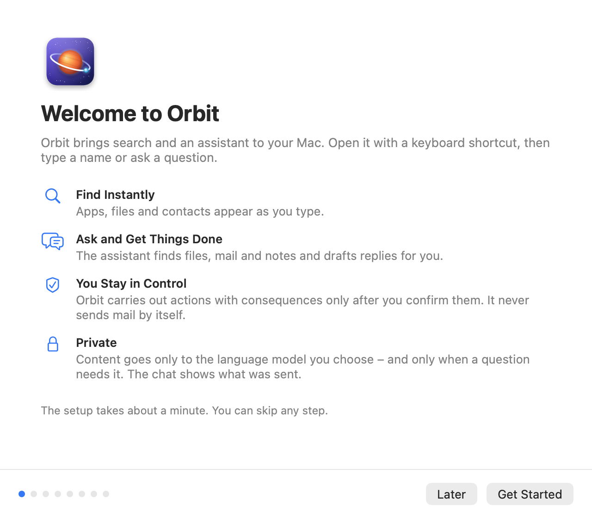
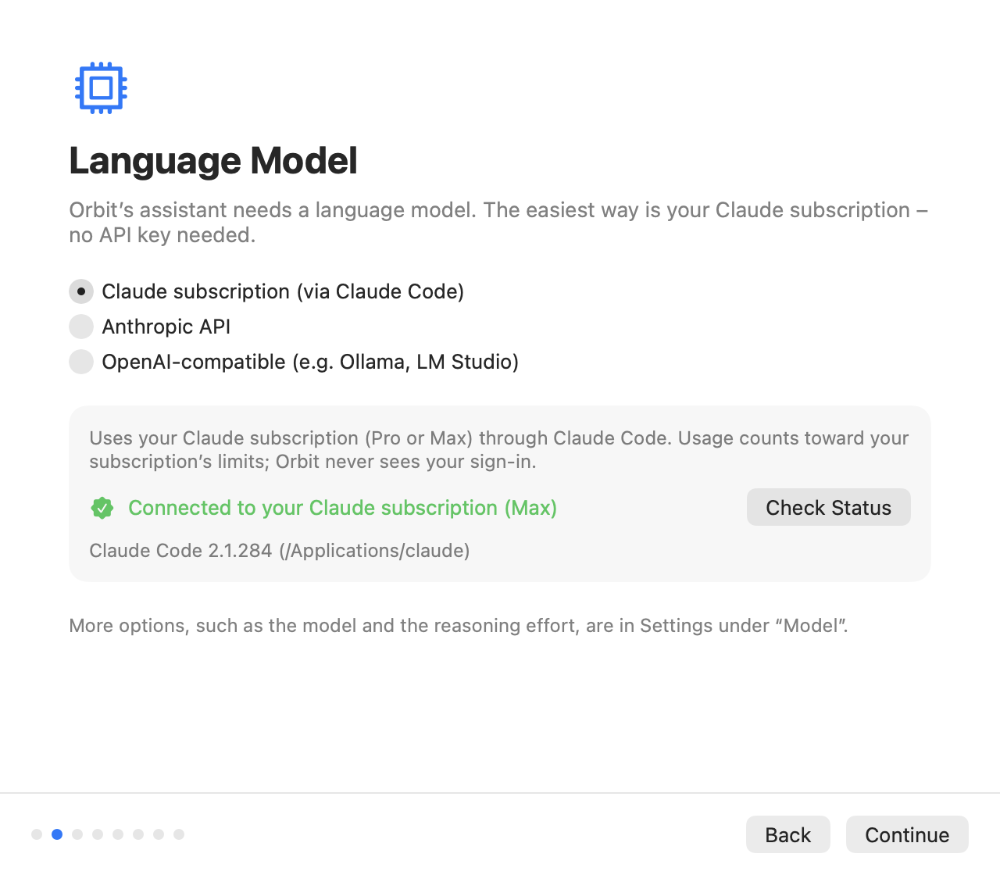
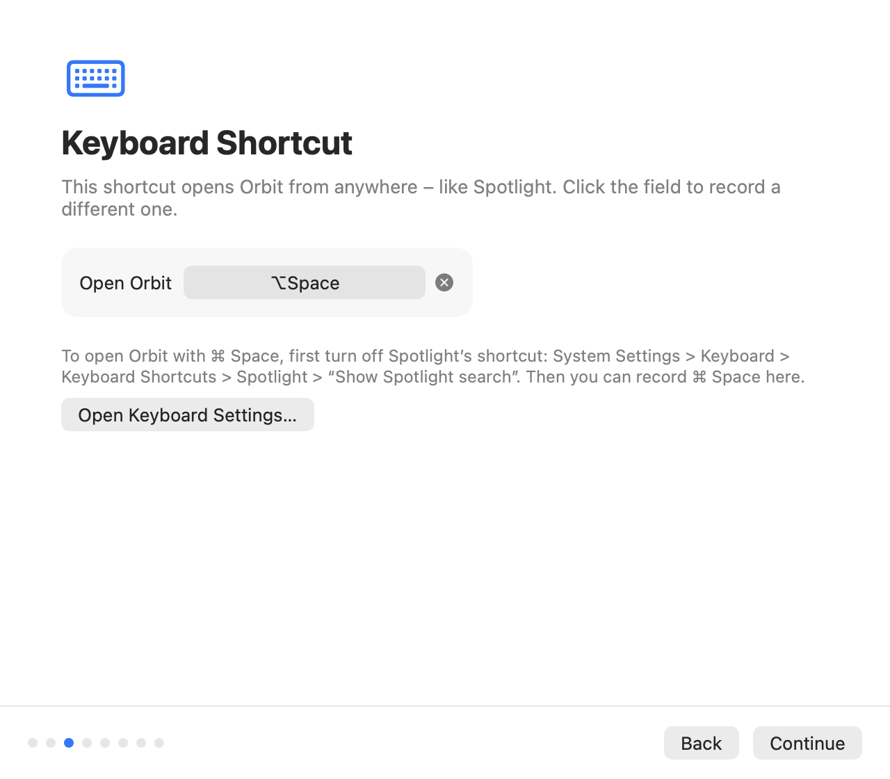
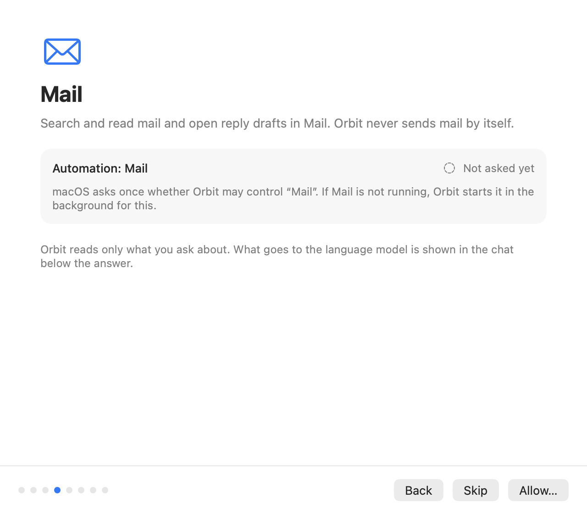
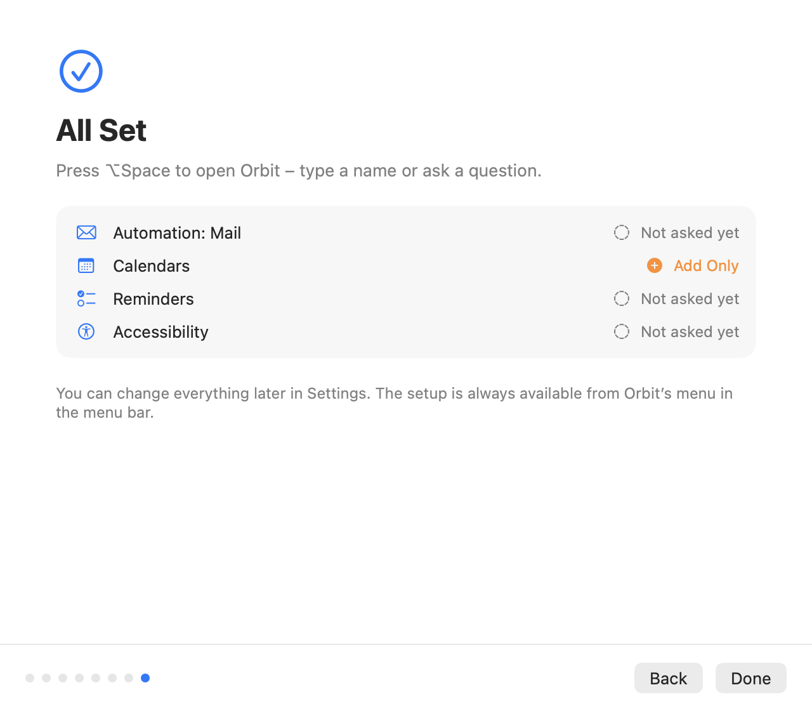

# Getting started

This page takes you from nothing to your first answer: what Orbit needs, how to install or build it, what the
setup window asks on first launch, a few questions to try, how to update, and how to remove Orbit completely.

**On this page**

- [Requirements](#requirements)
- [Installing Orbit](#installing-orbit)
- [First launch and setup](#first-launch-and-setup)
- [After an update: "New in Orbit"](#after-an-update-new-in-orbit)
- [Your first questions](#your-first-questions)
- [Updating](#updating)
- [Uninstalling](#uninstalling)

## Requirements

- **macOS 14 Sonoma or later** to run Orbit, on Apple silicon or Intel. Building it needs macOS 15.2 or later (see
  below).
- **One language model** for the assistant (instant search works without one):
    - a **Claude subscription** (Pro or Max) with the Claude desktop app or Claude Code installed and signed in,
    - an **Anthropic API key**, or
    - any **OpenAI-compatible** Chat Completions server, for example Ollama or LM Studio on your Mac, or OpenAI.

    See [Choosing a language model](providers.md) for how to set up each one.

- **To build from source** (for now the only way to get Orbit): macOS 15.2 or later and the Command Line Tools
  (`xcode-select --install`) or Xcode 16.3 or later, that is Swift 6.1 or newer, which GRDB.swift and
  KeyboardShortcuts need. Orbit is developed and tested with Swift 6.3 (Xcode 26.4 or later, or its Command Line
  Tools). The first build downloads these two Swift packages from GitHub and needs about 1.5 GB of free disk space.

Every macOS permission is optional. Without one, Orbit turns off only the tools that need it (see
[Permissions](permissions.md)).

## Installing Orbit

Orbit has no prebuilt download yet: you build it from source, which takes a few minutes and needs no Apple
developer account. The app belongs in your **Applications** folder.

### Building from source

Orbit is a Swift package with no Xcode project. With the Command Line Tools or Xcode 16.3+ installed:

```sh
git clone --branch v0.1.0 https://github.com/eric-volz/Orbit.git &&
cd Orbit &&
Scripts/build-app.sh release &&
cp -R build/release/Orbit.app /Applications/ &&
open /Applications/Orbit.app
```

Each `&&` runs the next command only if the one before succeeded, so a failed step stops there.

`build-app.sh` writes the app to `build/release/Orbit.app`. These commands build the current release, 0.1.0; the
[releases page](https://github.com/eric-volz/Orbit/releases) lists the versions and their changes. For the newest,
unreleased source, clone without `--branch v0.1.0`. Copying to `/Applications` needs an administrator account. If
Orbit is installed already, follow [Updating](#updating) instead, which removes the old copy first.

`build-app.sh` compiles the app, bundles its resources and signs it. By default the signature is **ad hoc**, which
is fine for trying Orbit on your own Mac.

> [!IMPORTANT]
> Run Orbit from `/Applications`, not from the `build` folder, for two reasons:
>
> - **Launch at login needs it.** macOS registers only a copy in the Applications folder as a login item. Elsewhere,
>   Settings says "Opening at login is not available for this copy of Orbit. Move Orbit to the Applications folder
>   and open it from there."
> - **Permissions follow the code signature.** macOS remembers what you allowed (Mail, Contacts, Calendars, …) for
>   one signature. An ad hoc signature changes with every build, so a rebuilt Orbit loses its permissions and asks
>   again. If you rebuild often, create a stable local signing identity once with `Scripts/create-dev-cert.sh` and
>   build with `ORBIT_SIGN_IDENTITY="Orbit Development" Scripts/build-app.sh release`.

More about the build scripts, debug builds and the development certificate is in [Development](development.md);
universal builds, Developer ID signing and notarization are in [Releasing](releasing.md).

## First launch and setup

Orbit is a menu bar app: it has **no Dock icon and no main window**. After launch you see its icon (a planet with
an orbit and a satellite) in the menu bar, and on the very first launch the **Set Up Orbit** window opens.

The setup takes about a minute. Every step can be skipped, and closing the window in any way (**Done**, **Later**,
the close button or ⌘W) counts as finished. You can open the whole setup again at any time from the menu bar icon →
**Setup…**. In the setup window, Return presses the step's main button and Escape skips (**Later** on the first
step, **Skip** on a permission step). VoiceOver reads the title of each new step, for example "Keyboard Shortcut,
step 3 of 12".

### 1. Welcome to Orbit



What Orbit does and how it treats your data: **Find Instantly**, **Ask and Get Things Done**, **You Stay in
Control** and **Private**. Click **Get Started**, or **Later** to close the setup.

### 2. Language Model



Choose the provider for the assistant:

- **Claude subscription (via Claude Code)**: uses your Pro or Max plan through the Claude Code that comes with the
  Claude desktop app (or one you installed in Terminal). The step shows whether Claude Code is installed and signed
  in. If it is not signed in, **Sign In…** opens Anthropic's own sign-in in your browser; Orbit never sees your
  credentials. **Check Status** reads the status again. On the first launch this provider is preselected when Orbit
  finds Claude Code; otherwise the Anthropic API is.
- **Anthropic API**: paste an API key from the Anthropic Console. Orbit stores it in your login keychain.
- **OpenAI-compatible (e.g. Ollama, LM Studio)**: enter the server address (for example
  `http://localhost:11434/v1` for Ollama), the model (for example `gpt-oss:20b`) and, if the server needs one, an API
  key.

For the two API providers, **Test Connection** checks that the server answers, accepts the key and has the model.
A key that passes the test is saved right away. A key you typed but did not save is stored when you move on or
leave the setup from any step, also with the close button or ⌘W. On this step Return presses **Continue** only
while no text field is shown (that is, for the Claude subscription).

The model and the reasoning effort are in Settings → **Model**. Details for every provider:
[Choosing a language model](providers.md).

### 3. Keyboard Shortcut



The global shortcut opens Orbit from anywhere, like Spotlight. The default is **⌥ Space**. Click the field to
record another one. To use **⌘ Space**, first turn off Spotlight's shortcut in System Settings → Keyboard →
Keyboard Shortcuts → Spotlight → "Show Spotlight search"; **Open Keyboard Settings…** takes you there.

### 4. Permissions, one at a time



Next comes one step for each permission the tools need, in this order: **Mail** (Automation: Mail), **Notes**
(Automation: Notes), **Contacts**, **Calendars**, **Reminders** and **Photos**, plus **Finder** (Automation: Finder) and
**Accessibility** while the context chips or the "Read frontmost app" tool are on. Each step says why Orbit
needs the permission, how macOS asks for it and its current status.

- **Allow…** shows macOS's own prompt. For Mail and Notes macOS can ask only while the app runs, so Orbit starts it
  in the background first. For Accessibility, macOS shows a notice that leads to System Settings → Privacy &
  Security → Accessibility, where you switch Orbit on.
- A permission you denied earlier, and calendars or reminders set to **Add Only**, cannot be asked for again; the
  step offers **Open System Settings…** instead.
- **Skip** moves on. Without the permission, the related tools stay off; skipping Finder or Accessibility turns no
  tool off, it only leaves that part of the context out.
- A step reads its permission when it appears and again when Orbit becomes active, so after you come back from
  System Settings it shows what you allowed there.
- macOS reports Accessibility only as allowed or not, so until you click **Allow…** in this setup, the step shows it
  as **Not asked yet** rather than as a warning.
- The Finder and Accessibility steps explain that Orbit reads your selection when you open the panel, while
  **Use the selection when opening** is on, and how to switch that off.

Three permissions appear only in Settings → **Permissions**, never in the setup: **Full Disk Access** (optional,
for faster mail search), **Automation: System Events** and **Automation: Photos** (macOS asks for both on first
use). All permissions are described in [Permissions](permissions.md).

### 5. All Set



The last step shows your shortcut ("Press ⌥Space to open Orbit, then type a name or ask a question.") and a summary
of the permissions, read again when the step appears. Click **Done**. Everything can be changed later in Settings.

## After an update: "New in Orbit"

Orbit remembers which permission steps a setup has shown. When an update brings tools that need a permission you
never had a step for, the setup opens once more by itself at launch, marked **New in Orbit** and with only the new
permission steps, followed by **All Set**. Each new permission is offered exactly once; after that, the setup opens
only when you choose **Setup…** in the menu bar menu. (Installations from before Orbit remembered this count as
having seen Mail, Notes and Contacts.)

## Your first questions

Press **⌥ Space** (or your own shortcut). Type a few letters to find an app, file or contact instantly, or type a
question and press Return on **Ask Orbit** to start a chat. Some things to try:

| Try | What happens |
|---|---|
| `calc` | Instant search finds Calculator, no model involved. Return opens it. |
| Find the Telekom invoice from March | The assistant searches your files and shows them on a file card. |
| What did Lisa write to me last? | It searches Mail and shows the messages on a mail card. A follow-up such as "Tell her Thursday works" opens a reply in Mail: Orbit never sends mail. |
| What do I have tomorrow? | It lists tomorrow's events from all your calendars. |
| Show me my photos from July 2025 | A grid of thumbnails; click one to see it in Photos. |
| Summarize the selected files | Select files in Finder first, then open Orbit: they appear as a context chip above the input. |
| Add a haircut appointment the day after tomorrow at 3 pm | A **confirmation card** shows the event. You can still edit it; nothing is created until you click **Create** (or press ⌘Return). |
| Turn on dark mode | Another confirmation card: macOS switches only after you click **Switch**. |

Orbit answers in the language you write in. Below each answer, a small note says what was sent to the model, for
example "3 emails sent to Claude". The [User guide](user-guide.md) explains everything in the panel, and
[Keyboard shortcuts](keyboard-shortcuts.md) lists every key.

## Updating

Orbit never checks for updates by itself; the [releases page](https://github.com/eric-volz/Orbit/releases) lists new
versions. To update, first get the new source in your clone:

- **A release:** fetch the tags and switch to the new one, for example `git fetch --tags` and then
  `git checkout v0.2.0`.
- **The newest source:** `git checkout main` and then `git pull`.

Then quit Orbit (menu bar icon → **Quit Orbit**), build again and replace the app. If the build fails, the commands
stop and your installed copy stays as it is:

```sh
Scripts/build-app.sh release &&
rm -rf /Applications/Orbit.app &&
cp -R build/release/Orbit.app /Applications/ &&
open /Applications/Orbit.app
```

Your chats, settings and API keys stay where they are. An ad hoc signed build loses its macOS permissions with each
rebuild (see [Building from source](#building-from-source)). If the update brings new permissions, the setup shows them
once at launch ([New in Orbit](#after-an-update-new-in-orbit)).

## Uninstalling

To remove Orbit and everything it stored:

1. **Remove the login item.** If you turned on Settings → **General** → **Open at login**, switch it off first. If
   Orbit is already gone, remove it in System Settings → General → Login Items.
2. **Quit Orbit:** menu bar icon → **Quit Orbit** (or ⌘Q while the panel is open).
3. **Delete the app:** move `/Applications/Orbit.app` to the Trash.
4. **Delete the data folder** with your chat history and working files:

    ```sh
    rm -rf ~/Library/Application\ Support/Orbit
    ```

5. **Delete the API keys** from your login keychain. Orbit keeps at most two items (one per API provider) under the
   service `io.github.eric-volz.Orbit.credentials`; run this until it reports that the item could not be found:

    ```sh
    security delete-generic-password -s io.github.eric-volz.Orbit.credentials
    ```

    You can also delete them in Keychain Access: new keys carry the label "Orbit: anthropic-api-key" or "Orbit:
    openai-compatible-api-key", and you can search for `io.github.eric-volz.Orbit.credentials`.

6. **Delete the settings:**

    ```sh
    defaults delete io.github.eric-volz.Orbit
    ```

7. **Optional: reset the macOS permissions** you gave Orbit:

    ```sh
    tccutil reset All io.github.eric-volz.Orbit
    ```

Orbit does not install anything else. Claude Code, the Claude app and their sign-in belong to Anthropic's software
and are not touched by any of these steps. What Orbit stores, and where, is described in [Privacy](privacy.md).
