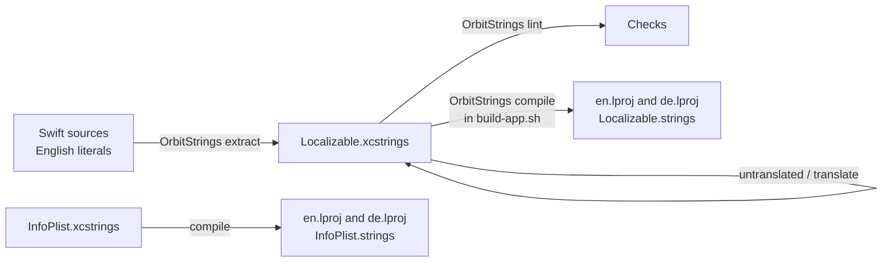

# Localization

Orbit's interface is available in English and German. This page explains how Orbit picks its language and how to
switch it, and, for contributors, how the String Catalogs, the `OrbitStrings` tool and the localization rules
work.

**On this page**

- For users
    - [How Orbit chooses its language](#how-orbit-chooses-its-language)
    - [Switching the language](#switching-the-language)
    - [What follows the language](#what-follows-the-language)
    - [What does not follow the language](#what-does-not-follow-the-language)
- For contributors
    - [How localization works](#how-localization-works)
    - [The String Catalogs](#the-string-catalogs)
    - [OrbitStrings](#orbitstrings)
    - [Workflow for new or changed text](#workflow-for-new-or-changed-text)
    - [Rules for user-visible text](#rules-for-user-visible-text)
    - [How the build compiles the catalogs](#how-the-build-compiles-the-catalogs)
    - [Tests](#tests)
    - [Adding a new language](#adding-a-new-language)
    - [Limitations](#limitations)

## How Orbit chooses its language

Orbit has no language setting of its own. It follows macOS, which picks the language in this order:

1. The language chosen **for Orbit** in System Settings → General → Language & Region → Applications.
2. Otherwise, the first of your **preferred languages** (System Settings → General → Language & Region) that Orbit
   ships: English or German, whichever comes first in the list.
3. Otherwise **English**. If none of your preferred languages is English or German (say, only French), Orbit shows
   English. With French and then German, it shows German.

Settings → General says so: "Orbit follows the language of macOS: English or German, whichever comes first in
your preferred languages, otherwise English. To choose a language just for Orbit, go to System Settings > General >
Language & Region > Applications; it takes effect after Orbit restarts."

> [!NOTE]
> Older builds of Orbit set German as Orbit's own language on their first launch whenever German was one of your
> preferred languages. Current builds remove that setting once at launch (only when it is exactly the value those
> builds wrote), so Orbit follows macOS again. A language you chose for Orbit in System Settings is kept.

## Switching the language

1. Open System Settings → General → Language & Region.
2. In the **Applications** section, click +, choose Orbit and the language (English or Deutsch), and click Add.
   To let Orbit follow the system language again, select Orbit in that list and click −.
3. Quit Orbit (menu bar icon → "Quit Orbit") and open it again. The change takes effect only after a restart.

## What follows the language

The whole interface uses the chosen language: the panel, the menu bar menu, Settings, the setup, result cards,
confirmation cards, notices, status lines and what VoiceOver reads.

Dates, times, numbers, file sizes, durations and lists follow the interface language **together with your region's
formats**. The same event start looks like this:

| Interface language | Region | Example |
|---|---|---|
| German | Germany | `Mo. 5. Okt. · 10:00` |
| English | Germany | `Mon 5. Oct · 10:00` |
| English | United States | `Mon, Oct 5 · 10:00 AM` |

When macOS runs in a language Orbit does not ship, Orbit's formats use its interface language with your region and
settings, so English text gets "Oct" and German text gets "Okt.", never a third language.

## What does not follow the language

- **The assistant answers in the language of your message**, whatever language the interface has. Ask in German
  and the answer is German, even in the English interface.
- **The model is never told the interface language.** It gets only your region and clock format, for example
  "The user's region is Germany (DE); their Mac uses the 24-hour clock."
- **Texts already in a chat** (status lines, notices, cards) stay in the language they were written in. Only the
  note on what was sent to the model ("3 emails sent to Claude") is always shown in the current language.

## How localization works

Orbit is a Swift package without an Xcode project, so Xcode's String Catalog tooling (extraction at build time,
compilation into the app) is not available. The [`OrbitStrings`](../DevTools/OrbitStrings) developer tool replaces
it. It never ships in the app.



English is the **source language**: the keys in the catalog are the English text, and German is a translation of
every key. `Config/Info.plist` holds the English base strings and lists the shipped localizations in
`CFBundleLocalizations` (`en`, `de`), with `CFBundleDevelopmentRegion` set to `en`.

At runtime, [`AppLanguage`](../Orbit/Storage/AppLanguage.swift) reports the language macOS picked from the bundle
(`interfaceLanguage`) and provides `AppLanguage.locale`, the locale all interface formatting uses. Its
`formattingLocale(language:current:)` keeps your current locale when it speaks the interface language, and
otherwise combines the interface language with your region and settings. `RootView` and `SettingsView` set this
locale in the SwiftUI environment.

## The String Catalogs

Both catalogs live in `Orbit/Resources/` and use Xcode's `.xcstrings` JSON format (version `1.0`,
`sourceLanguage` `en`):

| Catalog | Contents |
|---|---|
| [`Localizable.xcstrings`](../Orbit/Resources/Localizable.xcstrings) | Every interface text. Keys are the English text; each entry has a `de` string unit with the German translation. |
| [`InfoPlist.xcstrings`](../Orbit/Resources/InfoPlist.xcstrings) | The localized `Info.plist` values: `CFBundleDisplayName` and the permission texts (`NSAppleEventsUsageDescription`, `NSContactsUsageDescription`, `NSCalendarsUsageDescription`, `NSCalendarsFullAccessUsageDescription`, `NSRemindersUsageDescription`, `NSRemindersFullAccessUsageDescription`, `NSPhotoLibraryUsageDescription` and the Desktop, Documents and Downloads folder descriptions). Entries are marked `manual` and hold both an `en` and a `de` value; the `en` value must equal `Config/Info.plist`. |

Entry fields `OrbitStrings` understands:

- `localizations.<lang>.stringUnit` with `value` and `state`. The states `translated` and `needs_review` count as
  translated (a unit without a state, as in hand-written catalogs, counts too).
- `extractionState`: `stale` for keys no longer found in the sources, `manual` for entries the tool never marks
  stale, `extracted_with_value` for keys that have their own English value (see
  [Rules](#rules-for-user-visible-text)).
- `comment` (copied from `comment:` arguments) and `shouldTranslate: false` (the key is shown as is in every
  language).

The tool keeps any other fields (variations, substitutions, …) unchanged when it rewrites a catalog, and writes
Xcode's formatting (two-space indentation, sorted keys), so the files also open in Xcode.

## OrbitStrings

Run it through the wrapper script from the repository root:

```sh
Scripts/swiftpm.sh run OrbitStrings <command> [options]
Scripts/swiftpm.sh run OrbitStrings --help
```

Options take the form `--name value`; paths are relative to the current directory. Diagnostics use the
`file:line: error: message` format editors understand. Exit codes: 0 on success, 1 on an error (or a failed
lint), 64 on a usage error.

| Command | Options | What it does |
|---|---|---|
| `extract` | `--sources <dir>` `--catalog <file>` [`--source-language en`] | Scans every `.swift` file below `<dir>` (skipping hidden folders and `.build`) and adds the localizable literals to the catalog. Keeps all translations. Keys no longer used are marked `stale`; a stale key that is used again is revived. Idempotent: the file is only written when it changes. `--source-language` only applies when the catalog does not exist yet. Literals with string interpolation are skipped with a warning. Prints `+` for added, `↺` for revived and `-` for keys marked stale, then a summary. |
| `untranslated` | `--catalog <file>` [`--language de`] | Prints a JSON object `{"key": ""}` with every key that has no translation in that language (stale keys and keys with `shouldTranslate: false` are left out). The default language is the first shipped language that is not the source language, which is German. |
| `translate` | `--catalog <file>` `--input <file.json \| ->` [`--language de`] | Sets translations from a JSON object `{"key": "translation"}` (a file, or `-` for standard input), with the state `translated`. Empty values are skipped; an unknown key stops the command ("run extract first"). |
| `lint` | [`--sources <dir>`] `--catalog <file>` [`--languages en,de`] [`--strict`] | Checks the catalog (and with `--sources` the literals in the code). **Errors:** string interpolation inside a localized literal; format specifiers of a translation that differ from the key's; an en or em dash (U+2013, U+2014) in any text. **Warnings:** a missing translation for one of the languages (default: the shipped languages except the source language); a literal in the sources that is missing from the catalog. Exits 1 on errors, and with `--strict` also on warnings. Ends with a line such as `lint: … localized literals, … catalog keys, 0 errors, 0 warnings`. |
| `compile` | `--catalog <file>` `--output <Resources dir>` [`--table <name>`] [`--languages de,en`] | Writes `<lang>.lproj/<table>.strings` (UTF-8) for each language. The table defaults to the catalog's file name. For the source language each key gets its English value (or the key itself); other languages get translated entries only. Entries with plural or device variations are skipped with a warning, because `.strings` files cannot express them. Without `--languages` it writes the source language, the shipped languages and every language found in the catalog. |
| `rekey` | `--sources <dir>` `--map <file.json>` [`--all-literals`] [`--dry-run`] | Replaces localized literals in the sources by new keys from a JSON object `{"old key": "new key"}`, for example when the source language changes. Other literals that equal an old key are listed; `--all-literals` replaces them as well (for tests that compare texts). `--dry-run` writes nothing. Warns when a map would chain (`A → B → C`): run such a map only once. |
| `self-test` | none | Runs the tool's built-in checks of the scanner, the catalog merge and the formatters (the Orbit test target cannot link the executable, so these checks live in the tool). |

### What extract finds

The scanner reads Swift tokens (comments and `Text(verbatim:)` are ignored) and takes a string literal when it is:

- the first unlabeled argument of a SwiftUI or AppKit initializer: `Text`, `Button`, `Label`, `Toggle`, `Picker`,
  `TextField`, `SecureField`, `Section`, `Menu`, `LabeledContent`, `LocalizedStringKey`,
  `LocalizedStringResource`, `Link`, `GroupBox`, `DisclosureGroup`, `Stepper`, `ProgressView`,
  `ContentUnavailableView`, `ControlGroup`, `Tab`, `CommandMenu`, `Window`, `WindowGroup`, `MenuBarExtra`,
  `NavigationLink`, `ShareLink`, `DatePicker`, `MultiDatePicker`, `ColorPicker`, `TableColumn`, `Recorder`
  (KeyboardShortcuts) and `NSLocalizedString`; the module qualifiers `SwiftUI.` and `KeyboardShortcuts.` are
  allowed;
- the first unlabeled argument of the modifiers `.help`, `.navigationTitle`, `.navigationSubtitle`,
  `.accessibilityLabel`, `.accessibilityHint`, `.accessibilityValue`, `.accessibilityCustomContent`,
  `.confirmationDialog`, `.alert` and `.badge`, or the `prompt:` of `.searchable` and the `named:` of
  `.accessibilityAction`;
- the `localized:` argument of `String(localized: "…", defaultValue: "…", table: "…", comment: "…")`.

Literals with a `table:` or `tableName:` other than `Localizable` are skipped. Empty literals are ignored.

## Workflow for new or changed text

```sh
CATALOG=Orbit/Resources/Localizable.xcstrings
Scripts/swiftpm.sh run OrbitStrings extract --sources Orbit --catalog $CATALOG          # add new keys
Scripts/swiftpm.sh run OrbitStrings untranslated --catalog $CATALOG > /tmp/de.json     # keys without German
# fill in the German values in /tmp/de.json
Scripts/swiftpm.sh run OrbitStrings translate --catalog $CATALOG --input /tmp/de.json
Scripts/swiftpm.sh run OrbitStrings lint --sources Orbit --catalog $CATALOG             # must say 0 errors, 0 warnings
```

For `InfoPlist.xcstrings`, edit the `en` value together with `Config/Info.plist` and the `de` value by hand, then
check it with `lint --catalog Orbit/Resources/InfoPlist.xcstrings` (without `--sources`, only the catalog is
checked).

`lint` must report **0 errors and 0 warnings** for both catalogs. If you are not comfortable writing German, say so
in your pull request ([CONTRIBUTING.md](../CONTRIBUTING.md)).

## Rules for user-visible text

- **Write user-visible text as SwiftUI literals or with `String(localized:)`**, in English:
  `Text("New Chat")`, `Button("Cancel")`, `.help("…")`, `String(localized: "…")`. Text passed to your own views as
  a `String` is not found by `extract`; wrap it in `String(localized:)` or `LocalizedStringKey("…")`.
- **Never interpolate inside a localized literal.** The lint fails (and the build with it). Use a format string
  instead:

    ```swift
    String(format: String(localized: "Found %lld files"), count)
    String(format: String(localized: "With selection: %1$@ and %2$lld more"), name, count)
    ```

    Positional specifiers (`%1$@`, `%2$lld`) let a translation reorder the arguments; the lint checks that a
    translation has the same specifiers as the key. Write a literal percent sign as `%%` in format strings
    (`"%lld%%"`, shown as "50%").

- **Use `Text(verbatim:)` for user data** such as file names, mail subjects or event titles, so they are never
  looked up in the catalog.
- **Plurals are separate keys** ("1 file name" and "%lld file names"), because the compiled `.strings` files cannot
  express plural variations.
- **Give a second meaning its own key.** When one English word needs two different translations, add a key that
  names the meaning and give it the English text as its default value:

    ```swift
    // German: "Abgesagt" for a canceled event, "Abgebrochen" (key "Canceled") for a canceled action.
    String(localized: "Canceled (event)", defaultValue: "Canceled")
    ```

    `extract` stores the default value as the key's English value (`extracted_with_value`), and the build shows it in
    English. The reverse case needs no trick: macOS calls the permission "Calendars" and the app or an event's field
    "Calendar"; these are two English keys that both translate to "Kalender".

- **Format with Foundation's format styles and `AppLanguage.locale`** (the default of the card formatters): dates,
  times, numbers, byte sizes, durations and lists. Never build date or number patterns by hand.
- **Follow macOS's typography in English:** "Allow…" (the ellipsis right after the word), curly quotes and
  apostrophes (“…”, ’), "50%" without a space. No straight quotes, no `...`, no German quotes („…“).
- **No en or em dashes** in any text, in either language. Rephrase with a comma, colon, period or parentheses.
- **Use macOS's terms** for settings, menus and statuses in both languages ("Settings…", "Quit Orbit", "Add Only").
- **Text for the model stays English**: the system prompt, tool descriptions and tool results. The assistant still
  answers in the language of the user's message.
  The system prompt tells the assistant to avoid en and em dashes in its own words, also in emails and notes it
  writes; quoted text, names and data stay as they are.

## How the build compiles the catalogs

[`Scripts/build-app.sh`](../Scripts/build-app.sh) localizes the app after assembling it:

1. Reads the languages from `CFBundleLocalizations` in the generated `Info.plist` (`en de`).
2. Builds `OrbitStrings` (`Scripts/swiftpm.sh build --product OrbitStrings`).
3. Checks that both catalogs exist, then runs `lint --sources Orbit` on `Localizable.xcstrings` and `lint` on
   `InfoPlist.xcstrings`. A lint error stops the build; warnings are printed but do not (the build does not pass
   `--strict`).
4. Runs `compile` for both catalogs with `--languages en,de` into `Orbit.app/Contents/Resources`, which gives
   `en.lproj/Localizable.strings`, `en.lproj/InfoPlist.strings`, `de.lproj/Localizable.strings` and
   `de.lproj/InfoPlist.strings`.
5. Validates every generated `.strings` file with `plutil -lint`.
6. Copies the KeyboardShortcuts package's own texts (the shortcut recorder) only for the app's languages, so the
   recorder matches the rest of the interface.

The build summary lists the `.lproj` folders and how many strings each localization file contains. A key without a
German translation is missing from `de.lproj`, so macOS shows its English text.

## Tests

The unit tests run without Orbit's app bundle, so every lookup returns the catalog key: the test process sees the
**English** interface, as Orbit looks on an English Mac. Details are in
[testing.md](testing.md#the-interface-language-in-tests).

- [`LocalizationTests`](../OrbitTests/LocalizationTests.swift) checks the catalogs and the sources without the
  `OrbitStrings` executable (the test target cannot link it), so it repeats the lint's rules:
    - both catalogs are valid with the source language `en` and version `1.0`, and every unit has a value and a state;
    - `InfoPlist.xcstrings` matches `Config/Info.plist` (English values equal, a German value for each key, no keys
      that are not in `Info.plist`), and the folder access texts say that Orbit searches as you type;
    - every key in `Localizable.xcstrings` has a German translation;
    - translations keep the key's format specifiers;
    - English typography ("Word…", curly quotes, "50%");
    - no en or em dashes in either language;
    - no localized literal contains string interpolation;
    - German text reaches the interface only through the catalog: a literal with German letters or quotes in
      `Orbit/` is a mistake, except in a few files that hold data rather than interface text (mailbox names, the
      "Recently Deleted" folder in many languages, quote characters a parser strips) and in descriptions for the
      model.
- [`RepositoryTextTests`](../OrbitTests/RepositoryTextTests.swift) goes further than the catalogs: it fails on any
  en or em dash in the text files of `Orbit/`, `OrbitTests/`, `DevTools/`, `Scripts/`, `Config/`, `Package.swift`,
  `README.md` and `docs/`.
- [`GermanInterface`](../OrbitTests/Support/GermanInterface.swift) (test support) shows the German interface while a
  test body runs: the main bundle answers `String(localized:)`, `NSLocalizedString` and SwiftUI's `Text("…")` (with
  and without an explicit locale) with the German catalog values. It works on the main thread only and does not
  nest. With `formats:` it also makes dates, numbers and lists German; that override is process-wide, so it is for
  tests that run alone. `EnglishFormats` pins English formats the same way.
- `GermanInterfaceTests`, a regular unit test, checks that every lookup path still answers in German while
  `GermanInterface` runs (so a macOS change to these lookups is caught), that the system prompt is the same for both
  interface languages, and that the texts in the English snapshots contain no German.
- The gated snapshots render the interface in both languages:

    ```sh
    ORBIT_UI_SNAPSHOT_DIR=/tmp/orbit-snapshots Scripts/swiftpm.sh test --filter UISnapshot
    ```

    `UISnapshot` renders the German interface with German sample data (`GermanInterface`, `de_DE` formats);
    `UISnapshotEnglish` renders the main views in English with `en_US` formats as files named `en-…`. Any German text
    in the English pictures, other than sample user data, bypassed the catalog. See
    [testing.md](testing.md#gated-suites) before running them: they take the keyboard focus.

The [manual checks](manual-qa.md#english-and-german-interface) show how macOS applies the language in the real app.

## Adding a new language

Orbit ships English and German only, and the language list is fixed in several places. The tools already take a
language parameter, so most of the work is translation; the rest is changing these places:

| Place | What to change |
|---|---|
| [`Config/Info.plist`](../Config/Info.plist) | Add the language code to `CFBundleLocalizations`. `build-app.sh` compiles exactly these languages (and copies the matching KeyboardShortcuts texts). |
| [`Orbit/Storage/AppLanguage.swift`](../Orbit/Storage/AppLanguage.swift) | Add it to `AppLanguage.shipped`; otherwise `interfaceLanguage` and the formatting locale fall back to English. |
| [`DevTools/OrbitStrings/StringCatalog.swift`](../DevTools/OrbitStrings/StringCatalog.swift) | Add it to `StringCatalog.shippedLanguages`, so `lint` warns about its missing translations by default. Until then, pass `--languages en,de,<code>` to `lint`. |
| `Orbit/Resources/Localizable.xcstrings` | Fill in the translations: `untranslated --language <code>` prints the keys, `translate --language <code> --input …` applies them. |
| `Orbit/Resources/InfoPlist.xcstrings` | Add a value for each permission text and the display name. |
| [`OrbitTests/LocalizationTests.swift`](../OrbitTests/LocalizationTests.swift) | The completeness and format-specifier checks look at German (`de`) only; extend them to the new language. |
| Interface texts that name the languages | For example the note in Settings → General ("English or German, whichever comes first…"). |

`untranslated` and `translate` default to the first shipped language that is not the source language, so always
pass `--language` for a third language. The test harness renders the German interface only (`GermanInterface`);
there is no harness or snapshot suite for other languages yet. The build summary's string count compares `en` with
`de`.

## Limitations

- Orbit has no language setting of its own (System Settings chooses it), and a change takes effect after a
  restart.
- Chats keep the texts Orbit wrote into them (status lines, notices, cards) in the language Orbit had then; only the
  note on what was sent follows a later change.
- `extract` finds localizable strings by call patterns (`Text`, `Button`, `.help`, `String(localized:)`, …). Text
  passed to your own views needs `String(localized:)` or `LocalizedStringKey("…")` to be extracted.
- The compiled `.strings` files cannot express plural or device variations; `compile` skips such entries.
