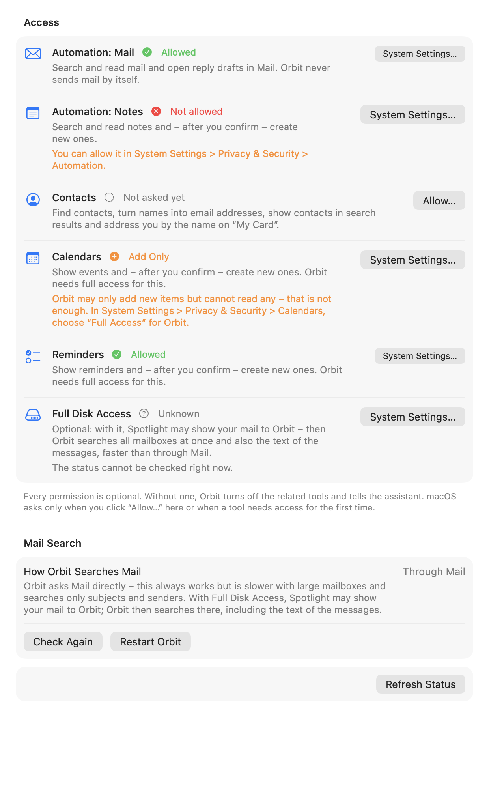

# Permissions

Orbit uses a number of macOS privacy permissions so its assistant can work with Mail, Notes, your contacts,
calendars, photos and the app in front of you. This page lists every permission, explains what each one is for, how
Orbit reads and requests them, and what happens when one is missing.

**On this page**

- [Every permission is optional](#every-permission-is-optional)
- [The Permissions tab in Settings](#the-permissions-tab-in-settings)
- [All permissions](#all-permissions)
- [What happens without a permission](#what-happens-without-a-permission)
- [How Orbit reads a status without asking](#how-orbit-reads-a-status-without-asking)
- [When Orbit reads the statuses again](#when-orbit-reads-the-statuses-again)
- [What "Allow…" does](#what-allow-does)
- [Mail search and Full Disk Access](#mail-search-and-full-disk-access)
- [Permissions in the setup and after updates](#permissions-in-the-setup-and-after-updates)
- [Code signing and permissions](#code-signing-and-permissions)
- [Resetting permissions](#resetting-permissions)

## Every permission is optional

Orbit works without any of these permissions: instant search for apps and chatting with the assistant need none of
them, and file search needs only the folder access macOS asks for on first use. Each permission unlocks a group of
tools. Without it, Orbit turns off the related tools and tells
the assistant why, so it can tell you where to change that.

macOS asks you for a permission only in two situations:

- you click **Allow…** in Settings → **Permissions** or in the setup, or
- a tool needs a permission for the first time (for example the first time the assistant searches your mail).

Reading a permission's status never asks and never reads any of your data.

## The Permissions tab in Settings



Settings → **Permissions** lists every permission Orbit uses, in this order: Automation: Mail, Automation: Notes,
Contacts, Calendars, Reminders, Photos, Automation: Photos, Automation: Finder, Automation: System Events,
Accessibility and Full Disk Access. Each row shows:

- **the name**, as System Settings → Privacy & Security calls it;
- **the status:**

    | Status | Meaning | Tools |
    |---|---|---|
    | **Allowed** | You gave Orbit access. For Photos this includes limited access to selected photos. | on |
    | **Not allowed** | You declined, or turned Orbit off in System Settings. | off |
    | **Not asked yet** | macOS has not asked you yet. It asks on first use. | on |
    | **Restricted** | A configuration profile or Screen Time does not allow this access. | off |
    | **Unknown** | macOS cannot report the status right now, for example for Automation: Notes while Notes is not running. | on |
    | **Add Only** | Calendars (and Reminders) only: Orbit may add items but not read them, which is not enough for Orbit's tools. | off |

    While a status is being read, the row shows **Checking…**; while macOS's prompt is open, **Waiting for macOS…**.

- **why Orbit needs it** (see the [table below](#all-permissions));
- **a hint** when the status needs one, for example "You can allow it in System Settings > Privacy & Security >
  Contacts.", "macOS reports the status only while Notes is running.", "A profile or Screen Time does not allow this
  access." or, for **Add Only**, "Orbit may only add new items but cannot read any, which is not enough. In System
  Settings > Privacy & Security > Calendars, choose “Full Access” for Orbit." Hints for statuses that turn tools off
  are shown in orange;
- **one button:**
    - **Allow…** while macOS can still ask: it shows macOS's own prompt (see [What "Allow…" does](#what-allow-does));
    - **Check…** instead of **Allow…** for an Automation permission whose status is **Unknown** because its app is
      not running: Orbit starts the app in the background so macOS can answer (and ask, if you have not decided yet);
    - **System Settings…** once macOS will not ask again: it opens the matching page of System Settings → Privacy &
      Security. For a permission that is **Allowed**, the button stays (smaller) so you can change it there.
      Accessibility keeps **Allow…** until it is allowed (macOS's notice leads to System Settings anyway), and Full
      Disk Access always shows **System Settings…**.

The footer reads: "Every permission is optional. Without one, Orbit turns off the related tools and tells the
assistant. macOS asks only when you click “Allow…” here or when a tool needs access for the first time."

Below the list, the **Mail Search** section shows how Orbit searches mail right now (see
[Mail search and Full Disk Access](#mail-search-and-full-disk-access)), and **Refresh Status** reads every
permission again.

Two permissions appear only while the feature that uses them is on: **Accessibility** and **Automation: Finder** are
listed (and read) only while Settings → **General** → **Use the selection when opening** or the **Read frontmost
app** tool (`get_frontmost_context`) is on. **Full Disk Access** is listed when the mail tools exist, and
**Automation: Photos** when the photo tools exist. The list follows the registered tools, so tools added in a later
version bring their permissions along.

VoiceOver reads each row's name, status and explanation as one element, and the button separately ("Allow
Automation: Mail", "Check Automation: Mail", "Open System Settings for Contacts"). After **Allow…**, VoiceOver
announces macOS's answer ("Automation: Mail: Allowed"); for Accessibility, which you turn on in System Settings, it
announces where to do that and later the new status, once Orbit reads it.

## All permissions

| Permission | Why Orbit needs it | Tools and features |
|---|---|---|
| **Files** (Desktop, Documents, Downloads) | Show matching files as you type, and find, read, open or reveal the files you ask about. macOS asks on first access, possibly while you type in instant search. Not listed in Settings, because macOS manages it per folder. | Instant search, `search_files`, `read_file`, `open_file`, `reveal_in_finder`, `recent_files`, file cards |
| **Automation: Mail** | Search and read mail and open drafts and replies in Mail. Orbit never sends mail by itself. | `search_mail`, `read_mail`, `create_mail_draft` |
| **Automation: Notes** | Search and read notes and, after you confirm, create new ones; open a note in Notes. | `search_notes`, `read_note`, `create_note`, `open_note` |
| **Contacts** | Find contacts, turn names into email addresses, show contacts in instant search (only once access was granted) and address you by the name on “My Card”. | `search_contacts`, name resolution in `create_mail_draft`, instant search, the system prompt (your name) |
| **Calendars** (full access) | Show events and, after you confirm, create new ones. **Add Only** is not enough. | `list_events`, `create_event` |
| **Reminders** (full access) | Show reminders and, after you confirm, create new ones. | `list_reminders`, `create_reminder` |
| **Photos** | Find photos and videos by date, album, favorites and kind, and show them as thumbnails. The pictures themselves never go to the language model. | `search_photos`, photo cards |
| **Automation: Photos** | Show a photo you click in Orbit in the Photos app. macOS asks on first use. | Photo cards (never turns `search_photos` off) |
| **Automation: Finder** | Use the items selected in Finder as context for your question. Read only while Finder is in front, and never asked for while the panel opens. | Context chips, `get_frontmost_context` (switches no tool off) |
| **Automation: System Events** | Switch between the light and dark appearance after you confirm. macOS asks on first use. | `set_appearance` |
| **Accessibility** | Use the selected text and the window title of the frontmost app as context for your question. Password fields are never read. | Context chips, `get_frontmost_context` (switches no tool off) |
| **Full Disk Access** (optional) | With it, Spotlight may show your mail to Orbit: faster mail search in all mailboxes at once that also covers the message text. Orbit uses it whenever Spotlight does. | `search_mail` (switches no tool off) |

Tools without a permission of their own: `open_app`, `open_url`, `list_shortcuts`, `run_shortcut` and `set_volume`.
See [Tools](tools.md) for every tool in detail.

## What happens without a permission

A permission whose status is **Not allowed**, **Restricted** or **Add Only** turns off the tools that need it.
**Not asked yet** and **Unknown** keep them on: macOS asks (or answers) when a tool first uses the permission.

When a tool is off for a missing permission:

- **The assistant knows.** It sees the tool as unavailable with the reason ("macOS permission 'Automation: Mail' was
  not granted") and is told to explain this and point you to Orbit's settings. If a permission changes during a
  chat, the assistant learns it with your next message.
- **Settings → Tools** marks the tool with "Missing permission: Automation: Mail".
- **A request that needs it**, or a tool call macOS refuses, gets a "permission not granted" answer for the
  assistant, naming the permission as Settings shows it ("Automation: Mail") and telling it that you can allow it in
  Orbit's settings under "Permissions". The tool's status row reads "Missing permission: …".
- **The chat shows a notice**, for example "Orbit is not allowed to control Mail.", with **Open Settings**, which
  opens Settings on the **Permissions** tab. It appears once per permission and request.
- **Notes under the input** are read out by VoiceOver too, for example when a card cannot open a note because Orbit
  may not control Notes: "Orbit is not allowed to control Notes. You can allow it in Orbit’s settings under
  “Permissions”."

Accessibility, Automation: Finder, Automation: Photos and Full Disk Access never turn a tool off:

- without **Accessibility**, Orbit takes neither selected text nor window titles;
- without **Automation: Finder**, Orbit takes no selection from Finder;
- without **Automation: Photos**, a photo card cannot show its photo in Photos ("Orbit is not allowed to control
  Photos, so it cannot show the photo.");
- without **Full Disk Access**, mail search asks Mail directly.

## How Orbit reads a status without asking

Reading never shows a prompt and never reads anything personal. All reading happens off the main thread.

| Permission | How Orbit reads it |
|---|---|
| Contacts, Calendars, Reminders, Photos | The frameworks' authorization status (Contacts, EventKit, PhotoKit). Photos' limited access counts as **Allowed**. EventKit's write-only access shows as **Add Only**. |
| Automation (Mail, Notes, Finder, System Events, Photos) | `AEDeterminePermissionToAutomateTarget` with "ask the user" turned off. It sends no Apple Event. macOS answers only while the target app runs; otherwise the status is **Unknown**. |
| Accessibility | `AXIsProcessTrusted()`: **Allowed** or **Not allowed**. |
| Full Disk Access | Orbit opens Mail's folder `~/Library/Mail` and closes it again at once, without reading anything. If macOS refuses, the status is **Not allowed**; if the folder does not exist (Mail was never set up), it is **Unknown**. |

Details worth knowing:

- **Automation while the app is closed.** Because macOS answers only for running apps, Automation: Notes shows
  **Unknown** until Notes is open. An earlier **Allowed** or **Not asked yet** stays meanwhile; a **Not allowed**
  does not, so a stale refusal never keeps tools off after you allowed Orbit in System Settings.
- **Accessibility** is either allowed or not; macOS reports **Not allowed** even before Orbit ever asked. Until you
  turn Orbit on in System Settings, it reads **Not allowed** (the setup shows it as **Not asked yet** until you
  clicked **Allow…** there).
- **Not read yet.** Until Orbit has read a permission, its tools stay available, and macOS asks on first use.

## When Orbit reads the statuses again

- **At launch:** all permissions.
- **When the panel opens or Orbit becomes active again** (for example when you come back from System Settings), at
  most every 3 seconds: the permissions the tools need and, while the context features are on, Accessibility and
  Automation: Finder. Full Disk Access is not probed on these occasions.
- **When Mail, Notes, Finder, System Events or Photos start or quit**, the Automation permission for that app.
- **After a tool that needs a permission ran or was refused**: you may just have answered macOS's prompt.
- **When a context feature is switched on**, its permissions.
- **Whenever Settings or the setup show the permissions.** An open **Permissions** tab reads all of them again,
  Full Disk Access included, every time Orbit becomes active, and **Refresh Status** reads them on demand.

A change reaches the assistant with your next message.

## What "Allow…" does

**Allow…** shows macOS's own prompt. What happens next depends on the permission:

- **Contacts, Calendars, Reminders, Photos:** macOS asks once. For calendars and reminders Orbit asks for full
  access.
- **Automation (Mail, Notes, Finder, System Events, Photos):** macOS can only ask while the app runs. If it does not
  run, Orbit starts it in the background, hidden, without bringing it to the front and without adding it to recent
  items, waits up to 15 seconds for it to finish launching, and then asks. The app keeps running afterwards. In
  Settings the button reads **Check…** while the status is **Unknown**.
- **Accessibility:** macOS shows a notice that leads to System Settings → Privacy & Security → Accessibility, where
  you switch Orbit on. Orbit picks up the change when you come back.
- **Full Disk Access:** macOS has no prompt for it, so the button is always **System Settings…**. Turn Orbit on in
  System Settings → Privacy & Security → Full Disk Access; it takes effect after Orbit restarts (**Restart Orbit**
  next to the mail search mode).

Once you have answered a prompt, macOS never asks again; from then on only System Settings changes the permission,
and the button becomes **System Settings…** (the setup offers **Open System Settings…**). It opens the matching page through
`x-apple.systempreferences:com.apple.preference.security?Privacy_…` (`Privacy_Contacts`, `Privacy_Calendars`,
`Privacy_Reminders`, `Privacy_Photos`, `Privacy_Automation`, `Privacy_Accessibility`, `Privacy_AllFiles`). If a
future macOS ignores the page name, System Settings opens on its start page.

## Mail search and Full Disk Access

The **Mail Search** section in Settings → **Permissions** shows **How Orbit Searches Mail**:

- **Through Spotlight**: "Fast, in all mailboxes at once, and also in the text of the messages. For unread mail and
  for Sent, Drafts, Junk and Trash, Orbit still asks Mail, which searches by subject and sender only."
- **Through Mail**: "Orbit asks Mail directly. This always works but is slower with large mailboxes and searches
  only subjects and senders. With Full Disk Access, Spotlight may show your mail to Orbit; Orbit then searches there,
  including the text of the messages."

**Check Again** asks Spotlight again whether it shows your mail to Orbit; no message is read. While the mode is
**Through Mail**, **Restart Orbit** appears: Full Disk Access takes effect only after Orbit restarts. Full Disk
Access is detected through Mail's folder only, so its status is **Unknown** on a Mac where Mail was never set up.

## Permissions in the setup and after updates


The setup (see [Getting started](getting-started.md#4-permissions-one-at-a-time)) shows one step per permission, in
the order of the list above: Mail, Notes, Contacts, Calendars, Reminders, Photos and, while the context features are
on, Finder and Accessibility. Each step says why Orbit needs the permission, how macOS asks for it ("macOS asks once
whether Orbit may control “Mail”. If Mail is not running, Orbit starts it in the background for this.") and its
status, with **Back**, **Skip** and **Allow…**. Skipping leaves the related tools off; skipping Finder or
Accessibility turns no tool off.

Three permissions appear only in Settings, never in the setup: **Full Disk Access** (optional), **Automation: System
Events** and **Automation: Photos** (macOS asks for both on first use).

Orbit remembers which permission steps a setup has shown. When an update brings tools that need a permission you
never had a step for, the setup opens once by itself at launch, marked **New in Orbit**, with only the new permission
steps and the summary. Installations from before Orbit remembered this count as having seen Mail, Notes and
Contacts. See [After an update: "New in Orbit"](getting-started.md#after-an-update-new-in-orbit).

## Code signing and permissions

macOS ties privacy permissions to the app's code signature. This matters if you build Orbit yourself:

- **Ad hoc builds** (the default of `Scripts/build-app.sh`) get a new signature with every build, so macOS forgets
  the permissions after each rebuild, and Orbit has to ask again.
- **A stable development certificate** avoids this. `Scripts/create-dev-cert.sh` creates a self-signed "Orbit
  Development" code-signing identity in your login keychain (once). Builds signed with it keep their permissions
  across rebuilds:

    ```sh
    Scripts/create-dev-cert.sh                                   # once
    ORBIT_SIGN_IDENTITY="Orbit Development" Scripts/build-app.sh debug
    ```

    `Scripts/create-dev-cert.sh --remove` deletes the identity again.

- **Release builds** are signed with a Developer ID and notarized. See [Releasing](releasing.md).

## Resetting permissions

To make macOS forget every decision about Orbit, for example to test the setup again, reset them with `tccutil`
and restart Orbit:

```sh
tccutil reset All io.github.eric-volz.Orbit
```

You can also reset a single service, for example `tccutil reset AppleEvents io.github.eric-volz.Orbit` (all Automation
permissions), `Accessibility`, `AddressBook` (Contacts), `Calendar`, `Reminders`, `Photos` or `SystemPolicyAllFiles`
(Full Disk Access). Afterwards Orbit shows **Not asked yet** again, and macOS asks on the next **Allow…** or first
use. Turning Orbit off in System Settings → Privacy & Security works too, but then macOS will not ask again until you
reset the permission.

To remove Orbit completely, see [Uninstalling](getting-started.md#uninstalling).
