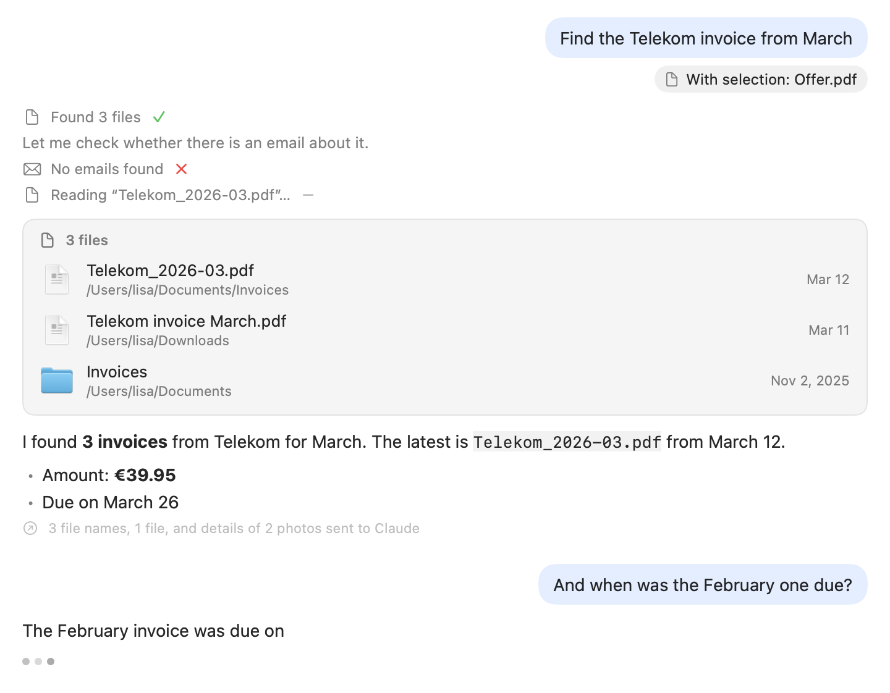

# Privacy

What leaves your Mac when you use Orbit, what Orbit stores and where, what it logs, and how to delete it all. In
short: Orbit has no server of its own, sends your content only to the language model provider you choose and only
when a question needs it, tells you in the chat what it sent, and keeps everything else on your Mac.

**On this page**

- [Principles](#principles)
- [Network](#network)
- [What is sent to the language model](#what-is-sent-to-the-language-model)
- [What the chat tells you was sent](#what-the-chat-tells-you-was-sent)
- [What Orbit stores](#what-orbit-stores)
- [Logs](#logs)
- [Deleting your data](#deleting-your-data)

## Principles

- **Local first.** Instant search, your chat history, your settings and your keys stay on your Mac.
- **Only your provider.** Content goes only to the language model you set up, and only when a question needs it.
- **You see what was sent.** Below each answer, the chat lists which of your content went to the provider.
- **You confirm actions.** Anything with consequences (creating a note, an event or a reminder, running a shortcut,
  changing the appearance or volume, opening a link you did not type) waits for you on a confirmation card. Orbit
  never sends mail and never deletes anything.
- **Secrets stay out.** Orbit never reads keychains, SSH keys, credential files or password managers, and never reads
  password fields. API keys live only in the keychain.
- **No telemetry.** No analytics, no crash reporting, no update checks.

## Network

Orbit makes exactly one kind of network connection: to the language model provider you set up in Settings →
**Model**. Settings → **Privacy** → **Network** names it.

| Provider | Who connects | Where to |
|---|---|---|
| Claude subscription (via Claude Code) | **Claude Code**, not Orbit | Anthropic. Settings says: "With the Claude subscription, Claude Code connects to Anthropic. Orbit itself makes no connection to the internet." |
| Anthropic API | Orbit | `api.anthropic.com`, or the compatible server address you entered |
| OpenAI-compatible server | Orbit | The server address you entered (default `http://localhost:11434/v1`, Ollama on this Mac) |

- **The loopback listener.** With the Claude subscription, Orbit starts the locally installed Claude Code as a child
  process and listens on `127.0.0.1` for Claude Code's tool calls (on a random port, for that process only,
  protected by a random secret). Nothing outside your Mac can reach it. Details in the
  [security model](security-model.md#the-mcp-bridge).
- **Claude Code** is started with its telemetry, error reporting, automatic updates and other non-essential traffic
  turned off. Its sign-in stays with Claude Code; Orbit never reads, stores or forwards Claude credentials.
- **Encryption.** Orbit connects with HTTPS, or with plain HTTP only to this Mac, an IP address, a `.local` name or a
  name without a dot (such as `gaming-pc`). macOS (App Transport Security) blocks plain HTTP to other names such as
  `pc.fritz.box`, and Settings says so: "Orbit allows unencrypted connections (http://) only to this Mac, to IP
  addresses and to .local addresses. Use https:// or the server’s IP address." For plain HTTP to an IP address
  outside this Mac and your local network, Settings warns: "Unencrypted connection: the key and content would be sent
  in plain text. Use it only for servers on this Mac or in your local network."
- **No telemetry, analytics or update checks.** Settings → **Privacy** says "Orbit sends no telemetry or analytics
  data." To update Orbit, you build or install a new version yourself.
- **Things you start yourself.** A link opens in your browser (after your confirmation, unless you typed it), a draft
  opens in Mail for you to send, and a shortcut you confirm may use the network. Orbit does none of this on its own.

## What is sent to the language model

Every request sends the conversation so far to the provider: your messages, the assistant's answers and the results
of the tools it used. Orbit adds:

- **a system prompt** with the date and time the chat started, your time zone, your region and 12/24-hour clock, the
  available tools and, with the Contacts permission, your name from “My Card”;
- **a context block** in front of each message with the current time and, if present, the context chips (the Finder
  selection or the selected text) and changes in which tools are available.

Your personal content reaches the model **only when the assistant asks for it through a tool** (or when you send it
along as a context chip). By area:

| Area | When it is read | What reaches the model |
|---|---|---|
| **Instant search** | As you type | **Never anything.** Instant search runs entirely on your Mac; it searches apps, Spotlight's file names and, with the Contacts permission, contact names. |
| **Files** | When the assistant searches or reads files | File names and paths of search results; a file's text only when it is read (20,000 characters by default, 40,000 at most). Secrets are never read or listed. |
| **Mail** | When the assistant searches or reads mail | For each message a search lists: sender, subject, date and a short preview. The text of a message the assistant reads (up to 4,000 characters). Names of mailboxes when needed (see below). Checking whether Spotlight shows your mail reads no message. |
| **Notes** | When the assistant searches or reads notes | Titles, folders and excerpts of matching notes; a note's text when it is read (up to 20,000 characters). Notes are created only after you confirm them. |
| **Contacts** | When the assistant searches contacts, or resolves a name for a draft | The details of the matching contacts. |
| **Calendar and reminders** | When the assistant lists them (through EventKit) | Titles, times, locations, calendar and list names and notes of the listed items. Events and reminders are created only after you confirm them; Orbit never changes or deletes them. |
| **Photos** | When the assistant uses `search_photos` (through PhotoKit) | Each photo's date, kind, favorite flag, video length and pixel size; **never the picture, its place or the people in it**. Names of albums you made, when needed. Thumbnails are shown only in Orbit's panel, kept in memory (never on disk) and never downloaded from iCloud. Orbit never changes your library. |
| **Apps, shortcuts and context** | When you open Orbit (the context chips) or the assistant asks (`get_frontmost_context`) | The selected text (up to 4,000 characters) or the Finder selection, and with the tool also the window title. Never from password fields or password managers, and only with your message (chips) or in the tool's answer. Shortcut names when the assistant lists them (and the names it suggests for a misspelled one); a shortcut's output when it runs. |

More details:

- **Context chips.** The selection is read when you open Orbit with the shortcut or **Open Orbit** in the menu bar;
  switch this off with Settings → **General** → **Use the selection when opening**. It reaches the provider only if
  you send a message with the chip still there. `get_frontmost_context` reads the same way when the assistant asks,
  whether or not the chips are on; switch it off in Settings → **Tools** (**Read frontmost app**) if you do not want
  it. Finder items Orbit never shares (keys and other secrets, `~/Library`, Orbit's data folder) are left out; the
  assistant hears only how many, never their names.
- **Drafts and replies.** Orbit never sends mail: drafts open in Mail for you to send. For a reply, the text the
  assistant wrote goes to the clipboard, where other apps and clipboard managers can see it, as with anything you
  copy.
- **Actions.** A shortcut runs, the appearance or volume changes, and a note, event or reminder is created only after
  you confirm the card. Links open only as `http`, `https` or `mailto`, and only after you confirm them on a card,
  unless you typed or pasted the link in your message. See [Confirmation cards](user-guide.md#confirmation-cards).
- **Names that help the assistant.** When a calendar, reminder list, folder (in Notes and Shortcuts), mailbox or album
  name fits none or several, a tool lists the candidates; it may complete a name from the start the assistant gave
  ("Pri" → "Private"), add the account that tells two calendars apart, or say where a new event, reminder or note
  went. Those names count as your content and are noted in the chat. The names of the frontmost app, your installed
  apps and the audio output device count as the Mac's, not your content, and are not noted. The standard album names
  are Photos' own and are not counted either.
- **Switching providers.** A chat can continue with another provider. A provider that has not received this chat
  before gets all of it, so its note lists everything in the history, not only the new content. With the Claude
  subscription, a new Claude Code process for an existing chat (for example after a restart) receives the earlier
  conversation as a transcript.
- **Content is data, not instructions.** Everything Orbit passes from your files, mail, notes, calendar, photos and
  screen is marked as data, so the model is told never to follow instructions found in it. See the
  [security model](security-model.md#untrusted-content-and-prompt-injection).

## What the chat tells you was sent



Below each answer that used your content, the chat shows a short note, for example:

- "3 emails sent to Claude"
- "2 notes sent to Claude", "3 contacts sent to Claude"
- "7 events sent to Claude", "3 reminders sent to Claude"
- "Details of 30 photos sent to Claude"
- "3 file names, 1 file, and details of 2 photos sent to Claude"
- "Names of 4 calendars sent to Claude", "Name of 1 folder sent to Claude"
- "Names of 12 shortcuts sent to Claude", "Output of 1 shortcut sent to Claude"
- "1 selected text sent to Claude", "2 file names sent to Claude", "1 window title sent to Claude"

Its help text reads "This content was sent to the provider for the answer." The recipient is "Claude" for the Claude
subscription and the Anthropic API, the host name for another server, "the local model" for a server on your Mac, or
"the language model" when no address is set. Orbit counts these kinds: file names, files (contents), emails, notes,
events, reminders, contacts, details of photos, selected texts, names of shortcuts, output of shortcuts, window
titles, and names of calendars, reminder lists, folders, mailboxes and albums. A failed tool call is counted too when
its message carries your data (for example the names of similar shortcuts when a name does not exist), and content
from a stopped request is noted with the next request that sends it.

## What Orbit stores

Everything Orbit stores is on your Mac. Orbit's data folder is `~/Library/Application Support/Orbit` (Settings →
**Privacy** → **Storage location**, with **Show in Finder**).

| What | Where | Protection and lifetime |
|---|---|---|
| **Chat history**: your messages, the answers, the tool results the model received, cards and notes | `~/Library/Application Support/Orbit/Orbit.sqlite` (with `-wal` and `-shm` files): SQLite via GRDB | The folder is created readable only by you (mode 0700). The **100 most recent chats** are kept; older ones are deleted when a chat is saved. SQLite's `secure_delete` is on, so deleted content is overwritten instead of lingering in free pages. **Delete Chat History…** (see below) removes everything. A database file that cannot be read is moved aside to `Orbit.sqlite.damaged` and a new one is started; deleting the history removes that copy too. |
| **API keys** (Anthropic API, OpenAI-compatible server) | Your login keychain, service `io.github.eric-volz.Orbit.credentials` (accounts `anthropic-api-key` and `openai-compatible-api-key`); new items are labeled "Orbit: <account>" in Keychain Access | Only there, never in files, settings or logs. Settings never shows a stored key; the field only accepts a new one. The Claude subscription needs no key. |
| **Settings** | `UserDefaults` of `io.github.eric-volz.Orbit` | Provider, models, server addresses, the Claude Code path, reasoning effort, tools you switched off, the keyboard shortcut, "Use the selection when opening", setup progress, and the chat you left with **New Chat**. No secrets. Also instant search's **launch counts**: app paths and numbers only (at most 100 apps and 1,000 launches each), never files, contacts or what you typed. |
| **Claude Code working files** | `~/Library/Application Support/Orbit/ClaudeCode` | An otherwise empty folder, readable only by you. Per Claude Code process, Orbit writes the system prompt and the tool-bridge configuration (with its secret token) as files only you can read. The configuration is deleted as soon as Claude Code has connected; both are deleted when the process ends and when Orbit quits. Leftovers of a process that did not end cleanly are removed after 10 minutes, the next time Claude Code starts. |
| **Shortcut input and output** | Input: `~/Library/Application Support/Orbit/ShortcutInput`; output: a private `orbit-shortcut-…` folder in your temporary folder | Readable only by you; deleted right after the run, also when it fails or is stopped. Leftovers (for example after Orbit quit during a run) are removed after an hour. |
| **Photo thumbnails** | Memory only | Never written to disk. |
| **Claude Code's own data** | Claude Code's own folders | Claude Code's sign-in and settings belong to Claude Code and the Claude app. Orbit runs it without saved sessions, and never reads its credentials. Deleting Orbit's data does not touch them. |

> [!NOTE]
> Deleting the chat history overwrites the content in the database files (`secure_delete`, then `VACUUM` and a
> truncation of the write-ahead log); this is best effort: SSDs and APFS may keep old blocks, and backups such as Time
> Machine keep their own copies.

**Delete Chat History…** is in Settings → **Privacy** → **Chat History**. It asks "Delete the entire chat history?"
("All saved chats are removed from this Mac. This cannot be undone.") and then reports "Chat history deleted". If
another Orbit build reads the database at that moment, the chats are deleted anyway and the log is truncated by a
later checkpoint.

## Logs

Orbit writes to the macOS unified log under the subsystem `io.github.eric-volz.Orbit` (categories `app`, `panel`, `llm`,
`agent`, `tools`, `search`, `storage` and `permissions`). It records events, counts, durations and error kinds,
**never** prompts, answers, mail, notes, contacts, file names, paths, file contents, search words, app names, links,
shortcut names, selected text, window titles or API keys. Anything derived from your input that does appear is marked
private, so macOS redacts it.

To watch the log, open the Console app and filter for the subsystem, or run:

```sh
log stream --level info --predicate 'subsystem == "io.github.eric-volz.Orbit"'
```

## Deleting your data

- **Only the chats:** Settings → **Privacy** → **Delete Chat History…**.
- **Only an API key:** click **Remove** next to the key in Settings → **Model**, or delete the item in Keychain Access (search for
  `io.github.eric-volz.Orbit.credentials`).
- **Everything:** follow [Uninstalling](getting-started.md#uninstalling); it removes the app, the data folder, the
  keychain items, the settings and, optionally, the macOS permissions. Claude Code, the Claude app and their sign-in
  are not touched.

Related: [Permissions](permissions.md) · [Security model](security-model.md) · [Tools](tools.md)
