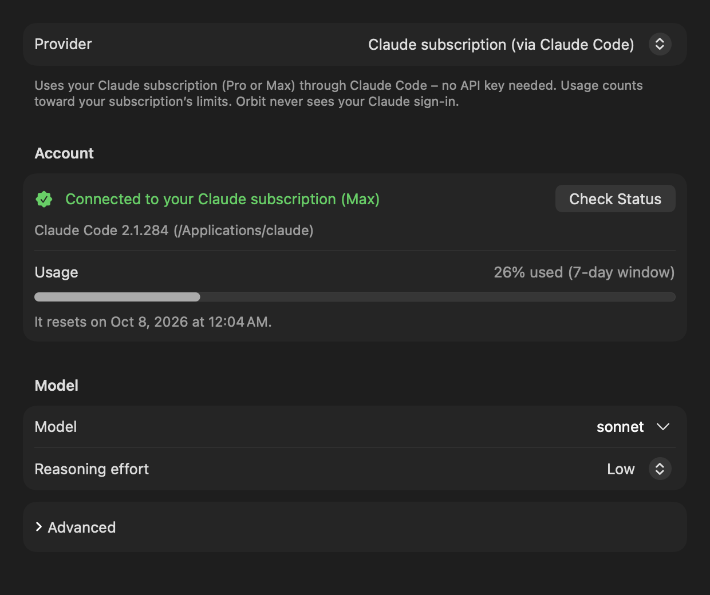
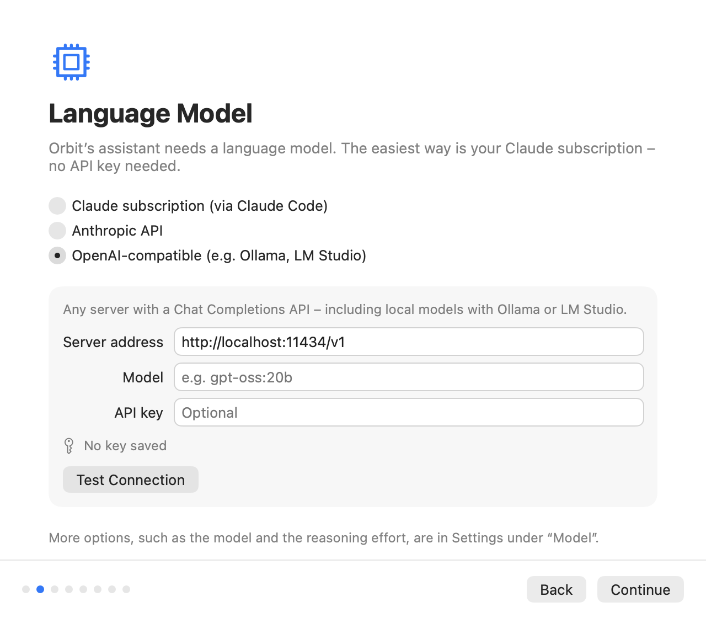

# Choosing a language model

Orbit's assistant needs a language model. This page compares the three kinds of provider Orbit supports, explains how
to set up each one, and covers **Test Connection**, switching providers and where the settings are kept. Instant
search never uses a model; only questions you ask Orbit do.

**On this page**

- [The three providers at a glance](#the-three-providers-at-a-glance)
- [Claude subscription via Claude Code](#claude-subscription-via-claude-code)
- [Anthropic API](#anthropic-api)
- [OpenAI-compatible servers](#openai-compatible-servers)
- [Reasoning effort](#reasoning-effort)
- [Plain HTTP addresses](#plain-http-addresses)
- [Test Connection](#test-connection)
- [Automatic retries and timeouts](#automatic-retries-and-timeouts)
- [Switching providers inside a chat](#switching-providers-inside-a-chat)
- [Where these settings are stored](#where-these-settings-are-stored)

## The three providers at a glance

You choose the provider in the setup's **Language Model** step or in Settings → **Model** → **Provider**.

| | Claude subscription (via Claude Code) | Anthropic API | OpenAI-compatible |
|---|---|---|---|
| **What you need** | A Claude Pro or Max plan, plus the Claude desktop app (which bundles Claude Code) or a Claude Code installation, signed in | An API key from the Anthropic Console | A server with a Chat Completions API: Ollama or LM Studio on your Mac, another machine, or a hosted service such as OpenAI |
| **Cost model** | Counts toward your subscription's usage limits; no per-request bill | Pay per token on your Anthropic account | Free on your own hardware; per-token pricing with hosted services |
| **Where requests go** | Orbit starts Claude Code on your Mac; **Claude Code** connects to Anthropic. Orbit itself makes no internet connection | Orbit connects to `api.anthropic.com`, or to the Anthropic-compatible server you enter | Orbit connects to the server address you enter (default `http://localhost:11434/v1`, Ollama on this Mac) |
| **Tool support** | All of Orbit's tools, through a local bridge (Claude Code runs the tool loop) | All of Orbit's tools | All of Orbit's tools, **if the model supports tool calling** (for example gpt-oss or qwen3) |
| **Setup effort** | Lowest: install the Claude app, sign in once in the browser | Paste a key | Install and start a server, download a model, enter its address and name |

On the first launch, Orbit preselects the Claude subscription when it finds Claude Code in one of its standard
locations (including the Claude app's own copy); otherwise it preselects the Anthropic API.

Whichever provider you use, the chat notes what personal content was sent to it, for example "3 emails sent to
Claude". The note names Claude for the Claude subscription and Anthropic's API, the server's host name for other
servers, and "the local model" for a server on this Mac. See [Privacy](privacy.md).

## Claude subscription via Claude Code

The provider **Claude subscription (via Claude Code)** runs Orbit on your Claude Pro or Max plan instead of an API
key: "Uses your Claude subscription (Pro or Max) through Claude Code, no API key needed. Usage counts toward your
subscription’s limits. Orbit never sees your Claude sign-in."

Orbit does not talk to Anthropic itself. It starts the **locally installed, unmodified Claude Code** as a child
process, and Claude Code uses its own sign-in. Orbit never reads, stores or forwards Claude credentials.

> [!IMPORTANT]
> Orbit is an independent project and is not affiliated with or endorsed by Anthropic. You sign in with your own
> Claude account through Anthropic's own sign-in flow; Orbit never touches your credentials and runs Claude Code
> unmodified. You are responsible for making sure that your use complies with Anthropic's terms for your plan; see
> [Claude Code: legal and compliance](https://code.claude.com/docs/en/legal-and-compliance). If you are unsure, use
> the [Anthropic API](#anthropic-api) or a local model through an [OpenAI-compatible server](#openai-compatible-servers).

### Requirements

- A **Claude Pro or Max** subscription.
- **Claude Code**, in one of two ways:
    - the **Claude desktop app** (from [claude.ai/download](https://claude.ai/download)), which keeps its own copy of
      Claude Code, or
    - a **Claude Code installation** you set up in Terminal.
- Claude Code **signed in** with your Claude account (see [Signing in](#signing-in)).

### How Orbit finds Claude Code

Orbit looks for the `claude` program in this order and uses the first one that is an executable file (an absolute
path; symbolic links are followed):

1. The **Program path** from Settings → **Model** → **Advanced** (see [Advanced settings](#advanced-settings)), with
   `~` expanded. If the path is not usable, Orbit goes on with the next steps.
2. The copy the **Claude desktop app** keeps in `~/Library/Application Support/Claude/claude-code/<version>/`
   (the program is `claude.app/Contents/MacOS/claude` inside it). The app keeps one folder per version. Orbit prefers
   versions whose download the app has verified, and among them the **newest verified version**; unverified
   versions come after all verified ones, newest first.
3. The standard install locations, in this order: `~/.local/bin/claude`, `~/.claude/local/claude`,
   `/opt/homebrew/bin/claude`, `/usr/local/bin/claude`.
4. A login shell: `/bin/zsh -lc 'command -v claude'` with a minimal environment, which also finds installs through
   version managers. It may take at most 5 seconds. Orbit remembers the answer and checks before each use that the
   file is still there.

Orbit repeats this lookup for every request, so when the Claude app updates its copy of Claude Code, Orbit picks up
the new version without a restart.

### Signing in

Settings → **Model** shows whether Claude Code is installed and signed in. If it is not signed in, click
**Sign In…**: Orbit runs `claude auth login --claudeai`, which opens **Anthropic's own sign-in in your browser**.
Orbit never sees your credentials.

- While the sign-in runs, Settings shows "Signing in through your browser…" and **Cancel**.
- The sign-in may take up to 10 minutes; after that it counts as not completed.
- If it fails or times out: "Sign-in was not completed. Please try again."
- **Sign In…** also appears in the setup's **Language Model** step and on the chat notice "Claude Code is not signed
  in. …" (there, Orbit sends your request again by itself after a successful sign-in; see
  [Troubleshooting](troubleshooting.md#how-notices-work)).
- All three places share one sign-in: starting it twice opens only one browser flow.
- A sign-in that is still running ends when Orbit quits.
- If the browser does not open, sign in once in Terminal with `claude auth login`.

### Status, plan and usage

The **Account** section reads the status with two commands that spend no tokens: `claude --version` and
`claude auth status --json` (each may take up to 20 seconds). Of the status, Orbit reads **only** the fields
`loggedIn`, `authMethod` and `subscriptionType`, never the account's e-mail address or organization.

| What you see | Meaning |
|---|---|
| "Checking Claude Code…" | The status is being read. |
| "Connected to your Claude subscription (Max)" | Signed in; the plan comes from `subscriptionType` (for example Pro or Max). Without a plan: "Connected to your Claude account". |
| "Claude Code is not signed in" | Installed but signed out. **Sign In…** is offered. |
| "Claude Code was not found" | No usable `claude` program. "Install the Claude app from claude.ai/download or Claude Code in Terminal, then click “Check Status”." |
| "Claude Code’s status could not be checked" | `claude auth status` failed or answered something Orbit does not understand. |

The line under the status names the Claude Code Orbit uses: "Claude Code 2.1.284 from the Claude app", or the
version with its path, for example "Claude Code 2.1.251 (~/.local/bin/claude)". If Claude Code is signed in with an
Anthropic Console account instead of a subscription, it adds: "Claude Code is not signed in with a Claude
subscription; usage is billed through the Anthropic Console."

**Check Status** reads the status again.

**Usage.** Once Claude Code has reported your usage during a request, the **Usage** row shows it, for example
"26% used (7-day window)", with a bar (orange from 80 %) and the reset time ("It resets on Sep 29, 2026 at 6:00
PM."). The windows are the 5-hour window, the 7-day window, the 7-day window for Opus and the 7-day window for
Sonnet. The text turns red when the limit is reached.

### Usage warnings and the usage limit

- **Warnings at 80 % and 95 %.** When a usage window reaches 80 % and again at 95 %, the chat shows an info notice,
  for example "You have used 82% of your Claude usage limit (5-hour window). It resets on Sep 29, 2026 at 6:00 PM."
  Each threshold is shown once per window while Orbit runs. (Claude Code itself flags usage much earlier, for
  example at 26 %; Orbit does not warn for that.)
- **Limit reached.** When the subscription's limit stops a request, the notice says: "Your Claude subscription’s
  usage limit has been reached. It resets on Oct 5, 2026 at 3:00 PM." with **Try Again**. A usage warning that the
  same request showed is removed, so only one notice remains.
- **Where the reset time comes from.** Only from Claude Code's rejection of that request, never from an earlier
  warning, which may be about another window (for example the week's while the five hours ran out). If Claude Code
  reports the limit only as text, Orbit reads a time of day such as "resets 3pm (Europe/Berlin)" (in the named time
  zone, otherwise your Mac's), but not a date such as "resets Oct 3"; the notice then only says that the limit has
  been reached. See [Known limitations](known-limitations.md#claude-subscription).

### Models

The **Model** field takes a Claude Code model alias or a full model ID. Its suggestions menu offers:

| Alias | Shown as |
|---|---|
| `sonnet` | **Sonnet: balanced (default)** |
| `opus` | **Opus: most capable** |
| `haiku` | **Haiku: fastest** |

The default is `sonnet`, which Claude Code resolves to its current Sonnet model. Orbit passes the value to Claude Code
as `--model=<value>` and checks only its form (1 to 128 characters: letters, digits and `. _ : @ [ ] -`, starting with
a letter or digit). If your plan does not include the model, the notice says: "Your Claude subscription does not
include the selected model. Choose a different model in Settings."

**Reasoning effort** is passed as `--effort low|medium|high`; **Automatic** passes nothing and uses Claude Code's
default. See [Reasoning effort](#reasoning-effort).

### Advanced settings

Under **Advanced**, **Program path** sets the `claude` program to use. Leave it empty ("Detect automatically") to find
Claude Code automatically "(from the Claude app or an installation in Terminal)". Press Return in the field to check
the status with the new path.

### How Orbit isolates Claude Code

Claude Code runs as a plain chat engine. It gets none of its built-in tools, skills, slash commands, plugins, hooks,
memory, settings files or saved sessions, and no messages from other Claude Code sessions.

**Command-line flags** for every chat process:

| Flag | Effect |
|---|---|
| `-p`, `--input-format stream-json`, `--output-format stream-json`, `--include-partial-messages`, `--verbose` | Non-interactive streaming chat over standard input and output |
| `--model=<model>` and, unless Automatic, `--effort <level>` | The model and reasoning effort from Settings |
| `--tools ""` | No built-in tools (no shell, no file editing, no web access of its own) |
| `--disable-slash-commands` | No slash commands or skills |
| `--strict-mcp-config` | Only the MCP servers Orbit passes, no others from your configuration |
| `--setting-sources ""` | No user, project or local settings files |
| `--no-session-persistence` | Sessions are not saved to disk |
| `--settings {"crossSessionInbound":"refuse"}` | Other Claude Code sessions cannot send it messages |
| `--system-prompt-file <file>` | Orbit's system prompt |
| `--mcp-config <file>` and `--allowedTools mcp__orbit__*` | Orbit's tool bridge as the only MCP server, and only its tools (only when tools are offered) |

**Working folder:** an otherwise empty folder, `~/Library/Application Support/Orbit/ClaudeCode`, readable only by you.

**Environment:** Claude Code does **not** inherit Orbit's environment. Only these variables are passed on, when set:
`PATH`, `HOME`, `USER`, `LOGNAME`, `LANG`, `LC_ALL`, `LC_CTYPE`, `TMPDIR`, and for network configuration
`HTTPS_PROXY`, `https_proxy`, `HTTP_PROXY`, `http_proxy`, `NO_PROXY`, `no_proxy` and `NODE_EXTRA_CA_CERTS`.
Everything else is dropped, in particular every `ANTHROPIC_*` variable (API keys, base URLs) and every
`CLAUDE_CODE_*` or `CLAUDECODE` variable from Orbit's own environment. `PATH` gets the program's own folder and
`/usr/bin:/bin:/usr/sbin:/sbin` added; `LANG` defaults to `en_US.UTF-8`.

Orbit then sets these switches:

| Variable | Value | Effect |
|---|---|---|
| `CLAUDE_CODE_DISABLE_AUTO_MEMORY` | `1` | No automatic memory |
| `CLAUDE_CODE_DISABLE_BUNDLED_SKILLS` | `1` | No bundled skills |
| `CLAUDE_CODE_DISABLE_EXPLORE_PLAN_AGENTS` | `1` | No built-in sub-agents |
| `CLAUDE_CODE_DISABLE_NONESSENTIAL_TRAFFIC` | `1` | No non-essential network traffic |
| `DISABLE_TELEMETRY` | `1` | No telemetry |
| `DISABLE_ERROR_REPORTING` | `1` | No error reporting |
| `DISABLE_AUTOUPDATER` | `1` | No automatic updates from Orbit's processes |
| `MCP_TOOL_TIMEOUT` | `3600000` | A tool call may wait up to 60 minutes (for example for you to confirm a card) |
| `CLAUDE_CODE_MCP_AUTO_BACKGROUND_MS` | `0` | Long tool calls are never moved to the background |

### One process per chat

- The Claude Code process of the current chat is **reused for follow-up questions**: it remembers the conversation,
  so Orbit sends only your new message.
- The process is **replaced** when you send a message in another chat (a new chat or a restored one), when the
  model, reasoning effort, system prompt, tools or program path change, and after a request fails. It **ends after 15
  minutes without a request** and when Orbit quits.
- A **new process for an existing chat** (for example after a restart of Orbit, the idle timeout or a settings
  change) first receives the earlier conversation as a compact, text-only transcript (up to 60,000 characters; the
  newest messages are kept).
- **Escape** interrupts the running answer at once. If Claude Code does not finish the interrupted turn within 10
  seconds, or answers that it cannot interrupt, Orbit ends the process; the next request starts a new one with the
  transcript.

### How tools work with Claude Code

Claude Code runs the tool loop itself. It calls Orbit's tools through a small MCP server that Orbit starts for each
process:

- Streamable HTTP on `127.0.0.1` at a random port, path `/mcp`.
- A random 256-bit bearer token per process; requests without it are refused.
- Only the hosts `127.0.0.1` and `localhost` at that port; requests from browsers (with an `Origin` header) are
  refused.
- The tools appear to Claude Code as `mcp__orbit__<tool name>`.

Every call goes through the same checks, confirmation cards, status rows and the limit of 15 tool calls per request
as with the API providers, and the chat history is recorded the same way, which is why you can switch providers
within a chat. Technical details: [LLM providers](llm-providers.md#mcp-bridge).

### Temporary files

For each process Orbit writes two temporary files into the working folder, readable only by you (the folder is
readable only by you as well):

- `system-prompt-<id>.txt`: the system prompt.
- `mcp-config-<id>.json`: the MCP configuration with the bridge's token. It is deleted **as soon as Claude Code has
  connected**.

Both are deleted when the process ends, and at the latest when Orbit quits. Leftovers from a process that did not end
cleanly are removed when the next process starts, once they are older than 10 minutes.

## Anthropic API

The provider **Anthropic API** uses Claude through Anthropic's Messages API with your own API key: "Claude through the
Anthropic API. You can get an API key in the Anthropic Console."

### The API key

1. Create a key in the [Anthropic Console](https://console.anthropic.com).
2. Paste it into **API key** (in the setup or in Settings → **Model** → **Account**) and click **Save** (or press
   Return).

The key is stored **only in your login keychain** (labeled "Orbit: anthropic-api-key"), never in a file or in Orbit's settings. The field accepts a new
key but never shows the stored one. The row under it says "Saved in keychain" or "No key saved"; **Remove** deletes
the stored key. **Test Connection** with a typed key saves it when the test succeeds.

The official API always needs a key: without one, a request ends with "No API key is set. Enter it in Settings."
before anything is sent.

### Models

The **Model** field defaults to `claude-sonnet-5-5`. Its suggestions menu offers `claude-sonnet-5-5 (default)`,
`claude-opus-5-5` and `claude-haiku-4-5`; you can type any model ID your account can use. Each response may be up to
32,000 tokens long.

On the official API, Orbit also:

- asks the API to cache the conversation (prompt caching);
- for `claude-sonnet-5-5`, `claude-opus-5-5`, `claude-fable-5`, `claude-fable-5-1` and `claude-mythos-5-1`, lets the
  model think adaptively and shows its short progress notes as status lines while it works.

**Reasoning effort** is sent only to models that support it (the Claude Sonnet 5, Opus 5, Fable and Mythos families,
Claude Opus 4.5 to 4.8 and Claude Sonnet 4.6); other models, such as `claude-haiku-4-5`, get no effort setting. See
[Reasoning effort](#reasoning-effort).

### A custom server address

**Server address** is optional: "Optional. Leave empty for api.anthropic.com, or enter the address of a compatible server, e.g.
http://localhost:11434 for Ollama."

- Enter the server's root address. A trailing `/v1` or `/v1/messages` is removed, so `http://localhost:11434`,
  `http://127.0.0.1:11434` and `http://localhost:11434/v1` all work for **Ollama's Anthropic-compatible API**.
- A compatible server may not need a key. If it refuses a request without one, the notice says "No API key is set.
  Enter it in Settings." (not that a key was rejected).
- Compatible servers get only the plain Messages API: no caching of the whole conversation, no progress notes, and no
  reasoning effort for non-Claude models such as `gpt-oss:20b`. If such a server rejects an optional part of a
  request, Orbit sends the request again without it and remembers that for this server and model until Orbit quits.
- For a server on this Mac, the chat's note on what was sent names "the local model"; for another server, its host
  name.

Plain `http://` works only for some addresses; see [Plain HTTP addresses](#plain-http-addresses).

## OpenAI-compatible servers

The provider **OpenAI-compatible** works with "any server with a Chat Completions API, including local models with
Ollama or LM Studio", and with OpenAI itself.

### Server address

The address must include the API's version path, usually ending in **`/v1`**. Orbit adds `/chat/completions` and
`/models` itself (a pasted `…/chat/completions` is trimmed). If the field is empty, Orbit uses
`http://localhost:11434/v1`.

| Server | Address |
|---|---|
| Ollama on this Mac | `http://localhost:11434/v1` |
| LM Studio's local server on this Mac | `http://localhost:1234/v1` (start the server in LM Studio first) |
| OpenAI | `https://api.openai.com/v1` (needs an API key) |
| Another machine in your network | for example `http://192.168.1.20:11434/v1` |

An address without `/v1` usually ends with "The server address in Settings is invalid.", because the server answers
that it does not know the route.

### Model

Enter the model name exactly as the server knows it, for example `gpt-oss:20b` or `qwen3` for Ollama. A model is
required: without one, Orbit says "No model is set. Enter a model in Settings." When **Test Connection** looks for the
model in the server's list, Ollama's implicit `:latest` tag does not matter: `llama3` and `llama3:latest` count as the
same model.

**The model must support tool calling.** Orbit always offers its tools, so a model without tool support cannot answer:
"The model “gemma3:4b” cannot use tools. Choose a model with tool support in Settings, for example gpt-oss or qwen3."

### API key

The key is **optional**: local servers such as Ollama and LM Studio need none ("No key saved (not needed for local
servers)"). If you enter one, it is stored only in your login keychain (labeled "Orbit: openai-compatible-api-key") and sent as a bearer token. If a server refuses
a request because no key was sent, the notice says "No API key is set. Enter it in Settings." For OpenAI, enter your
OpenAI API key.

### Reasoning with OpenAI-compatible servers

When **Reasoning effort** is not **Automatic**, Orbit sends it as `reasoning_effort` (`low`, `medium` or `high`). If a
server rejects that field, Orbit sends the request again without it and remembers that for this server and model until
Orbit quits. While the model works through tools, its reasoning is sent back to the server in the field it came in
(models such as gpt-oss expect that); a server that rejects it gets the request again without it.

## Reasoning effort

**Reasoning effort** in Settings → **Model** controls how thoroughly the model thinks: "Higher is more thorough but
slower."

| Setting | Effect |
|---|---|
| **Automatic** | Sends no setting: the provider's default (for the Claude subscription, Claude Code's default) |
| **Low** | The default |
| **Medium** | More thorough |
| **High** | Most thorough, slowest |

The setting is shared by all providers. How it is sent: `--effort` for Claude Code, `output_config.effort` for
supporting Claude models on the Anthropic API, `reasoning_effort` for OpenAI-compatible servers.

## Plain HTTP addresses

Orbit connects with HTTPS, or with plain `http://` only to addresses macOS (App Transport Security) allows without
encryption:

- this Mac (`localhost`, `127.0.0.1`, `::1`),
- IP addresses,
- `.local` names (for example `studio.local`),
- names without a dot (for example `gaming-pc`).

macOS **blocks** plain HTTP to other names, such as `pc.fritz.box`. The **Server address** field says so right away,
and a request ends with: "Orbit allows unencrypted connections (http://) only to this Mac, to IP addresses and to
.local addresses. Use https:// or the server’s IP address." Use `https://`, the server's IP address or its `.local`
name instead.

For plain HTTP to an IP address outside this Mac and the private address ranges, the field warns: "Unencrypted
connection: the key and content would be sent in plain text. Use it only for servers on this Mac or in your local
network." The connection still works.

An address that is not `http` or `https` with a host shows "Invalid address. Example: http://localhost:11434/v1".

## Test Connection

**Test Connection** (Settings → **Model**, and the setup's **Language Model** step) checks the two API providers
without generating any text, so it spends no tokens and loads no model:

1. A model must be entered ("Please enter a model.") and the address must be usable (otherwise "The server address in
   Settings is invalid." or the plain-HTTP message above).
2. **Anthropic API:** the official API needs a key. Orbit asks for the model (`GET /v1/models/<model>`); a compatible
   server that does not know that route is asked for its model list instead.
3. **OpenAI-compatible:** Orbit asks for the model list (`GET <address>/models`) and checks that the model is on it.
   For an address ending in `/v1`, it also asks **Ollama's model information** (`/api/show`, next to `/v1`) whether
   the model can use tools (metadata only, without loading the model). Other servers do not answer that question, so
   with them a model without tool support shows only with the first request.

The test uses the key you typed (or the stored one). A typed key that passes is saved. The result appears next to the
button ("Connection successful" or the same text a chat notice would show, for example "The server on this Mac
(localhost:11434) cannot be reached. Start it (for example Ollama or LM Studio) and try again."), and VoiceOver reads
it.

The Claude subscription has no **Test Connection**; **Check Status** reads Claude Code's status instead (see
[Status, plan and usage](#status-plan-and-usage)).

## Automatic retries and timeouts

With the two API providers, Orbit retries rate limits, overload, server errors and network failures **twice** by
itself (after 1 and 3 seconds, or after the wait the server asks for, at most 20 seconds) before it shows a notice.
It retries only while nothing of the answer has appeared yet. A request fails when the server sends nothing for 120
seconds, and a single response may take at most 15 minutes. Claude Code does its own retrying.

See [Troubleshooting](troubleshooting.md) for every notice and what to do.

## Switching providers inside a chat

Orbit builds the provider from the current settings for every request. You can change the provider, model or
reasoning effort in Settings → **Model** at any time; the next message in the same chat uses the new setting.

- The chat history is stored in a provider-neutral form, so the new provider sees the whole conversation.
- When you switch to the Claude subscription, the new Claude Code process first receives the earlier conversation as
  a transcript (see [One process per chat](#one-process-per-chat)).
- If the Anthropic API rejects reasoning that another model produced earlier in the chat, Orbit leaves it out and
  sends the request again.
- The note on what was sent names the provider that received it at that time.

## Where these settings are stored

| What | Where |
|---|---|
| Provider, models, server addresses, reasoning effort, Claude Code's program path | The user defaults of `io.github.eric-volz.Orbit` (keys `providerKind`, `anthropicModel`, `anthropicBaseURL`, `openAIModel`, `openAIBaseURL`, `claudeCodeModel`, `claudeCodePath`, `reasoningEffort`) |
| API keys | Only the login keychain, service `io.github.eric-volz.Orbit.credentials`, accounts `anthropic-api-key` and `openai-compatible-api-key`; new items are labeled `Orbit: <account>` |
| Claude sign-in | Stays with Claude Code; Orbit never reads or stores it |

Each provider keeps its own model, server address and key, so switching back and forth does not lose them; the
reasoning effort is one setting for all. More about stored data: [Privacy](privacy.md#what-orbit-stores).
