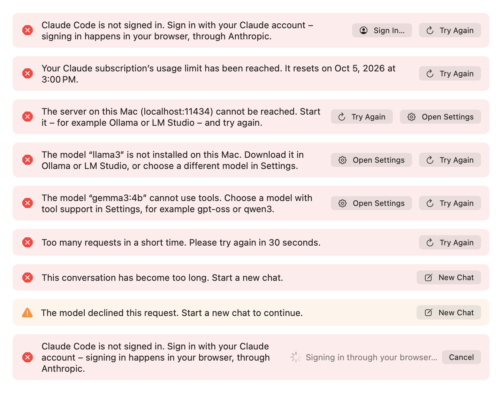

# Troubleshooting

When something goes wrong, Orbit tells you in the chat what happened and what helps. This page explains those notices,
lists every failure case with its exact wording and buttons, walks through common problems, shows how to collect logs
safely and answers frequently asked questions.

**On this page**

- [How notices work](#how-notices-work)
- [Every notice and what to do](#every-notice-and-what-to-do)
- [Automatic retries](#automatic-retries)
- [Tool failures and card problems](#tool-failures-and-card-problems)
- [Trying the notices safely](#trying-the-notices-safely)
- [Common problems](#common-problems)
- [Collecting logs safely](#collecting-logs-safely)
- [Resetting permissions](#resetting-permissions)
- [FAQ](#faq)

## How notices work



A failed request ends with **one notice** in the chat. It says what happened and what helps, in the interface's
language and in Orbit's own words, never the provider's or the network's error text. A notice is an info (blue),
a warning (orange) or an error (red), and it has up to two buttons, the most fitting one first:

| Button | What it does |
|---|---|
| **Try Again** (⌘R) | Sends the same request again without retyping. |
| **Open Settings** | Opens Settings on the tab that fixes the problem: **Model** for the provider, **Permissions** for a macOS permission. |
| **Sign In…** | Runs Claude Code's sign-in (Anthropic's sign-in in your browser) and then sends the request again by itself. Meanwhile the notice shows "Signing in through your browser…" and **Cancel**. **Cancel** leaves the notice as it was; a failed sign-in says so in the notice ("Sign-in was not completed. Please try again."). |
| **New Chat** (also ⌘N) | Starts over when the conversation no longer fits the model. The request that did not fit is already in the input, exactly as you typed it, for you to send again or change; it is not sent by itself, and its context chips stay behind, since what was selected may have changed. |

- **Try Again**, **Sign In…** and **New Chat** appear only on the **latest** notice, and only while nothing is
  running. **Open Settings** stays on older notices too.
- After such a notice, ⌘N, the input's **New Chat** button and **New Chat** in the menu bar menu also start the new
  chat with the request in the input. After any other chat, a new chat starts with an empty input.
- **VoiceOver** reads each notice once, when it appears. An error interrupts what VoiceOver is saying; other notices
  wait. Warnings and errors are read with "Warning:" or "Error:" in front, since VoiceOver cannot see the symbol.
- **Show in Finder** on a file card is ⇧⌘R, not ⌘R, because ⌘R retries a failed answer.

## Every notice and what to do

The notices name your model and server where it helps (examples below use `gpt-oss:20b`, `localhost:11434` and so
on).

### Claude subscription

| What happened | The notice says | Buttons |
|---|---|---|
| Claude Code not found | "Claude Code was not found. Install the Claude app or Claude Code, or choose another provider in Settings." | Open Settings, Try Again |
| Claude Code not signed in | "Claude Code is not signed in. Sign in with your Claude account. Signing in happens in your browser, through Anthropic." | Sign In…, Try Again |
| Claude Code refuses Orbit's command-line options | "This version of Claude Code is too old for Orbit. Update the Claude app or Claude Code, then try again." | Try Again, Open Settings |
| Claude Code ended unexpectedly | "Claude Code quit unexpectedly. Please try again." | Try Again |
| The subscription's usage limit | "Your Claude subscription’s usage limit has been reached. It resets on Oct 5, 2026 at 3:00 PM." The reset time comes from Claude Code's rejection of this request or its message ("resets 3pm"), never from an earlier warning, which may be about another window (for example the week's). Without a known time, only the first sentence. | Try Again |
| Your plan does not include the model | "Your Claude subscription does not include the selected model. Choose a different model in Settings." | Open Settings, Try Again |

A usage warning ("You have used 96% of your Claude usage limit …") that the same request showed gives way to the
limit's notice, so only one remains.

### API key, model and server address

| What happened | The notice says | Buttons |
|---|---|---|
| No API key | "No API key is set. Enter it in Settings." Also shown when a server refuses a request that was sent without a key (instead of "rejected"). | Open Settings, Try Again |
| The key was rejected | "The API key was rejected. Check it in Settings." | Open Settings, Try Again |
| The key has no access to the model | "This API key does not have access to the selected model." | Open Settings, Try Again |
| The keychain could not be read | "The API key could not be read from the keychain. Allow Orbit access and try again." | Try Again |
| No model set | "No model is set. Enter a model in Settings." | Open Settings, Try Again |
| Unknown model | "The model “gpt-oss:20b” is not available. Choose a different model in Settings." For a server on this Mac: "The model “llama3” is not installed on this Mac. Download it in Ollama or LM Studio, or choose a different model in Settings." | Open Settings, Try Again |
| A model that cannot use tools (Ollama: "does not support tools") | "The model “gemma3:4b” cannot use tools. Choose a model with tool support in Settings, for example gpt-oss or qwen3." | Open Settings, Try Again |
| An unusable server address | "The server address in Settings is invalid." | Open Settings, Try Again |
| Plain HTTP that macOS blocks | "Orbit allows unencrypted connections (http://) only to this Mac, to IP addresses and to .local addresses. Use https:// or the server’s IP address." | Open Settings, Try Again |
| A request the provider refused | "The provider rejected the request. Check the model and your settings." | Open Settings, Try Again |
| A billing problem | "There is a billing problem with the provider. Check your account with the provider." | Try Again |

### Network and server

| What happened | The notice says | Buttons |
|---|---|---|
| A server on this Mac does not answer | "The server on this Mac (localhost:11434) cannot be reached. Start it (for example Ollama or LM Studio) and try again." | Try Again, Open Settings |
| Another server does not answer | "The server 192.168.1.20:11434 cannot be reached. Check the address in Settings and your network connection." | Try Again, Open Settings |
| Anthropic's API does not answer | "The Anthropic API cannot be reached. Check your internet connection." | Try Again |
| A certificate problem | "A secure connection to 192.168.1.20:11434 could not be established. Check the server’s address and certificate." (for Anthropic: "A secure connection could not be established.") | Try Again, Open Settings (only for a server address you set) |
| No internet connection | "No internet connection." | Try Again |
| The connection dropped | "The connection to the provider was interrupted. Please try again." | Try Again |
| A timeout | "The provider is not responding. Please try again." | Try Again |
| Another network error | "Network error. Please try again." | Try Again |
| Rate limit | "Too many requests in a short time. Please try again in 30 seconds." (with the wait the server asked for, otherwise "… in a moment.") | Try Again |
| Overload | "The service is overloaded right now. Please try again in a moment." | Try Again |
| A server error | "The provider ran into an error. Please try again later." | Try Again |
| An incomplete answer | "The provider’s response was incomplete. Please try again." | Try Again |

### The conversation and the answer

| What happened | The notice says | Buttons |
|---|---|---|
| The conversation no longer fits the model | "This conversation has become too long. Start a new chat." or "This conversation has become too long for the model. Start a new chat." | New Chat |
| The model declined, and the request can be taken back | "The model declined this request." The refused request is removed from the history, so follow-ups do not carry it. | None |
| The model declined, and the request cannot be taken back | "The model declined this request. Start a new chat to continue." | New Chat |
| The model hit its output limit before answering | "The model reached its output limit before it could answer." | Try Again |
| No answer at all | "The model did not return an answer." | Try Again |
| The answer was cut off | "The answer was cut off because it reached the maximum length." (info) | None |
| The tool limit (15 calls per request) | API providers: "Orbit stopped the request after 15 tool calls. Make it more specific, or send a new message to continue." Claude subscription: "Orbit stopped running tools after 15 tool calls. Make your request more specific if the answer is incomplete." | None |
| You stopped the answer (Escape) | "Canceled." (info) | None |
| Anything else | "An unexpected error occurred. Please try again." | Try Again |

### macOS permissions

When macOS refused a permission a tool needed, the chat adds an info notice such as "Orbit is not allowed to control
Mail.", "Orbit is not allowed to control Notes.", "Orbit is not allowed to access your contacts.", "Orbit does not have
full access to your calendars." (also when macOS allows adding only), "Orbit does not have full access to your
reminders.", "Orbit is not allowed to access your photos.", "Orbit is not allowed to control Photos.", "Orbit is not
allowed to control Finder." or "Orbit is not allowed to control System Events." They come with **Open Settings**,
which opens the **Permissions** tab. Each permission's notice appears once per request. See [Permissions](permissions.md).

## Automatic retries

With the Anthropic API and OpenAI-compatible servers, Orbit retries rate limits, overload, server errors and network
failures **twice by itself** before it shows a notice: after 1 and 3 seconds, or after the wait the server asked for
(at most 20 seconds). It retries only as long as nothing of the answer has appeared. That is why a stopped Ollama shows
its notice only after a few seconds. Claude Code retries on its own.

If a server rejects an optional part of a request (such as the reasoning effort), Orbit sends the request again
without it and remembers that for this server and model until it quits. See
[Choosing a language model](providers.md#automatic-retries-and-timeouts).

## Tool failures and card problems

- **Tool failures** do not end the request. They appear as status lines under the tool's row: "Timed out",
  "Missing permission: Automation: Mail", "Not found", "Not available", "Invalid parameters" or "Failed", and the
  assistant explains them in its answer. A permission macOS refused also adds the notice described above.
- **Card problems** (a file that is gone, Notes or Photos that Orbit may not control) are said in a short note
  **under the input** for about 4 seconds, for example "“Offer.pdf” was not found. It may have been moved or
  deleted." VoiceOver reads it out.

## Trying the notices safely

You can see the notices without breaking anything. Run a debug build against **FakeLLMServer**, the scripted stand-in
for both APIs (see [Development → FakeLLMServer](development.md#fakellmserver)), and send:

| Message | Notice |
|---|---|
| `#error 401` | The API key was rejected. |
| `#error 404 model not found` | The model is not available (it names the model you set). |
| `#error 400 this model does not support tools` | The model cannot use tools. |
| `#error 429` | Too many requests (the server asks for a 2-second wait; Orbit retries twice first). |
| `#error 529` | The service is overloaded. |

With `ORBIT_DEBUG_BASE_URL=http://127.0.0.1:9` (nothing listens there), every request ends with "The server on this
Mac (127.0.0.1:9) cannot be reached. Start it (for example Ollama or LM Studio) and try again."

[`orbitctl`](development.md#orbitctl) shows a notice's buttons: `orbitctl state` lists them as `action` and
`secondaryAction`, and `orbitctl key cmd-r` presses **Try Again**.

## Common problems

### The keyboard shortcut does nothing

- The default shortcut is **⌥ Space**. Check it in Settings → **General** → **Keyboard Shortcut**. If you removed it
  there, open Orbit from its menu bar icon (**Open Orbit**).
- **⌘ Space belongs to Spotlight.** To use it for Orbit, first turn off Spotlight's shortcut in System Settings →
  Keyboard → Keyboard Shortcuts → Spotlight → "Show Spotlight search"; then record ⌘ Space in Orbit.
- If macOS already uses the combination you record, Orbit warns: "macOS already uses this shortcut. Change it first in
  System Settings > Keyboard > Keyboard Shortcuts." You can still choose **Use Anyway**, but macOS may keep the
  shortcut for itself. Choose another one, or free it in System Settings.
- Orbit has no Dock icon. If its icon is missing from the menu bar, Orbit is not running; open it from the
  Applications folder.

### Permissions are lost after rebuilding Orbit

macOS ties privacy permissions to the app's code signature, and an ad hoc build gets a new one with every build. Sign
your builds with a stable development certificate (`Scripts/create-dev-cert.sh`, then
`ORBIT_SIGN_IDENTITY="Orbit Development"`) to keep them. See
[Permissions → Code signing and permissions](permissions.md#code-signing-and-permissions).

### "Automation: Notes" (or Mail) shows Unknown

macOS reports Automation permissions only while the target app is running, so **Automation: Notes** shows **Unknown**
while Notes is closed. Open Notes, or click **Check…** in Settings → **Permissions**: Orbit then starts Notes (or
Mail) in the background to ask. An earlier **Allowed** stays meanwhile, so your tools keep working. See
[Permissions](permissions.md#how-orbit-reads-a-status-without-asking).

### Full Disk Access does not seem to work

Full Disk Access has no prompt: turn Orbit on in System Settings → Privacy & Security → Full Disk Access. It takes
effect **only after Orbit restarts**: use **Restart Orbit** next to the mail search mode in Settings →
**Permissions**. Full Disk Access is detected through Mail's folder only, so it shows **Unknown** on a Mac where Mail
was never set up.

### Claude Code is not found

- Install the **Claude desktop app** from [claude.ai/download](https://claude.ai/download) (it brings its own Claude
  Code) or install Claude Code in Terminal, then click **Check Status** in Settings → **Model**.
- If Claude Code is installed somewhere unusual, enter the full path of the `claude` program under **Advanced** →
  **Program path**.
- Orbit's search order is described in
  [Choosing a language model](providers.md#how-orbit-finds-claude-code).

### Claude Code is not signed in

Click **Sign In…** (on the notice, in Settings → **Model** or in the setup). Anthropic's sign-in opens in your browser;
after you sign in, a request from a notice is sent again by itself. If the browser does not open, run
`claude auth login` once in Terminal, then click **Check Status**.

If Settings says "Claude Code is not signed in with a Claude subscription; usage is billed through the Anthropic
Console.", Claude Code uses an Anthropic Console account. Sign in with your Claude account instead if you want to use
your subscription.

### Claude Code is too old

Orbit recognizes an old Claude Code by its refusal of Orbit's command-line options. Update the Claude app (its copy of
Claude Code updates with it) or your Claude Code installation, then press **Try Again**. Orbit itself never updates
Claude Code: the processes it starts have automatic updates turned off.

### The usage limit is reached

The notice says when the limit resets, if Claude Code reported it. Wait until then and press **Try Again**, or switch
to another provider in Settings → **Model** for the meantime; the chat continues with the new provider. Settings →
**Model** shows your usage and the reset time once Claude Code has reported them.

### Ollama: not reachable, model not installed, no tool support

- **"The server on this Mac (localhost:11434) cannot be reached. …"**: Ollama is not running. Start it, then press
  ⌘R: the answer comes without retyping.
- **"The model “llama3” is not installed on this Mac. …"**: download the model in Ollama (for example
  `ollama pull llama3`) or enter a model you have.
- **"The model “gemma3:4b” cannot use tools. …"**: Orbit always offers tools, so the model must support tool calling.
  Choose one that does, for example `gpt-oss:20b` or `qwen3`.
- **Test Connection** in Settings → **Model** shows the same texts for all three (for tool support it asks Ollama's
  model information, so the model is not loaded), and "Connection successful" with a working model such as
  `gpt-oss:20b`.
- With an OpenAI-compatible address, include `/v1`: `http://localhost:11434/v1`. With the Anthropic API provider,
  use the root address: `http://localhost:11434`.

### "No API key is set" with OpenAI

`https://api.openai.com/v1` needs a key. Without one, the notice says "No API key is set. Enter it in Settings." (not
that a key was rejected). Enter your OpenAI key under **API key** and save it.

### Plain HTTP is blocked for a server in your network

macOS allows plain `http://` only to this Mac, IP addresses, `.local` names and names without a dot. A name such as
`pc.fritz.box` is blocked, and Settings shows: "Orbit allows unencrypted connections (http://) only to this Mac, to IP
addresses and to .local addresses. Use https:// or the server’s IP address." Use the server's IP address (for example
`http://192.168.1.20:11434/v1`), its `.local` name, or HTTPS. See
[Choosing a language model](providers.md#plain-http-addresses).

### Open at login needs approval

If macOS wants your approval, Settings → **General** shows "Allow Orbit in System Settings > General > Login Items."
with **Open Login Items…**. Allow Orbit there; when you come back, the note goes away. If Orbit cannot be registered
at all, the note says why. Most often it is "Opening at login is not available for this copy of Orbit. Move Orbit to the
Applications folder and open it from there." See [User guide → Launch at login](user-guide.md#launch-at-login).

### Mail search is slow or skips mailboxes

- Without Spotlight, Orbit asks Mail directly. That always works but is slower on large mailboxes and searches only
  subjects and senders. Settings → **Permissions** → **Mail Search** shows the mode (**Through Spotlight** or
  **Through Mail**).
- With **Full Disk Access**, Spotlight may show your mail to Orbit; Orbit then searches all mailboxes at once, also in
  the message text. Turn it on, click **Restart Orbit**, then **Check Again**. See
  [Permissions → Mail search and Full Disk Access](permissions.md#mail-search-and-full-disk-access).
- If Mail is slow, a search stops after about 35 seconds and reports the mailboxes it skipped; the assistant then narrows
  the search by sender and time.

### Files are not found

The file tools and instant search use Spotlight:

- Folders excluded from indexing (Spotlight's privacy settings in System Settings) and volumes without an index are
  not searched.
- New files appear once Spotlight has imported them, usually within seconds.
- Files lying directly in your home folder (not in a subfolder) are not searched.
- Words match the **beginning** of words in a name: "rechnung" ("invoice") finds "Telekom-Rechnung.pdf" but not
  "Telekomrechnung.pdf", which matters for German compound words. Phrases are not supported.
- The first search of Desktop, Documents or Downloads may bring up macOS's folder-access prompt for Orbit.

More in [Known limitations](known-limitations.md#files).

### The interface is in the wrong language

Orbit has no language setting of its own; it follows macOS: English or German, whichever comes first in your preferred languages, otherwise English. To choose a language just for Orbit, go to System Settings
→ General → Language & Region → Applications, add Orbit with its language, then quit and reopen Orbit. Texts already
in a chat keep the language they were written in. The assistant always answers in the language of your message. See
[User guide → Language](user-guide.md#language).

## Collecting logs safely

Orbit logs to the macOS unified log under the subsystem `io.github.eric-volz.Orbit` (categories `app`, `panel`, `llm`, `agent`,
`tools`, `search`, `storage` and `permissions`). The logs record events, counts, durations and error kinds; **never
content**: no prompts, answers, mail, notes, file names, paths, search words or file contents, and no API keys. That
makes them safe to attach to a bug report.

Watch the log live while you reproduce a problem:

```sh
log stream --level info --predicate 'subsystem == "io.github.eric-volz.Orbit"'
```

Or collect what happened recently, for example in the last hour:

```sh
log show --last 1h --info --predicate 'subsystem == "io.github.eric-volz.Orbit"' > orbit-log.txt
```

The Console app works too: filter for the subsystem `io.github.eric-volz.Orbit`. Read the file before you share it.

## Resetting permissions

To make macOS forget every permission decision about Orbit, run this and restart Orbit:

```sh
tccutil reset All io.github.eric-volz.Orbit
```

Orbit then shows **Not asked yet** again, and macOS asks on the next **Allow…** or first use. To reset a single
service, see [Permissions → Resetting permissions](permissions.md#resetting-permissions).

## FAQ

**Does Orbit send my data anywhere else?**
No. Orbit has no server of its own and sends no telemetry, analytics or update checks. Its only network connection is
the language model provider you set up; with the Claude subscription, Claude Code makes that connection, not
Orbit. Instant search never sends anything to a model. Content reaches the model only when a tool reads it for your
question, and the chat notes what was sent, for example "3 emails sent to Claude". See [Privacy](privacy.md).

**Can Orbit send mail or delete things?**
No. Orbit never sends mail: drafts and replies open in Mail for you to review and send. It cannot delete, move or
change messages, cannot edit or delete events and reminders, and never changes your photo library. Every action with
consequences (creating a note, event or reminder, running a shortcut, changing the appearance or volume, opening a
link you did not type) waits for you on a confirmation card. See [Tools](tools.md).

**Does it work with a local model?**
Yes. Choose **OpenAI-compatible** with Ollama (`http://localhost:11434/v1`) or LM Studio (`http://localhost:1234/v1`)
and a model that supports tool calling, such as `gpt-oss:20b` or `qwen3`. Nothing then leaves your Mac. See
[Choosing a language model](providers.md#openai-compatible-servers).

**Which model should I use?**
With a Claude subscription, start with the default `sonnet` ("Sonnet: balanced (default)"); `opus` is the most capable and
`haiku` the fastest. With the Anthropic API, the default is `claude-sonnet-5-5`. With a local server, the model must
support tools; `gpt-oss` and `qwen3` are examples that do.

**Why does Orbit ask before opening a link?**
A link can come from content the model read (an email, a note, a web page in a file) rather than from you. Orbit
opens links without asking only when you typed them in the current message. Every other link gets an **Open link**
card that shows the full address (and marks look-alike domains), so a crafted message cannot send you somewhere on its
own. See [Tools → open_url](tools.md#open_url).

**Why does Orbit stop after 15 tool calls?**
To keep a request from running away. Make the request more specific, or send a new message to continue.

**Does using the Claude subscription cost extra?**
No separate bill: usage counts toward your plan's limits, like using Claude yourself. Orbit warns at 80 % and 95 %
of a usage window. If Claude Code is signed in with an Anthropic Console account instead, usage is billed through the
Console.

**Can I switch providers in the middle of a chat?**
Yes. Change the provider in Settings → **Model**; the next message in the same chat uses it.

**Is something not working as described?**
Check [Known limitations](known-limitations.md) first.
