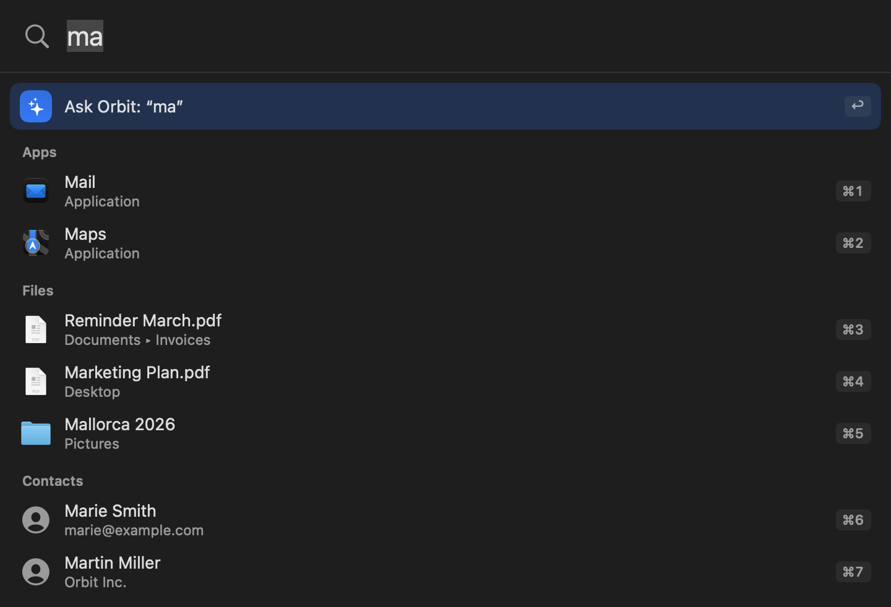
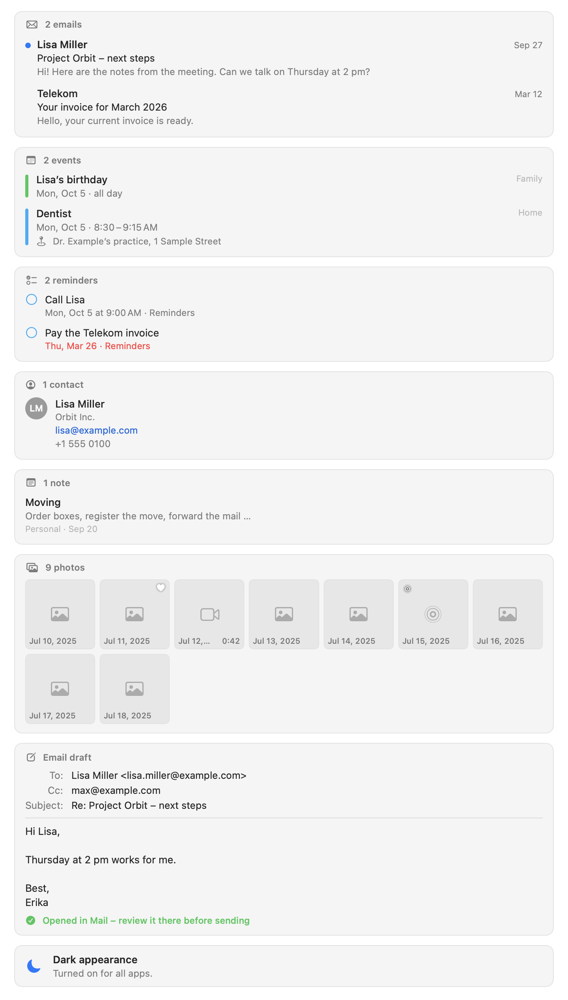
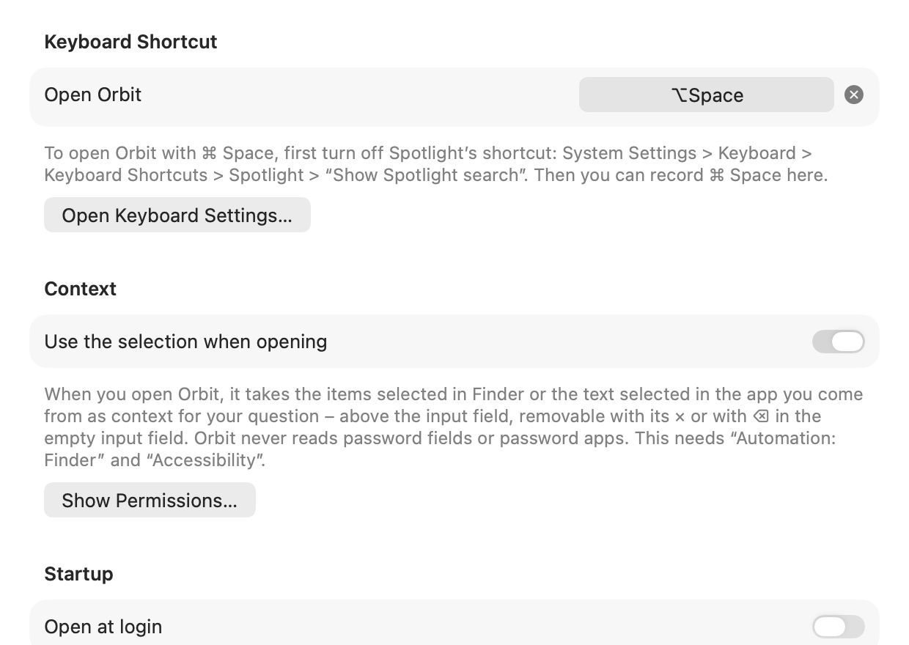
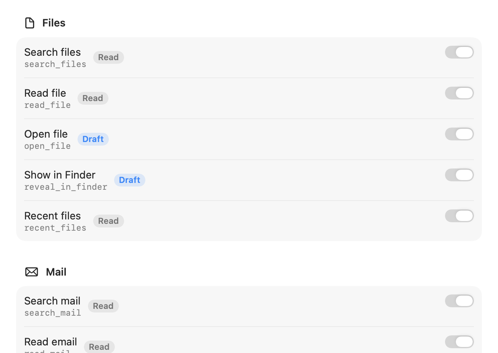

# User guide

Everything you can do in Orbit's interface: the floating panel, instant search, chatting with the assistant, the
result and confirmation cards, context chips, notices, the Settings window, launch at login and the interface
language. For installation and the first-launch setup, see [Getting started](getting-started.md); for a compact
list of keys, see [Keyboard shortcuts](keyboard-shortcuts.md).

**On this page**

- [The panel](#the-panel)
- [Instant search](#instant-search)
- [Asking Orbit](#asking-orbit)
- [Chat parking and history](#chat-parking-and-history)
- [Result cards](#result-cards)
- [Confirmation cards](#confirmation-cards)
- [Context chips](#context-chips)
- [Notices](#notices)
- [Settings](#settings)
- [Launch at login](#launch-at-login)
- [Language](#language)

## The panel

Orbit lives in a single floating panel, similar to Spotlight. It has one input field: what you type there is a
search until you ask Orbit a question, and then the panel becomes a chat.

### Opening and closing

- **Open:** press the global shortcut (default **⌥ Space**), or choose **Open Orbit** in the menu bar menu. The panel
  appears on the screen with the mouse pointer, a little below the top of the screen, at most 720 points wide. It
  floats above other windows (also above full-screen apps), on every Space, and the app you were using stays
  active.
- **Close:** press the shortcut again, press **Escape**, click anywhere outside the panel, or switch to another app.
  ⌘W also hides it. Opening Settings or the setup window closes the panel too.
- **Launching Orbit again** (from Finder, Spotlight or `open`) brings up the panel instead of starting a second
  copy.

Closing only hides the panel: what it showed is still there the next time (see
[Chat parking](#chat-parking-and-history) for what happens after a longer pause). The panel grows downward as
results or a chat need room, up to about 70% of the screen height, and then scrolls. When it opens again in search
mode, your previous search is selected, so typing replaces it.

Escape does one thing at a time: it closes a Quick Look preview first; otherwise it stops a running answer;
otherwise it closes the panel.

### The menu bar menu

Orbit has no Dock icon. Its icon in the menu bar opens this menu:

| Item | What it does |
|---|---|
| **Open Orbit** | Opens the panel (shows your current global shortcut next to it). Takes the selection of the app you came from as [context chips](#context-chips). |
| **New Chat** | Starts a new chat and opens the panel. |
| **Settings…** (⌘,) | Opens the [Settings](#settings) window. |
| **Setup…** | Opens the setup window from the first step (see [Getting started](getting-started.md#first-launch-and-setup)). |
| **Quit Orbit** (⌘Q) | Quits Orbit. A running answer stops and is saved first. |

From the keyboard, press ⌃F8 (macOS's "Move focus to status menus"), move to Orbit's icon with the arrow keys and
press Return.

## Instant search

As soon as you type, Orbit shows local results. Instant search **never asks the model** and sends nothing anywhere.
The first row is always **Ask Orbit: “…”** (see [Asking Orbit](#asking-orbit)).

### What it searches

- **Apps** in `/Applications`, `/System/Applications` and `~/Applications`, each with one level of subfolders such
  as Utilities (never inside apps), plus Finder. Every name of an app finds it: the one Finder shows (localized), the
  app's names in Orbit's language, in the first three of your preferred languages, and in English, and the file
  name. "Calculator", "calc" and "Rechner" (its German name, on an English Mac that also lists German) all find
  Calculator. The app list is built in the background at launch and scanned
  again about a second after something in those folders changes. Icons load when they are shown.
- **Files and folders** by name, through Spotlight, in the same places and with the same rules as the assistant's
  file tools: the visible folders in your home folder (Desktop, Documents, Downloads and the folders you created),
  iCloud Drive and cloud storage, but no hidden items, nothing else from `~/Library`, no contents of apps and
  document packages, and no secrets such as keys or `.env` files. Apps are left out of the file results. Under each
  file you see its folder as Finder names it, for example "Documents ▸ Invoices" or "iCloud Drive ▸ Taxes".
- **Contacts** by name, only once Orbit already has access to Contacts. Instant search never asks for a permission.
  (The first search of Desktop, Documents or Downloads may bring up macOS's own folder-access prompt.)

### Matching and ranking

- Matching ignores case, accents and character width ("ß" matches "ss").
- **Apps and contacts**, best match first: the whole name, the start of the name, the start of a later word or the
  initials ("vsc" finds Visual Studio Code), anywhere inside the name (from 2 characters), and the letters in order
  (from 3 characters: "xcd" finds Xcode).
- **Apps you open often** from instant search rank higher. Orbit counts launches per app path (for at most 100 apps,
  stored in its settings) and never counts files, contacts or what you typed.
- **Files:** every word you type must be the start of a word in the name. An exact name comes first; otherwise the
  most recently used or changed file, with a small lead for names that start with what you typed.

### Limits and timing

- At most **8 results**, grouped in the order Apps, Files, Contacts: **up to 4 apps**, **up to 2 contacts**, and
  files fill the rest (**at least 2**). The first nine have the shortcuts **⌘1 to ⌘9**.
- Orbit waits **80 ms** after your last keystroke, then shows apps at once from memory (about 85 ms after the
  keystroke).
- **Files and contacts** are searched from the second letter or digit. File names on disk arrive within
  milliseconds; Finder's localized folder names (such as "Dokumente" for Documents on a German Mac) about 0.2 s
  later.
- While a search runs, the earlier results that still match stay visible; your next keystroke cancels the running
  Spotlight queries.

### Opening results

- **↑/↓** move the highlight (it wraps around), **Return** opens the highlighted result, **⌘1 to ⌘9** open a result
  directly, and a click opens it too. The panel closes after opening.
- **Apps** launch or come to the front, **files and folders** open in their default app, **contacts** open in
  Contacts.
- Opening a program or script from instant search is your own action, as in Spotlight. Only the assistant's
  `open_file` tool refuses to open such files.
- **Moved or deleted files:** before a file opens, Orbit checks that it is still there. If it was moved or deleted
  since the search, the panel stays open, says "“…” was not found. It may have been moved or deleted." and searches
  again.
- The keyboard stays in the input field the whole time, so VoiceOver announces the highlighted row with its ⌘ number
  ("Mail, Application, Command-1") and, once a search is done, how many results it found.

## Asking Orbit

### Starting a chat

Type your question and press **Return** while the **Ask Orbit: “…”** row is highlighted (it is, unless you moved
the highlight to a result), or press **⌘Return**, which always asks Orbit. You can also click the row. The panel turns
into a chat with the language model you set up (see [Choosing a language model](providers.md)).

### While Orbit answers

- The answer **streams in** as it is written; three dots show that Orbit is working.
- Each tool the assistant uses gets a short **status row**, such as "Searching mail…" that turns into "Found 12
  emails". The mark at its end shows the outcome: ✓ completed, ✗ failed, and a dash symbol for canceled. Short notes the model writes
  between tool calls appear in gray.
- Results appear as **[result cards](#result-cards)** (files, mail, events, …). Actions with consequences wait on a
  **[confirmation card](#confirmation-cards)**.
- The answer is formatted (headings, lists, tables, code blocks with a **Copy Code** button). Links in answers open
  only if they are web or mail links (`http`, `https`, `mailto`).
- **"… sent to …":** below each answer, a small note lists what personal content went to the model for it, for
  example "3 emails sent to Claude" or "3 file names, 1 file, and details of 2 photos sent to Claude". See
  [Privacy](privacy.md) for what is counted.
- The assistant uses at most **15 tool calls per request**. If it reaches that limit, a notice says "Orbit stopped
  running tools after 15 tool calls. Make your request more specific if the answer is incomplete."

### Stopping, follow-ups and new chats

- **Stop:** press **Escape** or click the stop button next to the input. What was answered so far stays in the chat.
- **Follow-up:** type into the same input and press Return. While an answer is still running, Return keeps your text
  and says "Orbit is still answering. Wait a moment or stop the answer with Esc."; while a confirmation card waits,
  it says "Please confirm or cancel the action above first. Your message stays here."
- **Scroll** the chat with the trackpad, or from the input with Page Up/Page Down, Home/End and ⌘↑/⌘↓.
- **New Chat:** press **⌘N**, click the new-chat button next to the input, or choose **New Chat** in the menu bar
  menu. The panel goes back to search mode with an empty chat. After a notice that the conversation no longer fits
  the model, the new chat starts with that request already in the input (see [Notices](#notices)).

## Chat parking and history

Orbit is a launcher first. If you open the panel again **within 5 minutes**, it still shows your chat. After a
**longer pause**, it opens in search mode instead, so that typing "ma" finds Mail rather than asking the model.

The chat is only **parked**, not gone:

- **Continue chat: “…”** under the empty input shows it again; click it or press **↑** in the empty input.
- Typing a question and pressing Return on **Ask Orbit** starts a **new** chat with that text (like ⌘N followed by
  Return).
- **⌘N** closes the parked chat.

A chat that still needs you is never parked: while its answer is running, while a confirmation card waits, or while
its input holds a message you have not sent yet (that text stays a follow-up in the chat).

**After a relaunch,** Orbit brings back your last chat if it was active within the past **12 hours**. The chat is parked, so
the panel still opens in search mode. A chat you left with **New Chat** is not brought back.

**History:** chats are saved on your Mac in `~/Library/Application Support/Orbit/Orbit.sqlite`; the 100 most recent
are kept. Settings → **Privacy** → **Delete Chat History…** removes them all (see [Privacy](privacy.md)).

## Result cards

When a tool finds something, the chat shows it on a card. Cards show the first five rows (photo cards: three rows of
tiles) and a **Show N More** link for the rest; **Show Less** folds them again.

### Using cards from the keyboard

All cards except contact cards can be used without the mouse:

- **Tab** (or Shift-Tab) in the input moves the keyboard to the **latest** card.
- On a card, **↑/↓** select a row; past the folded rows, the card unfolds. **Return** opens the selected row.
- **Tab** and **Shift-Tab** move to the next and previous card and, past the last or first one, back to the input.
- **Escape** works as anywhere in the panel: it stops a running answer, otherwise it closes the panel. It does not
  lead back to the input; Tab and Shift-Tab do.
- VoiceOver reads each row the keyboard selects.

### File cards

`search_files` and `recent_files` show their results on a file card: icon, name, folder, date and size per file. The
folder is named as Finder names it: "Documents ▸ Invoices" or "iCloud Drive ▸ Keynote" instead of
`~/Library/Mobile Documents/com~apple~Keynote/Documents`. (Cards saved by older versions show the path.) The
tooltip and **Copy Path** always give the full path.

- **Mouse:** click a row to select it, double-click to open it, and drag it into Finder, Mail or any app that takes
  files. The magnifying glass that appears on hover shows the file in Finder. The context menu offers **Open**,
  **Quick Look**, **Show in Finder** (⇧⌘R) and **Copy Path** (⌥⌘C).
- **Keyboard:** ↑/↓ select, **Space** shows or hides Quick Look, **Return** opens, **⇧⌘R** shows the file in Finder
  (like "Show in Finder" in Music), **⌥⌘C** copies its path (like Finder's "Copy as Pathname"; VoiceOver says "Path
  copied"). The context menu shows these keys.
- **Quick Look:** the preview follows the selection, and ↑/↓ inside the preview move the selection too. It appears
  above Orbit's panel on the same screen (where it was last, if that is on this screen). It closes when the panel
  closes, also when another Orbit window such as Settings takes the keyboard. **Escape** closes the preview first,
  and only the next Escape stops an answer or closes the panel.
- **VoiceOver** reads each row's name, folder, date and size, announces the row that Tab and ↑/↓ select, and offers
  the same four actions.
- **What opens how:** the assistant chose what the card lists, so opening from a card follows the same rules as its
  `open_file` tool. Apps, programs, scripts, installers, link files and Finder aliases whose target may not be
  opened are **shown in Finder** instead, where you can open them yourself. A file that was moved or deleted since
  the card was made is not opened; a note under the input says so.

### Mail cards

A mail card lists messages with sender, subject, date, preview and unread state.

- A click on a message opens it in Mail.
- From the keyboard: ↑/↓ select a message (VoiceOver reads its sender, subject, date and whether it is unread), and
  Return opens it.

### Drafts and replies

Orbit never sends mail. When the assistant writes an email, it opens in Mail for you to review and send.

- **New email:** an **Email draft** card shows To, Cc, Subject and the text, with "Opened in Mail: review it there
  before sending". **Show in Mail** brings the draft window to the front. If you closed it meanwhile, a note under
  the input says "The draft is no longer open in Mail. If you saved it, you’ll find it in “Drafts”."
- **Reply:** Orbit opens Mail's own reply window, which Mail fills in itself (recipients, "Re: …", the quoted
  message, your signature). Mail does not let scripts write into its reply windows, so Orbit puts the text the
  assistant wrote on the clipboard. The **Email reply** card says "Reply opened in Mail: paste the text from the
  clipboard with ⌘V". Paste it, check the reply and send it. **Copy Text** puts the text on the clipboard again;
  **Show in Mail** brings the reply window to the front. Nothing reaches the clipboard if the reply window did not
  open.
- **Who has the keyboard during a reply:** Mail comes to the front with the reply window and has the keyboard, so ⌘V
  pastes straight into it. Orbit's panel stays visible next to it, without taking the keyboard back, with the
  reply's card in view, and VoiceOver hears where the text is. The panel closes as usual on your next click outside
  it or when another app comes to the front; the shortcut or a click into the panel gives it the keyboard again (then
  the shortcut or Escape closes it). A panel you closed before the reply window appeared stays closed. If you switch
  to another app while the reply window is still opening (for example with ⌘Tab), or it does not open after all, the
  panel closes like after any other focus change.
- **Keyboard:** on a draft or reply card the arrow keys (↑/↓ or ←/→) select **Copy Text** and **Show in Mail**, and
  Return or Space presses the selected one.

### Note cards

A note card lists notes with title, folder, date and an excerpt. A click on a row opens the note in Notes. If that is
not possible, a note under the input says why, for example that the note was deleted or that Orbit is not allowed
to control Notes. From the keyboard: ↑/↓ select a note (VoiceOver reads its title, folder and date), Return opens
it.

### Contact cards

A contact card shows each contact's initials, name, company, email addresses and phone numbers. A click on an email
address starts a new email in your mail app; phone numbers can be selected and copied. Contact cards are not part of
the Tab order of cards.

### Event and reminder cards

- **Events** show the time (or "all day"), title, location and calendar, and mark recurring, **Declined** and
  **Canceled** events. **Reminders** show the due date and list; overdue ones are red (with Differentiate Without
  Color they also say **Overdue**), completed ones are checked and struck through.
- Dates and times appear in Orbit's language with your region's formats, for example "Mon, Oct 5 · 10:00 AM to 11:30 AM" or, for all-day events, "Sun, Oct 4 to Thu, Oct 8 · all day".
- A click on an event, or Return on the selected row, shows it in Calendar; a reminder shows in Reminders. If the
  app does not open, a note under the input says so. Cards saved by older versions open just the app.
- After the assistant creates an event or reminder, its card says **Saved in Calendar** or **Saved in Reminders**
  and offers **Show in Calendar** or **Show in Reminders**.
- From the keyboard: ↑/↓ select (folded rows unfold). VoiceOver hears the title, time, place, calendar and state
  ("Declined", "Canceled", "Repeats"; for reminders the due date, list and "Not completed", "Overdue" or
  "Completed").

### Photo cards

`search_photos` shows a grid of thumbnails: three rows, then **Show N More** for the rest. Favorites have a heart,
videos show their length, and Live Photos have a badge.

- Thumbnails come from your Photos library at about 200 pixels and **never over the network**: a photo that is only
  in iCloud shows the small version on your Mac or a cloud symbol, and no download starts. At most 32 MB of
  thumbnails stay in memory (PhotoKit prepares at most 120 ahead), and loading stops when a card scrolls out of view.
- A click, or Return on the selected tile, **shows the photo in Photos**. The first time, macOS asks whether Orbit
  may control Photos (Automation: Photos). If it may not, a note under the input says so and nothing opens. If
  Photos cannot show that photo, Orbit opens Photos instead and the note says why.
- From the keyboard: ←/→ select a tile, ↑/↓ a row (folded rows unfold), Return shows it. **Space does nothing** on a
  tile: a Quick Look preview would need a copy of the photo on disk, so there is none.
- VoiceOver hears the kind (photo, video, Live Photo, screenshot), the date (with the year when it is not this year),
  "Favorite" and "Only in iCloud".

## Confirmation cards

Every action with consequences waits for you on a confirmation card: creating an event, reminder or note, running a
shortcut, changing the appearance or volume, and opening a link that you did not type yourself. Reading, searching,
opening a document and drafting an email do not need a card. Which tools ask first is shown in Settings →
**Tools** (see [Tools](tools.md)).

- **What the card shows:** a title (such as "Create event") and exactly what will happen. Many values can still be
  **edited** on the card before you confirm: an event's title, start, end, location and notes; a reminder's title
  and due date (**No Date**, **Add Date**, **With time**, which starts at 9:00); a note's title, text and folder; a
  shortcut's input; the new volume level. Edited values are checked again; if they do not fit (for example an end
  before the start), nothing runs and the card says **Not run**.
- **Link cards** (**Open link** and **Start a new email**) show the website (an international name together with
  its `xn--…` form) or the recipients, and the whole link as it would open. Nothing on them can be edited.
- **Run or cancel:** the run button (**Create**, **Run**, **Switch**, **Set**, **Open**) carries out the action;
  **Cancel** (⌘.) declines it.
- **Afterwards** the card stays in the chat with its outcome: Completed, Failed, Not run, Canceled, "Stopped, result
  unknown", or "Not run: the request ended." when the request ended before you decided.

### ⌘Return on a confirmation card

- With an **empty input**, **⌘Return runs the waiting card**, as long as you can see all of it.
- When the card is **out of view** (you scrolled up, or it is just appearing), the first ⌘Return scrolls it into
  view and gives its first editable field the keyboard (Tab moves between the fields), and a note under the input
  says "The action above is waiting for your confirmation: ⌘↩ runs it, ⌘. cancels it." The **next** ⌘Return runs
  it.
- If you then click back into the input and the card leaves the view again, ⌘Return brings it back first again.
  ⌘Return **never runs a card you cannot see**.
- Once the card is decided, the keyboard goes back to the input.
- With **text in the input**, ⌘Return sends the text and never runs the card (a note says to decide about the card
  first).
- Without a card and without text, ⌘Return does nothing here and is left to the system.

## Context chips

When you open Orbit with the shortcut or **Open Orbit** in the menu bar menu, it takes what is selected in the app
you came from and shows it as a **chip** above the input. The chip goes to the model only together with your
message.

- **In Finder:** the selected files and folders (at most 20). Only when Finder is in front and Orbit is already
  allowed to control Finder (Automation: Finder): Orbit reads that status without asking, so opening the panel never
  brings up a macOS prompt. The chip reads "With selection: Offer.pdf" or "With selection: Offer.pdf and 2 more".
- **In other apps:** the selected text, through Accessibility, only once Orbit is allowed under Accessibility. At
  most 4,000 characters are read; a longer selection is read only up to there. The chip reads "With selection:
  “Delivery by Friday…” (Mail)".
- **Never read:** password fields (recognized by their role before any text is read), anything while secure keyboard
  entry is on, password managers (Passwords, Keychain Access, 1Password, Bitwarden, KeePassXC, LastPass, Dashlane,
  Enpass, NordPass, Proton Pass, Keeper, RoboForm, MacPass, Strongbox, KeePassium, Secrets and others, recognized by
  the identifiers their vendors ship), and Orbit itself.
- **Protected files:** Finder items Orbit never shares (keys and other secrets, `~/Library`, Orbit's data folder)
  are left out of the chip and not counted; the chip says how many ("With selection: Notes.md · 1 protected file
  left out"), and the model hears only their number, never their names. Paths in your home folder reach the model as
  `~/…`.

**When it happens:** the panel appears at once and the chip follows when the capture is done: VoiceOver announces
it ("Context added: …"). A capture that takes longer than 0.3 s is dropped, and so is one that finishes after you
sent the message or closed the panel. A new opening replaces the chips of the previous one, unless the input still
holds text you have not sent together with chips you kept; then both stay and nothing new is captured.

**When nothing is captured:** while you type, when you launch Orbit again from Finder or Spotlight, while Orbit
keeps the panel up for Mail's reply window, when nothing is selected, and when the setting is off. There is no chip
for the app alone.

**Removing a chip:** click its **×**, use VoiceOver's **Remove** action, or press **⌫** in the empty input to remove
the last chip, like a token (VoiceOver says which one; held down, ⌫ stops at the empty input).

**The setting:** Settings → **General** → **Use the selection when opening** turns the chips off. The assistant's
"Read frontmost app" tool (`get_frontmost_context`) can still read the frontmost app's window title and selection
when a question needs it; switch that tool off in Settings → **Tools** if you do not want it. See
[Permissions](permissions.md) for Accessibility and Automation: Finder.

## Notices

When a request fails, the chat ends with **one notice** that says what happened and what helps, in Orbit's own words,
never the provider's or the network's error text. Its buttons:

- **Try Again** (⌘R) sends the same request again without retyping.
- **Open Settings** opens Settings on the tab that fixes the problem (**Model** for the provider, **Permissions** for
  a macOS permission).
- **Sign In…** (Claude subscription) runs Claude Code's sign-in in your browser and then sends the request again by
  itself; meanwhile the notice shows progress and **Cancel**.
- **New Chat** (also ⌘N) starts over when the conversation no longer fits the model, with the request that did not
  fit already in the input, as you typed it, to send again or change. It is not sent by itself, and its context chips
  stay behind, since what was selected may have changed. After any other chat, a new chat starts with an empty input.

The buttons that send a request again appear only on the latest notice while nothing is running; **Open Settings**
stays on older notices too. VoiceOver reads a notice once when it appears (an error interrupts, other notices wait).

What a card cannot do (a file that is gone, Notes or Photos that Orbit may not control) is shown as a short note
under the input for a few seconds instead, and read by VoiceOver. Every notice and what to do about it is listed in
[Troubleshooting](troubleshooting.md).

## Settings

Open Settings with **Settings…** in the menu bar menu or **⌘,** while the panel is open. The window is called
**Orbit Settings** and has five tabs: **General**, **Model**, **Tools**, **Permissions** and **Privacy**. ⌘1 to ⌘5
switch between them. It opens on the tab you used last (or the one a notice asks for). Opening it hides the panel;
closing it returns you to the app you came from.

### General

- **Keyboard Shortcut → Open Orbit:** click the field and press a new key combination. While recording, Esc cancels
  and ⌫ removes the shortcut; the × button next to the field removes it too (then open Orbit from the menu bar). A
  shortcut needs at least one of ⌘, ⌥ or ⌃. If one of Orbit's own menu commands already uses it, Orbit refuses it;
  if macOS uses it, Orbit warns and offers **Use Anyway**. To use ⌘ Space, first turn off Spotlight's shortcut in
  System Settings → Keyboard → Keyboard Shortcuts → Spotlight → "Show Spotlight search"; **Open Keyboard
  Settings…** goes there.
- **Context → Use the selection when opening** (on by default): the [context chips](#context-chips). **Show
  Permissions…** jumps to the Permissions tab (the chips need Automation: Finder and Accessibility).
- **Startup → Open at login:** see [Launch at login](#launch-at-login).
- **Language:** explains how Orbit chooses its language (see [Language](#language)).

### Model

Choose the **Provider** and set it up. Full instructions for each provider are in
[Choosing a language model](providers.md).

- **Claude subscription (via Claude Code):** the account status ("Connected to your Claude subscription (Max)",
  "Claude Code is not signed in" with **Sign In…**, or "Claude Code was not found"), which Claude Code Orbit uses
  (its version, and whether it is the copy from the Claude app or one at a path such as `~/.local/bin/claude`) and
  **Check Status**; the **Usage** of your subscription as Claude Code reports it, with a bar and the reset time; the
  **Model** (with suggestions **Sonnet: balanced (default)**, **Opus: most capable**, **Haiku: fastest**); the **Reasoning effort**; and under **Advanced** the
  **Program path** of Claude Code (empty: detect automatically).
- **Anthropic API** and **OpenAI-compatible:** the **API key** (stored only in your keychain; the field accepts a
  new key and never shows the stored one; **Save**, **Remove**), the **Model** (with suggestions for the Anthropic
  API), the **Server address** (empty uses the provider's default), the **Reasoning effort** and **Test
  Connection**. The address field warns about invalid addresses, about plain `http` that macOS blocks, and about
  unencrypted connections to other machines.
- **Reasoning effort:** **Automatic** (sends no setting), **Low** (the default), **Medium** or **High**: higher is
  more thorough but slower.

### Tools

Every tool has a switch, grouped by category (Files, Mail, Notes, Calendar, Reminders, Contacts, Photos, Apps,
System). Orbit does not offer a switched-off tool to the model. Each tool shows its name and a risk badge:

| Badge | Meaning |
|---|---|
| **Read** | Only reads and runs without asking. |
| **Draft** | Opens or drafts something without sending it. Runs without asking. |
| **Asks first** | Changes something. Orbit asks first, on a confirmation card. |
| **With warning** | Cannot be undone. Orbit asks first and shows a clear warning. (No current tool is at this level.) |

A tool that lacks a macOS permission shows "Missing permission: …" in orange; Orbit does not offer it until you
allow access in the Permissions tab. All tools are described in [Tools](tools.md).

### Permissions

Every permission Orbit uses, with its status (**Allowed**, **Not allowed**, **Not asked yet**, **Restricted**,
**Unknown**, and for calendars and reminders **Add Only**), why Orbit needs it, a hint for what to do, and one
button. Accessibility and Automation: Finder are listed only while the context chips or the "Read frontmost app" tool
are on.

- **Allow…** shows macOS's prompt while macOS can still ask (**Check…** while the status is unknown because Mail or
  Notes is not running);
- **System Settings…** opens the right page of System Settings → Privacy & Security otherwise.

**Mail Search** shows how Orbit currently searches mail (**Through Spotlight** or **Through Mail**), with **Check
Again** and, after you turned on Full Disk Access, **Restart Orbit**. **Refresh Status** reads all permissions again.
The tab also reads them again whenever Orbit becomes active, for example when you come back from System Settings.
Reading a status never asks. Details for every permission: [Permissions](permissions.md).

### Privacy

- **Chat History:** the **Storage location** (`~/Library/Application Support/Orbit`) with **Show in Finder**, and
  **Delete Chat History…**, which asks "Delete the entire chat history?" and then removes all saved chats from this
  Mac ("Chat history deleted"). This cannot be undone.
- **Network:** where your content goes. With the Claude subscription, Claude Code connects to Anthropic and Orbit
  itself makes no connection to the internet; with the other providers, Orbit's only connection is to the provider
  you set up. Orbit sends no telemetry or analytics data, and the chat shows below each answer which content was
  sent.

More in [Privacy](privacy.md).

## Launch at login

Settings → **General** → **Open at login** registers Orbit as a login item.

- **On:** Orbit starts when you log in. It needs to run from the Applications folder (see
  [Getting started](getting-started.md#building-from-source)).
- **Approval needed:** if macOS wants your approval first, the switch stays on, a note says "Allow Orbit in System
  Settings > General > Login Items." and **Open Login Items…** opens that page. When you come back to Orbit,
  Settings reads the state again, also when you changed it there yourself, and the note goes away once Orbit is
  allowed.
- **Cannot be registered:** a copy that macOS cannot register says why, and the switch flips back:
    - "Orbit is not validly signed, so it cannot open at login."
    - "Opening at login is not available for this copy of Orbit. Move Orbit to the Applications folder and open it
      from there."
    - "Opening at login was denied in System Settings."
    - otherwise "Orbit could not be added to the login items." (or "… removed from …" when switching off).
- A note from a failed attempt disappears once the state changes. VoiceOver reads the note that appears next to the
  switch.
- **Off:** Orbit no longer starts at login.

## Language

Orbit's interface is available in **English** and **German**. It has no language setting of its own; it follows
macOS: the language you chose for Orbit in System Settings, otherwise the first of your preferred languages that
Orbit ships, otherwise English. To choose a language just for Orbit, go to System Settings → General → Language &
Region → Applications, add Orbit with its language, and then quit and reopen Orbit.

- The whole interface follows that language (the panel, menus, Settings, the setup, cards, notices, status rows and
  what VoiceOver reads), and dates, times, numbers, file sizes, durations and lists use your region's formats: in
  German "Mo. 5. Okt. · 10:00 bis 11:30", in English with the region Germany "Mon 5. Oct · 10:00 to 11:30", in
  American English "Mon, Oct 5 · 10:00 AM to 11:30 AM". If none of your preferred languages is English or German
  (say, only French), Orbit shows English with your region's formats.
- **The assistant answers in the language of your message**, whatever language the interface has. The model is told
  only your region and clock format, never the interface's language.
- Texts already in a chat (status rows, notices, cards) stay in the language they were written in; the note on what
  was sent always uses the current language.

Older versions of Orbit set German as Orbit's own language on their first launch whenever German was one of your
preferred languages. Current versions remove that setting once, so Orbit follows macOS again unless you choose a
language for it in System Settings.

Details and how to help translate: [Localization](localization.md).
